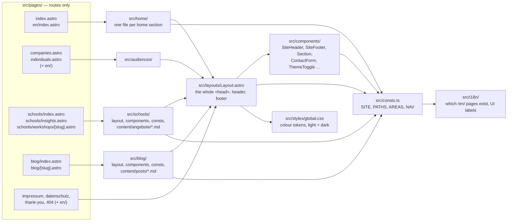

# felix-paul.de

One Astro project serving the whole domain: the personal site at `/`, the blog
at `/blog/`, the school workshops at `/schools/`, the audience pages
`/companies/` and `/individuals/`, and English versions of the main pages
under `/en/`. Static output, deployed by Cloudflare Pages on every push to
`main`.

- **Daily use:** this file.
- **How the site is built and why:** [`docs/`](docs/README.md) — a tutorial for
  the first change, how-to recipes, a file map, the architecture explanation
  and the decision records.
- **Never worked with Astro?** Start with
  [`docs/tutorials/first-change.md`](docs/tutorials/first-change.md).

## Run

```bash
npm install
npm run dev          # http://localhost:4321, reloads on save
npm run build        # -> dist/
npm run preview      # serve dist/ locally
```

Checks (all run before every push by the git hook, see below):

```bash
npm run check          # astro check — types and diagnostics
npm run check:links    # every internal link in dist/, resolved the way the host does
npm run verify         # check + build + link check in one go
npm run check:links:live   # additionally fetch every page from the live site
npm run check:contrast     # WCAG AA contrast of every colour pair in the markup, both themes
npm run slug -- "Ein Titel"   # anchor id for a heading, for hand-written tables of contents
```

## Adding content

Content is Markdown with a validated frontmatter. Add a file, and it appears
everywhere it belongs (list page, detail page, home page teaser, sitemap).

| What | Where | Details |
|---|---|---|
| Blog post | `src/blog/content/posts/<slug>.md` | [how-to](docs/how-to/add-content.md#blog-post) |
| School workshop | `src/schools/content/angebote/<slug>.md` | [how-to](docs/how-to/add-content.md#school-workshop) |
| News entry ("Aktuelles") | `src/news/content/<slug>.md`, copy `_vorlage.md` | [how-to](docs/how-to/add-content.md#news-entry) — section currently hidden |
| Images, PDFs, downloads | `public/…` | served verbatim at the same path |

The file name becomes the URL slug. `draft: true` hides a post or news entry;
`preview: true` shows a post or workshop as a "coming soon" teaser.

## Changing text, navigation, design

| I want to change… | Look in |
|---|---|
| Name, address, e-mail, social links | `src/consts.ts` → `SITE` |
| A URL of a section, the four business areas, the header menu | `src/consts.ts` → `PATHS`, `AREAS`, `NAV` |
| Text on the home page | `src/home/<Section>.astro` — one file per section, German and English side by side |
| Text on `/companies/` or `/individuals/` | `src/audiences/CompaniesPage.astro`, `IndividualsPage.astro` |
| Text on `/schools/` and its sub-pages | `src/pages/schools/*.astro`, `src/schools/components/*.astro` |
| Legal pages | `src/pages/impressum.astro`, `datenschutz.astro` (+ `src/pages/en/`) |
| Colours, dark mode, fonts | `src/styles/global.css` |
| `<head>`: titles, OG tags, schema.org | `src/layouts/Layout.astro` |
| Redirects | `public/_redirects` |

More in [`docs/how-to/`](docs/how-to/). The decision flow "what to change
where" is drawn in
[`docs/how-to/change-text-and-navigation.md`](docs/how-to/change-text-and-navigation.md).

## Where things live



Rule that keeps this tidy: **shared code (`components/`, `layouts/`,
`consts.ts`) never imports from a section (`blog/`, `schools/`, `news/`)**.
Sections and pages may import shared code. That is what keeps a section
liftable into its own repo.

## Setting up a clone

```bash
git clone git@github.com:org-felix-paul/felix-paul-website.git
cd felix-paul-website
npm install
git config core.hooksPath .githooks   # ← do not skip this
```

The last line activates the pre-push hook. Git's own hook folder is not
cloned, so the hook lives in the tracked `.githooks/` folder and every clone
has to opt in once. Check with `git config --get core.hooksPath` (prints
`.githooks`).

## Before pushing

With the hook active, `git push` first runs `astro check`, `astro build` and
the link checker (about 25–30 s). **If anything fails, nothing is pushed.**
Fix the problem, or, for a link that genuinely cannot be repaired, add it to
`KNOWN` in `scripts/check-links.mjs` with a reason. `git push --no-verify`
skips the hook; fine for a branch that is not deployed, not on `main`.

## Deploy

Cloudflare Pages, git-connected: push to `main` → build → live. Build command
`npm run build`, output directory `dist`, no secrets, no CI file. Every other
branch that Pages builds gets an amber "preview" banner above the header
automatically (`src/deploy.ts`). Details and the manual SEO review in
[`docs/how-to/check-and-deploy.md`](docs/how-to/check-and-deploy.md).

## Branching

Work on feature branches; one commit per feature; never commit to `main`
directly; delete branches after merging. `main` is what is live.

## Tech stack

| Layer | Choice | Why |
|---|---|---|
| Framework | [Astro](https://astro.build/) 7, static output | Markdown content in git, zero JS by default, one origin for several sections |
| Styling | [Tailwind CSS](https://tailwindcss.com/) 4 via the Vite plugin | Utility classes in the markup; colour tokens in `global.css` switch light/dark |
| Content | Astro content collections with Zod schemas | A typo in frontmatter fails the build, not the live site |
| Diagrams | [Mermaid](https://mermaid.js.org/) in blog Markdown, rendered in the browser | Only loaded on pages that contain a diagram |
| Fonts | Inter, self-hosted via `@fontsource-variable/inter` | No third-party request, no render-blocking |
| Forms | [FormSubmit](https://formsubmit.co) | Static site, no backend; see [ADR 0004](docs/adr/0004-formsubmit-contact-form.md) |
| Hosting | Cloudflare Pages | Free, git-connected, `_redirects` file for moved URLs |
| Checks | `astro check`, own link checker, own contrast checker, pre-push hook | Broken links and unreadable colours never reach `main` |

## History

Everything before September 2026 lived in four repositories and four
subdomains. What happened since, condensed:

| When | What | Why |
|---|---|---|
| 2026-09-10 | Four sites merged into one Astro project, one domain | Authority collects on one domain; one identity in schema.org instead of three competing ones |
| 2026-09-10 | Shared header, footer, contact form, legal pages, portrait | Each existed several times; single copies cannot drift |
| 2026-09-10 | Home page restructured, audience pages `/schools/`, `/companies/`, `/individuals/` | The offer is meant to cover adult education, not only schools |
| 2026-09-10 | English route segments, link checker, pre-push hook | Folders without `index.html` were served as 404 and slipped through naive checks |
| 2026-09-10 | Environment banner on preview deployments | The old `int` branch carried a source change and drifted from `main` |
| 2026-09-10 | Dark mode via colour tokens | About 590 colour classes; token switching needs no `dark:` variants |
| 2026-09-10 | `/en/` with German fallback | Complete English URL tree from day one; every translation replaces a fallback |
| 2026-09-10 | Reference projects moved out to GitHub Pages | 36 MB of never-changing copies were three quarters of every deploy |
| 2026-09-11 | Contrast fixes, Astro 7, tables and diagrams that fit on a phone | Measured, not guessed: `check-contrast.mjs`, headless Chrome measurements |
| 2026-09-11 | Repo cleanup: home and audience pages exist once, folder `src/schools/`, `docs/` | Every layout change had to be made twice, docs described an older state |

The reasoning behind each structural decision is in
[`docs/adr/`](docs/adr/README.md).

## Known gaps

Recorded so they are not mistaken for oversights. None is urgent.

- No RSS feed for the blog (`@astrojs/rss`, about half an hour).
- The sitemap has no `lastmod`; blog posts could pass `pubDate`.
- All pages share one `og:image` per section; per-post images would make
  shared links distinguishable.
- No `BreadcrumbList` in the schema.org graph.
- `/blog/` ships the full text of every post in a `data-search` attribute
  (about 245 KB) so that search works offline. Deliberate; revisit if the
  blog grows.
- `public/llms.txt` is hand-written and nothing checks it against `AREAS`.
- The "Aktuelles" section (`src/news/`) exists but is hidden until it has
  more than one entry.
