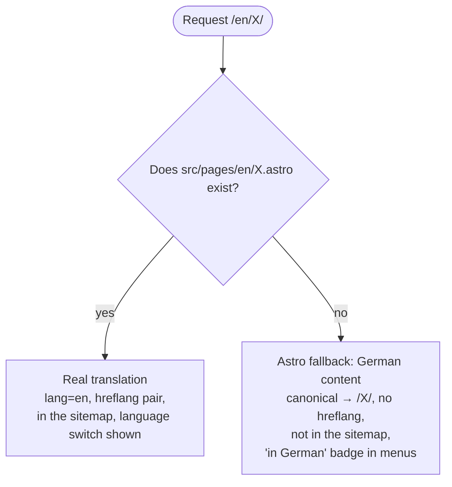

# Explanation: how the site is put together

This page explains the shape of the project and the reasoning behind it. For
"which file do I edit" see the [file map](../reference/file-map.md); for the
individual decisions see the [ADRs](../adr/README.md).

## One origin, several sections

Until September 2026 the personal site, the blog and the school offers were
three repositories on three subdomains, with three copies of the header,
footer, contact form, legal pages and portrait, and three schema.org
declarations of the same person. They were merged into one Astro project on
one domain ([ADR 0001](../adr/0001-one-astro-project-one-domain.md)).

Each section keeps its own folder (`src/blog/`, `src/schools/`, `src/news/`)
with its layout, components, constants, content and content schema. The one
rule that keeps this from turning into a tangle:

> Shared code never imports from a section. Sections and pages may import
> shared code.

Concretely: `src/components/`, `src/layouts/`, `src/consts.ts` and
`src/i18n/` know nothing about the blog or the schools. `src/home/` reads the
schools' and the blog's collections to show teasers, but that is a page
composing data, not shared code depending on a section. If a section ever
has to move out again, its folder, its route files and its `public/` folder
are all there is.

## The `<head>` is owned by one file

`src/layouts/Layout.astro` emits everything in `<head>`: title, description,
canonical, `hreflang`, Open Graph, the favicon, the theme script and the
schema.org graph. Section layouts (`BlogLayout`, `SchoolsLayout`) only pass
branding defaults through (site name suffix, OG image, favicon) and add their
header ([ADR 0002](../adr/0002-shared-layout-owns-the-head.md)).

The schema.org graph has three levels: `Person`, `Organization` and `WebSite`
once for the domain; `WebPage` on every page; and a page-type node passed in
by the page (`BlogPosting`, `Service`) that references the person by `@id`
instead of repeating it. Before the merge, search engines saw three competing
descriptions of the same human.

## Two languages, one file tree

German keeps the unprefixed URLs. Astro's `fallback: { en: "de" }` builds an
English URL for every German page, so the English tree is complete from day
one and each translation simply replaces a fallback. Everything that depends
on "is this a real translation" is computed at build time from the files
under `src/pages/en/` (`src/i18n/pages.mjs`): the `hreflang` pairs, the
language switch, the sitemap filter, the "in German" badges. Nothing is
maintained by hand ([ADR 0003](../adr/0003-english-routes-with-german-fallback.md)).

Pages that exist in both languages are one file with two text objects, `de`
and `en: typeof de`. TypeScript turns a missing translation into a build
error, and a design change is made once.

## Dark mode without touching the markup

About 590 colour classes are used in the markup. Instead of adding a `dark:`
variant to each, the Tailwind palettes point at CSS variables that `:root`
sets to the light values and `:root[data-theme="dark"]` to the dark values.
The grey scale is inverted in dark mode so `ink-900` stays "strongest text"
and `ink-50` stays "quietest surface"; the accent palettes are lightened.
Two roles could not be expressed as a colour and became their own tokens:
`surface`/`canvas` for white areas, and `on-accent` for text on filled
accent surfaces ([ADR 0006](../adr/0006-dark-mode-via-colour-tokens.md)).

An inline script in `<head>` sets `data-theme` before the body renders;
Mermaid diagrams bake colours into their SVG and are re-rendered on a theme
change.

## Content as data

Blog posts, workshops and news entries are Markdown files with a frontmatter
validated by a Zod schema next to the content. The vocabularies (audiences,
topics, news kinds) are TypeScript constants; the schema, the filter
buttons, the labels and the frontmatter all derive from them, so a new value
is added in one place and a typo is a build error.

The home page renders the first two workshops, the three newest posts and
(when enabled) the news log from the same collections the sub-pages use.
There is no second copy to keep in sync.

## What runs in the browser

Almost nothing. Astro ships static HTML with the CSS inlined. The scripts
that exist: the header (mobile menu, dropdown groups, scroll-spy), the theme
toggle, the blog list filter and search, and Mermaid on posts that contain a
diagram. There is no analytics, no cookie, no third-party request except
YouTube embeds and the FormSubmit form action.

## Checks instead of trust

The pre-push hook runs `astro check`, the build and the link checker. The
link checker resolves links the way Cloudflare Pages does, because a folder
without `index.html` exists on disk but is served as 404 and once slipped
through a naive check ([ADR 0007](../adr/0007-link-checker-and-pre-push-hook.md)).
The contrast checker reads the palette from `global.css` and tests the
colour pairs that actually occur in the markup, in both themes, because the
dark mode bugs it found were invisible in the light theme.

## Environments

Cloudflare Pages builds `main` as production and any other allowed branch as
a preview. The preview banner is decided from `CF_PAGES_BRANCH` at build
time: every branch except `main` gets one, local builds get none, `astro dev`
shows "Lokale Entwicklung". The earlier approach, a long-lived `int` branch
with a one-line source change, drifted from `main` on every merge.
