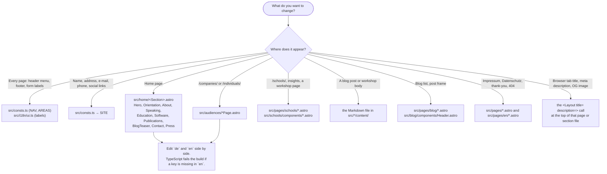

# How to change text, navigation and sections

## Where is the text I want to change?



Inside a home or audience file the pattern is always the same:

```ts
const de = { title: "Kurz zu mir", … };
const en: typeof de = { title: "A little about me", … };
const T = lang === "en" ? en : de;
```

Text with inline HTML (a `<strong>`, an `<em>`) is marked as `html` and
rendered with `set:html`; plain strings are escaped automatically.

## Header menu and footer

`NAV` in `src/consts.ts` is the header menu: a flat list of links and
groups. Each entry has `label` (German) and `labelEn`; `spy` names the home
page section it highlights while scrolling; `external: true` opens in a new
tab. Anchor links (`#speaking`) work from every page because the header
prepends the home page path when needed.

`AREAS` in the same file are the four business areas shown in the footer
and reused for the schema.org offers. Change a label there and it changes
everywhere.

The schools pages have their own smaller menu in
`src/schools/components/Header.astro`; the blog uses the site menu.

## URLs

`PATHS` in `src/consts.ts` is the only place a section's path is written.
Change `schools: "/schools/"` there and every link follows. The page files
themselves live under `src/pages/` and have to be moved too, because Astro
derives routes from file paths. Add a line to `public/_redirects` for the
old address (301). Then run `npm run check:links`.

## Show or hide a home page section

The home page is composed in `src/home/HomePage.astro`; the order of the
components is the order on the page. Remove a line to hide a section, add
one to show it. Two are prepared but switched off:

- **Aktuelles** (`src/news/NewsLog.astro`): import it and add
  `<NewsLog lang={lang} />` where the comment sits. Put the `#aktuelles`
  entry back into `NAV` so the menu links to it.
- **YouTube talks** inside `src/home/Speaking.astro`: remove the `{/* … */}`
  markers around the block.

When you add a section, give it an `id` and, if it should show in the menu,
a `NAV` entry with a matching `spy`.

## A new page

Create `src/pages/<name>.astro`, wrap the content in `<Layout title="…"
description="…">` and use `<Section as="h1" …>` for the first heading so the
page has exactly one `<h1>`. Add it to `PATHS` if other pages link to it. If
the page should exist in English too, see
[translate-a-page.md](translate-a-page.md).
