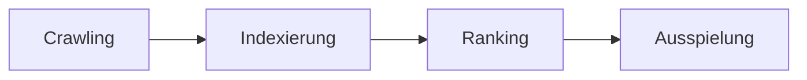

# How to write a blog post

The rules for the *content* of a post: voice, structure, sources, graphics,
demos. The mechanics (frontmatter fields, where images go, how Mermaid is
rendered) are in [add-content.md](add-content.md#blog-post) and are not
repeated here. This file is written for a human author and for an AI session
alike; an AI session reads it before touching `src/blog/content/posts/`.

## What a post is for

A post explains one thing so well that the given audience understands it. (professionals,  teachers, parents or pupil).
If prior knowledge is assumed state it very shortly.
The blog is sometimes the proof of expertise behind a workshops but it sells nothing. The workshop offer is one paragraph at the end, never woven into the text.
But blog posts unrelated to specific workshops also exist just to discuss topics.

## Voice

- **Write like a researcher who can teach.** Claims are backed by a source or
  by a reproducible example. Opinions are marked as opinions.
- **No marketing.** No superlatives, no "revolutionary", no urgency, no
  promises. If a sentence could appear in an ad, delete it.
- **Every step follows from the previous one.** A reader who skips a section
  should notice. If a section can be removed without loss, remove it.
- **Simple language, exact terms.** Explain each technical term once, then use
  it. Do not replace a term with a German paraphrase when the term is what
  professionals say ("Prompt Injection", "Crawling"); do explain it.
- **German**, second person singular ("du"), gender-inclusive with colon
  ("Schüler:innen"). Legal and product names stay as they are.
- **Honest about limits.** Where evidence is thin or comes from industry
  analyses rather than primary sources, say so in the text, not only in the
  source list.
  - **Use graphics and tables**: Use graphics and tables to give an overview about the most important topics. The goal is that readers can understand the main messages by just looking at graphics and tables. Do not render unnecessary common knowledge. 

## Structure

Look at `how-google-search-works.md` or `how-to-mislead-ai.md` as a model.
Every post has, in this order:

1. **Frontmatter** (see add-content.md). The `description` is one or two
   sentences of at most about 160 characters and is what search engines and
   the list page show. `pubDate` is the publication date, ISO format.
2. **Opening paragraph**: the question the post answers and why it matters
   to the reader, in three to five sentences. No heading above it.
3. **Method note** as a blockquote, `> **Hinweis zur Methode:** …`, when the
   post rests on specific sources, data, or an experiment: what was used,
   what was not, what the date of the data is.
4. **`## Gliederung`**: a numbered list linking to every section anchor.
   `npm run slug -- "1. Die vier Stufen"` prints the exact anchor id.
5. **Numbered sections** `## 1. …`, `## 2. …`. One idea per section. A
   section that needs sub-points uses `###`. Every section starts with the
   point, then the explanation, then the evidence.
6. **Worked example** where possible: a real, reproducible case the reader
   can repeat (own website, a demo page, a screenshot with numbers). This is
   what distinguishes the post from a summary.
7. **`## Einen Workshop buchen`**: one paragraph, links to the offer. The only
   place the workshops are mentioned.
8. **`## Quellen`**: footnotes, see below. The lists of figures and tables,
   the feedback note and the license line are added by the template
   automatically; do not write them into the post.

Length: most posts are 1,500 to 3,500 words. Shorter is fine when the topic
is small; longer needs a reason.

## Sources

- Every factual claim, number and quotation has a footnote: `[^key]` in the
  text, `[^key]: …` under `## Quellen`. Keys are short and readable
  (`[^jim-2025]`, `[^helpful]`).
- A footnote names **author or organisation, title, what it supports**, then
  in italics the **publication or survey date** and the **access date**
  (`abgerufen 2026-06-10`), then the URL in angle brackets. Documentation
  without a date says so: *Laufend gepflegte Dokumentation, ohne festes
  Datum*.
- **Primary sources first**: official documentation, laws, peer-reviewed
  papers, official statistics (JIM, KIM, BSI, Destatis, Eurostat). Industry
  analyses and press articles are allowed when marked as such in the text.
- Wikipedia only for definitions, never for numbers.
- **Never invent a number, a study or a quotation.** If no source can be
  found, the claim is dropped or rewritten as an open question. An AI session
  lists every source it could not open in its final message, so the author
  can verify them before the post goes live.
- The intro to `## Quellen` states the common access date and any caveat
  about the source mix.

## Figures, tables, anchors and references

Like `\label` and `\ref` in LaTeX: every figure and table has an id and a
number, the text refers to it by id, the number is filled in at build time,
and the post ends with a list of figures and a list of tables. A reference
to an id that does not exist fails the build.

### Figure

Use figures to illustrate the main messages.
The description stands **before** the image. `short` is the caption line and
the entry in the list of figures; the paragraphs inside are the long
description. Exactly one image or one Mermaid block per figure.

```md
:::figure{#abb-ki-nutzung short="Anteil der Lehrkräfte, die KI im Unterricht nutzen"}
Balkendiagramm aus der JIM-Studie 2025, n = 1.200 Lehrkräfte. Die Frage lautete …

:::
```

Rendered: `<figure id="abb-ki-nutzung">` with "**Abbildung 1: Anteil der Lehrkräfte, die KI im Unterricht nutzen.** Balkendiagramm aus …" above the image.
The alt text of the image stays what a screen reader hears: what the image
shows, in one sentence. The caption is not repeated in the alt text.

A diagram is a figure too:

```md
:::figure{#abb-pipeline short="Die vier Stufen der Google-Suche"}
Vereinfachte Darstellung nach der Google-Dokumentation; Ranking-Signale ausgelassen.

:::
```

### Table

The caption stands **after** the table. Same attributes, exactly one table
inside. Use latex principles for tables. Avoid vertical lines, avoid boxing cells, i funcertain align left, use usually three horizontal lines - above, below and after heading

```md
:::table{#tab-honorare short="Honorare nach Format, Direktbuchung"}
| Format | Honorar |
|---|---|
| Schülerworkshop 90 Min | 250–450 € |
| Pädagogischer Ganztag | 1.500–2.500 € |

Richtwerte 2026, ohne Reisekosten. Quelle: eigene Preisliste[^preise].
:::
```

Rendered: the table, then "**Tabelle 1: Honorare nach Format, Direktbuchung.** Richtwerte 2026, …".
The **blank line between the table and the description is required**;
without it Markdown reads the description as one more table row. The build
catches the usual shape of that mistake and says so.

### Anchor at an arbitrary point

```md
Der entscheidende Satz ist :anchor[dieser hier]{#kernaussage}.
```

Rendered as `<span id="kernaussage">dieser hier</span>`. The bracket text is
also the label a reference shows.

### References in the text

An empty link to an id is filled with the right label at build time:

| You write | Rendered | Target |
|---|---|---|
| `[](#abb-ki-nutzung)` | Abbildung 1 | a `:::figure` |
| `[](#tab-honorare)` | Tabelle 1 | a `:::table` |
| `[](#kernaussage)` | dieser hier | an `:anchor` |
| `[](#2-stufe-1--crawling)` | 2. Stufe 1 – Crawling | a heading, id as `npm run slug` prints it |
| `[](#interaktiv-1)` | Interaktiv 1 | an `<Interactive id="interaktiv-1">` in an `.mdx` post |

Write the reference in the sentence before the element appears: "… wie
[](#abb-ki-nutzung) zeigt." A link with your own text, `[der Abbildung oben](#abb-ki-nutzung)`,
is left as written. Numbers are never typed by hand.

### Lists of figures and tables

Generated automatically at the end of the post, after the sources:
"Abbildungsverzeichnis" and "Tabellenverzeichnis", one line per element with
its number and `short`, linked to the element. Nothing to write. A post
without figures has no list.

Ids: `abb-<wort>` for figures, `tab-<wort>` for tables, descriptive words,
never the number (`abb-1` breaks as soon as a figure is inserted before it).

### Images and diagrams, the rules that remain

- A diagram earns its place when it shows a mechanism, a sequence or a
  comparison that the text would need a paragraph for. Decorative graphics
  are not used.
- Mermaid renders in the browser, in light and dark mode, only on pages that
  contain one. Keep diagrams narrow enough for a phone: flowcharts top to
  bottom, few words per node.
- Image files go to `src/blog/content/posts/img/` or `public/blog/img/`,
  compressed (AVIF or WebP where possible). Every image has an alt text that
  states what the image shows, not "Screenshot".
- Tables wrap on small screens; nothing to do.

## Interactive elements inside a post

A form, quiz or classifier inside the text is one line in an `.mdx` post:
`<Interactive widget="eu-ai-act" id="interaktiv-1" title="…" />`. The frame,
the view switch, the JavaScript notice and the colours are defined once for
all elements; the element's own logic is one file. How to use one and how to add
one: [write-an-interactive-blog-post.md](write-an-interactive-blog-post.md).

A whole standalone page (a demo site of its own, like the drone shops in
`how-to-mislead-ai.md`) stays under `public/blog/demos/<post-slug>/` and is
linked from the text. That is for sites, not for elements in the text.

## Before it goes live

- `draft: true` while writing; the post is not built. `preview: true` shows a
  "coming soon" teaser without a page.
- `npm run verify` passes (types, build, internal links). The pre-push hook
  runs it anyway.
- Read the post once on a phone-sized window; check every Mermaid diagram in
  dark mode.
- Every source opened once; every number checked against its source.
- One person who is not the author has read it. The feedback note at the end
  of every post exists so that readers can send corrections as issues or pull
  requests.

## Working with an AI session

An AI session that writes or edits a post follows everything above, and:

- Reads two existing posts first, to match voice and structure.
- Writes into `src/blog/content/posts/<slug>.md` with `draft: true`, on a
  branch, never directly to `main`.
- Does not change the slug of a published post; the slug is the URL.
- Ends with a list of the sources used, marked as opened or not opened, and
  of every claim it could not source.
