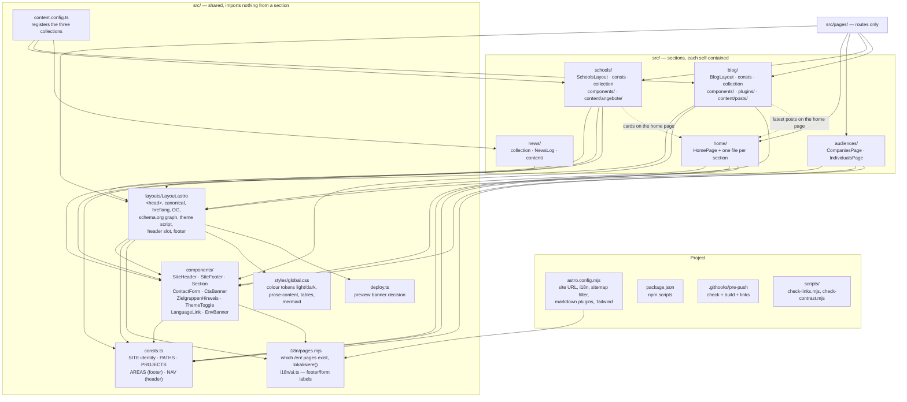
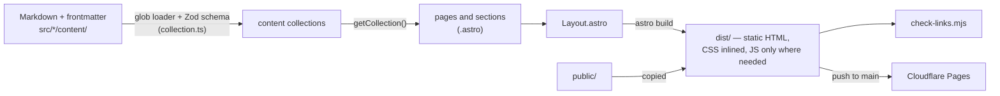

# Reference: file map

## Routes

Astro derives URLs from files under `src/pages/`. Route files are thin;
the content lives where the second column says.

| URL | Route file | Content lives in |
|---|---|---|
| `/` | `src/pages/index.astro` | `src/home/HomePage.astro` and one file per section |
| `/en/` | `src/pages/en/index.astro` | same, `lang="en"` |
| `/companies/`, `/en/companies/` | `src/pages/companies.astro`, `en/companies.astro` | `src/audiences/CompaniesPage.astro` |
| `/individuals/`, `/en/individuals/` | `src/pages/individuals.astro`, `en/individuals.astro` | `src/audiences/IndividualsPage.astro` |
| `/schools/` | `src/pages/schools/index.astro` | that file + `src/schools/components/`, cards from `src/schools/content/angebote/` |
| `/schools/insights/` | `src/pages/schools/insights.astro` | that file; links from `PROJECTS` in `consts.ts` |
| `/schools/workshops/<slug>/` | `src/pages/schools/workshops/[slug].astro` | `src/schools/content/angebote/<slug>.md` |
| `/blog/` | `src/pages/blog/index.astro` | list, filters and search; posts from `src/blog/content/posts/` |
| `/blog/<slug>/` | `src/pages/blog/[slug].astro` | `src/blog/content/posts/<slug>.md` |
| `/impressum/`, `/datenschutz/`, `/thank-you/`, `/404` | `src/pages/*.astro` | those files (English in `src/pages/en/`) |
| `/en/<anything else>/` | none | Astro fallback: German content, canonical to the German URL |
| `/sitemap-index.xml` | `@astrojs/sitemap` in `astro.config.mjs` | filter excludes thank-you pages and fallback pages |
| `/robots.txt`, `/llms.txt`, `/_redirects`, images, PDFs | `public/` | copied verbatim |

## What is defined where



Dashed arrows are data (a home section reads a section's collection), not
imports of section code into shared code.

## `src/consts.ts` at a glance

| Export | Holds | Used by |
|---|---|---|
| `SITE` | name, tagline, description, URL, e-mail, address, phone, social links | Layout (schema.org), footer, contact form, legal pages |
| `PORTRAIT` | the one portrait image and the press photo | hero, about, press section, schema.org |
| `PATHS` | every internal URL: sections, legal pages, `#kontakt`, thank-you | everything that links across sections |
| `FAVICONS` | one icon per section | the three layouts |
| `PROJECTS`, `GITHUB_PAGES` | links to the reference projects on GitHub Pages | `/schools/insights/` |
| `AREAS` | the four business areas with German and English labels | footer, schema.org offers |
| `NAV`, `NavItem`, `NavGroup`, `isGroup` | the header menu | `Header.astro`, `SiteHeader.astro` |

`src/schools/_source-images/` holds the working files for the schools logo
and favicon; nothing references them and they are not published.

Section constants: `src/blog/consts.ts` (`BLOG`, `postPath`, taxonomies and
labels), `src/schools/consts.ts` (`SCHOOLS`, `SCHOOLS_PATHS`,
`workshopPath`), `src/news/collection.ts` (`NEWS_KINDS`).

## Build pipeline



Markdown passes through `remark-mermaid` (turns ```` ```mermaid ```` blocks
into `<pre class="mermaid">`), `rehype-slug` (heading ids) and
`rehype-table-wrap` (a `div.table-wrap` around each table); all three are
configured in `astro.config.mjs`. Mermaid itself is loaded in the browser
only on pages that contain a diagram (`src/pages/blog/[slug].astro`).
