Wer heute ein KI-System baut, das mehr tun soll als antworten, stößt schnell auf eine Buchstabensuppe: MCP, A2A, AG-UI, A2UI, AP2, x402, ACP, UCP. Dazu die alten Bekannten REST, SOAP, GraphQL, gRPC, WebSockets und Webhooks, die seit Jahren oder Jahrzehnten laufen. Und quer dazu Begriffe wie JSON, XML, HTTP/2 oder JSON-RPC, die gern in einem Atemzug mit den Protokollen genannt werden, obwohl sie auf einer ganz anderen Ebene liegen.

Dieser Beitrag sortiert das. Er erklärt, was die einzelnen Protokolle ausmacht, auf welcher Ebene sie arbeiten, wie reif sie sind und wann man welches einsetzt. Ein eigenes Kapitel widmet sich den Querschnittsthemen, an denen in der Praxis die meisten Integrationen scheitern: Authentifizierung, Autorisierung, Identität von Agenten. Und weil agentischer Handel und agentische Zahlungen gerade das Feld sind, in dem sich am meisten bewegt, bekommen x402, AP2, ACP und UCP mehr Platz als die übrigen Neuzugänge.

> **Hinweis zur Methode:** Alle Aussagen zu Spezifikationen stützen sich auf die jeweils aktuellen offiziellen Spezifikationstexte, Changelogs und Ankündigungen der Projekte (Stand der Abfrage: 11.09.2026), bei IETF- und W3C-Standards auf die RFCs beziehungsweise Recommendations selbst. Adoptionszahlen stammen aus benannten Umfragen oder Pressemitteilungen und sind als Momentaufnahme zu lesen. Wo eine Zahl nur aus Sekundärquellen stammt, steht das dabei. Das Feld bewegt sich schnell: MCP hat allein 2025 und 2026 drei große Spezifikationsrevisionen bekommen, A2A ist erst im März 2026 auf Version 1.0 gesprungen. Im Zweifel gilt die aktuelle Fassung der jeweils verlinkten Quelle. Ich bin Informatiker, kein Jurist – Hinweise zu Regulierung sind Orientierung, keine Rechtsberatung.

## Gliederung

1. [Drei Ebenen, die man auseinanderhalten muss](#1-drei-ebenen-die-man-auseinanderhalten-muss)
2. [Die Landkarte: Wer spricht mit wem?](#2-die-landkarte-wer-spricht-mit-wem)
3. [Die klassischen Protokolle – seit Jahrzehnten im Einsatz](#3-die-klassischen-protokolle--seit-jahrzehnten-im-einsatz)
4. [MCP – der Agent und seine Werkzeuge](#4-mcp--der-agent-und-seine-werkzeuge)
5. [A2A – Agenten unter sich](#5-a2a--agenten-unter-sich)
6. [MCP, A2A oder doch nur eine API? Das Zusammenspiel](#6-mcp-a2a-oder-doch-nur-eine-api-das-zusammenspiel)
7. [Agent und Oberfläche: AG-UI, A2UI und MCP Apps](#7-agent-und-oberfläche-ag-ui-a2ui-und-mcp-apps)
8. [Agentische Zahlungen und agentischer Handel: x402, AP2, ACP, UCP](#8-agentische-zahlungen-und-agentischer-handel-x402-ap2-acp-ucp)
9. [Querschnittsthemen: Authentifizierung, Autorisierung und die anderen Pain Points](#9-querschnittsthemen-authentifizierung-autorisierung-und-die-anderen-pain-points)
10. [Entscheidungsbaum: Wann nutze ich was?](#10-entscheidungsbaum-wann-nutze-ich-was)
11. [Fazit](#11-fazit)
12. [Quellen](#12-quellen)

---

## 1. Drei Ebenen, die man auseinanderhalten muss

Die häufigste Verwirrung in Gesprächen über „Protokolle“ entsteht, weil drei Dinge vermischt werden, die nichts miteinander zu tun haben:

1. **Das Format** – wie eine Nachricht *aussieht*: JSON, XML, Protocol Buffers.
2. **Der Transport** – wie eine Nachricht *ankommt*: HTTP, WebSocket, ein lokaler Prozess mit stdin/stdout, eine Message Queue.
3. **Das Protokoll im engeren Sinn** – was die Nachricht *bedeutet* und welche Abläufe erlaubt sind: Welche Operationen gibt es, welche Zustände, welche Fehler, wie authentifiziert man sich.

Ein Beispiel macht es greifbar: MCP ist ein Protokoll. Es benutzt JSON-RPC 2.0 als Nachrichtenkonvention, JSON als Format und wahlweise stdio oder HTTP als Transport. Sagt jemand „wir nutzen JSON statt MCP“, vergleicht er Äpfel mit Fahrplänen. Die Aussage „wir nutzen REST statt MCP“ ist dagegen sinnvoll, denn beide liegen auf derselben Ebene: Beide beschreiben, wie ein Aufrufer mit einer Gegenstelle spricht.

Das folgende Schichtenmodell ordnet die in diesem Beitrag genannten Begriffe ein. Es ist an das OSI-Modell angelehnt, aber bewusst pragmatisch: Oben stehen die fachlichen Protokolle, unten die Leitung.

  

    
Fachliches Protokoll <small>Bedeutung, Abläufe, Zustände</small>

    

      MCPA2AAG-UIA2UIAP2x402ACPUCPWebhooksOpenAPI-beschriebene REST-API
    

  

  

    
Nachrichtenkonvention <small>Aufrufstil, Umschlag</small>

    

      REST-StilJSON-RPC 2.0SOAP-EnvelopeGraphQL-DokumentegRPC (Protobuf-Services)
    

  

  

    
Format <small>Serialisierung</small>

    

      JSONXMLProtocol BuffersCBORMessagePackJSON Schema (Beschreibung)
    

  

  

    
Anwendungsprotokoll <small>Kanal</small>

    

      HTTP/1.1HTTP/2HTTP/3WebSocketServer-Sent EventsAMQPMQTTKafka-Protokollstdio (lokaler Prozess)
    

  

  

    
Sicherheit &amp; Transport <small>Leitung</small>

    

      TLS 1.3TCPQUICIP
    

  

Ein paar Anmerkungen zu den Ebenen:

**Format.** JSON (RFC 8259) hat XML als Standardformat für Web-APIs praktisch abgelöst: leichter zu lesen, direkt in JavaScript nutzbar, ohne Namensräume und Schemata, die man erst laden muss.[^json] XML (W3C, 1998, fünfte Ausgabe 2008) lebt weiter, wo es formale Schemata, Signaturen auf Nachrichtenebene und jahrzehntealte Integrationen gibt – vor allem im SOAP-Umfeld.[^xml] Protocol Buffers sind binär, kompakt und mit Codegenerierung verbunden; man bezahlt mit Lesbarkeit und dem Zwang, beide Seiten zu kompilieren. CBOR (RFC 8949) ist die binäre Verwandte von JSON für Geräte mit wenig Ressourcen.[^cbor] Wichtig: **JSON ist kein Vertrag.** Was ein Feld bedeutet und welche Felder Pflicht sind, beschreibt erst ein Schema – bei REST OpenAPI, bei MCP JSON Schema 2020-12 für jede Tool-Eingabe.[^mcp-tools]

**Nachrichtenkonvention.** Hier entscheidet sich der *Stil* des Aufrufs. REST ist kein Protokoll, sondern ein Architekturstil aus Roy Fieldings Dissertation von 2000: Ressourcen mit URLs, die Standardverben von HTTP, zustandslose Aufrufe.[^fielding] JSON-RPC 2.0 ist das Gegenteil: ein winziger Umschlag (`method`, `params`, `id`) für entfernte Prozeduraufrufe, transportunabhängig und seit 2010 unverändert – und genau deshalb die Basis von MCP und eine der drei Bindungen von A2A.[^jsonrpc] SOAP legt einen XML-Umschlag mit Header und Body um alles. gRPC bringt seine Konvention mit Protobuf-Servicedefinitionen und HTTP/2 gleich mit.

**Kanal.** HTTP ist der Normalfall, mittlerweile in drei Generationen: HTTP/1.1, HTTP/2 mit Multiplexing über eine Verbindung (die Basis von gRPC) und HTTP/3 über QUIC statt TCP.[^http] WebSockets (RFC 6455) machen aus einer HTTP-Verbindung einen dauerhaften Kanal in beide Richtungen.[^ws] Server-Sent Events sind der einfache, nur in eine Richtung laufende Bruder – und werden von MCP und A2A für Streaming benutzt.[^sse] Message-Queue-Protokolle wie AMQP oder MQTT entkoppeln Sender und Empfänger zeitlich. Und **stdio**, also stdin und stdout eines lokal gestarteten Prozesses, ist ein vollwertiger Transport: MCP nutzt ihn für lokale Server, die direkt auf dem Rechner des Nutzers laufen.[^mcp-transports]

> **💡 Merksatz:** Format sagt, wie es aussieht. Transport sagt, wie es ankommt. Protokoll sagt, was es bedeutet. Ein neues agentisches Protokoll erfindet fast nie eine neue Leitung – MCP, A2A, AP2 und ACP laufen alle über HTTP und JSON. Neu ist die Bedeutungsebene: Werkzeuge, Aufgaben, Mandate, Agent Cards.

---

## 2. Die Landkarte: Wer spricht mit wem?

Bevor es in die einzelnen Protokolle geht, hilft eine Landkarte. Die agentischen Protokolle lassen sich am besten danach sortieren, **welche zwei Parteien** sie verbinden. Genau das ist auch die Logik, mit der die Projekte sich selbst voneinander abgrenzen: MCP verbindet einen Agenten mit Werkzeugen und Daten („vertikal“), A2A verbindet Agenten untereinander („horizontal“).[^a2a-mcp] AG-UI und A2UI verbinden den Agenten mit der Oberfläche vor dem Menschen. AP2, ACP und UCP verbinden Agenten mit Händlern und Zahlungsdienstleistern, x402 einen aufrufenden Agenten mit einer bezahlpflichtigen Ressource.

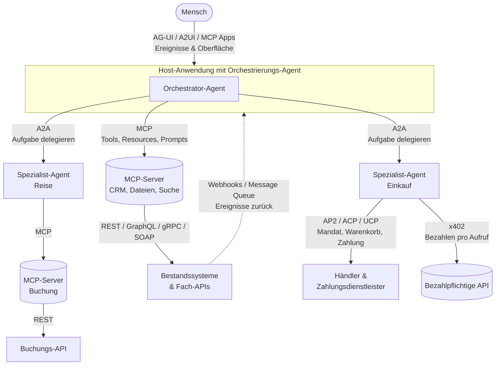

Die Grafik zeigt das typische Zusammenspiel: Ein Mensch redet mit einer Host-Anwendung, in der ein Orchestrator-Agent läuft. Der delegiert Teilaufgaben per A2A an spezialisierte Agenten – die können intern völlig anders gebaut sein, von einem anderen Anbieter kommen und auf einer anderen Plattform laufen. Jeder Agent greift per MCP auf seine Werkzeuge zu. Die MCP-Server wiederum sind meist nur dünne Adapter vor den klassischen APIs, die es schon gab. Ereignisse aus den Bestandssystemen kommen per Webhook oder Queue zurück. Und sobald Geld fließt, kommen die Handels- und Zahlungsprotokolle ins Spiel.

Wichtig ist der Blick auf die **Reife**. Die Protokolle in dieser Landkarte sind nicht gleich alt und nicht gleich stabil. Für die Einordnung im Rest des Beitrags verwende ich drei Stufen:

  

    <h4>Seit Jahrzehnten etabliert</h4>
    
Stabile Spezifikationen, breite Werkzeugunterstützung, jede Betriebsfrage ist beantwortet.

    <ul>
      <li>REST (2000), OpenAPI</li>
      <li>SOAP / WSDL / WS-Security (2000–2007)</li>
      <li>Webhooks (2007), Standard Webhooks (2023)</li>
      <li>WebSockets (2011), Server-Sent Events</li>
      <li>gRPC (2015), GraphQL (2015)</li>
      <li>AMQP (2012), MQTT (2014/2019), JSON-RPC 2.0 (2010)</li>
    </ul>
  

  

    <h4>Neu, aber etabliert</h4>
    
Unter zwei Jahre alt, aber mit Stiftungs-Governance, mehreren SDKs und produktivem Einsatz in großen Umgebungen.

    <ul>
      <li>MCP (Nov 2024; seit Dez 2025 in der Agentic AI Foundation der Linux Foundation; Spezifikation 2026-07-28)</li>
      <li>A2A (Apr 2025; seit Jun 2025 bei der Linux Foundation; Version 1.0 seit März 2026)</li>
    </ul>
  

  

    <h4>Experimentell</h4>
    
Öffentliche Spezifikationen, teils echte Produkte dahinter, aber noch keine Version 1.0, kein neutraler Träger oder erst wenige Monate alt.

    <ul>
      <li>AG-UI (Mai 2025, Version 0.0.x), A2UI (Dez 2025, v1.0 als Release Candidate), MCP Apps (Jan 2026)</li>
      <li>x402 (Mai 2025; seit Jul 2026 mit eigener Stiftung unter der Linux Foundation), AP2 (Sep 2025; seit Apr 2026 bei der FIDO Alliance), ACP (Sep 2025), UCP (Jan 2026), MPP (März 2026)</li>
      <li>Web Bot Auth (IETF-Arbeitsgruppe seit Okt 2025)</li>
    </ul>
  

Die Einstufung „experimentell“ ist keine Abwertung. Hinter UCP steht der laufende Checkout in Google-Oberflächen, hinter ACP stand mit Instant Checkout in ChatGPT ein echtes Produkt, hinter x402 laufen Millionen Transaktionen. Aber wer heute eine Architektur auf eines dieser Protokolle stellt, muss mit Breaking Changes rechnen und sollte sie kapseln. Bei MCP und A2A ist dieses Risiko deutlich kleiner geworden, aber auch nicht null: Die MCP-Revision vom Juli 2026 hat den Kern des Protokolls zustandslos gemacht und mehrere Bausteine als veraltet markiert (dazu in Abschnitt 4).

---

## 3. Die klassischen Protokolle – seit Jahrzehnten im Einsatz

Bevor man etwas Neues einsetzt, sollte man wissen, was das Alte kann. Die folgenden Steckbriefe sind bewusst knapp; die Einsatzempfehlung steht jeweils dabei.

  <article class="proto-card is-etabliert">
    
RESTEtabliert

    
Architekturstil, Roy Fielding 2000 · beschrieben mit OpenAPI (aktuell 3.2)

    <dl>
      <dt>Ebene</dt><dd>Nachrichtenkonvention über HTTP</dd>
      <dt>Format</dt><dd>JSON (früher XML)</dd>
      <dt>Muster</dt><dd>Anfrage/Antwort, zustandslos, Ressourcen + HTTP-Verben</dd>
      <dt>Auth</dt><dd>OAuth 2.0/2.1, API-Keys, mTLS – nicht vorgeschrieben</dd>
    </dl>
    <ul>
      <li><strong>Stärken:</strong> überall verstanden, cachebar, riesiges Werkzeug-Ökosystem, 93 % Nutzung laut Postman 2025</li>
      <li><strong>Schwächen:</strong> Over-/Underfetching, kein Standard für Streaming, „REST“ heißt in der Praxis oft nur „JSON über HTTP“</li>
      <li><strong>Wann:</strong> die Standardwahl für jede öffentliche oder interne Fach-API</li>
    </ul>
  </article>
  <article class="proto-card is-etabliert">
    
SOAPEtabliert, rückläufig

    
W3C, 1.2 als Recommendation 2007 · Vertrag per WSDL, Sicherheit per WS-Security

    <dl>
      <dt>Ebene</dt><dd>Nachrichtenkonvention (XML-Umschlag)</dd>
      <dt>Format</dt><dd>XML, formal per XSD</dd>
      <dt>Muster</dt><dd>Anfrage/Antwort, Operationen statt Ressourcen</dd>
      <dt>Auth</dt><dd>WS-Security: Signaturen und Verschlüsselung auf Nachrichtenebene</dd>
    </dl>
    <ul>
      <li><strong>Stärken:</strong> formale Verträge, Signatur der Nachricht selbst (nicht nur des Kanals), Transaktionen</li>
      <li><strong>Schwächen:</strong> ausufernd, schwerfälliges Tooling, nichts für Browser und Mobilgeräte</li>
      <li><strong>Wann:</strong> nur, wenn die Gegenstelle es vorgibt – typisch in Banken, Behörden und alten ERP-Integrationen</li>
    </ul>
  </article>
  <article class="proto-card is-etabliert">
    
GraphQLEtabliert

    
Facebook 2015, GraphQL Foundation seit 2019 · Spezifikation September 2025

    <dl>
      <dt>Ebene</dt><dd>Abfragesprache + Laufzeit, meist HTTP POST</dd>
      <dt>Format</dt><dd>JSON, Schema in eigener Sprache</dd>
      <dt>Muster</dt><dd>Client bestimmt die Form der Antwort; ein Endpunkt</dd>
      <dt>Auth</dt><dd>wie REST, plus Query-Tiefen- und Kostenlimits</dd>
    </dl>
    <ul>
      <li><strong>Stärken:</strong> kein Over-/Underfetching, starke Typisierung, Introspektion</li>
      <li><strong>Schwächen:</strong> HTTP-Caching greift kaum, N+1-Probleme, Angriffsfläche durch beliebige Abfragen</li>
      <li><strong>Wann:</strong> viele unterschiedliche Clients (Web, Mobile) über einem breiten Datenmodell</li>
    </ul>
  </article>
  <article class="proto-card is-etabliert">
    
gRPCEtabliert

    
Google 2015, CNCF seit 2017 · HTTP/2 + Protocol Buffers

    <dl>
      <dt>Ebene</dt><dd>RPC-Framework inkl. Konvention und Format</dd>
      <dt>Format</dt><dd>Protobuf (binär), Codegenerierung</dd>
      <dt>Muster</dt><dd>Unary, Server-/Client-/bidirektionales Streaming</dd>
      <dt>Auth</dt><dd>mTLS, Tokens per Metadaten</dd>
    </dl>
    <ul>
      <li><strong>Stärken:</strong> schnell, kompakt, Streaming eingebaut, Deadlines</li>
      <li><strong>Schwächen:</strong> nicht browser-nativ (gRPC-Web braucht Proxy), binär schwer zu debuggen</li>
      <li><strong>Wann:</strong> interne Service-zu-Service-Kommunikation mit hohem Durchsatz; eine der drei A2A-Bindungen</li>
    </ul>
  </article>
  <article class="proto-card is-etabliert">
    
WebhooksEtabliert

    
Begriff 2007 (Jeff Lindsay) · kein RFC, seit 2023 „Standard Webhooks“ als Konvention

    <dl>
      <dt>Ebene</dt><dd>Muster über HTTP: der Server ruft den Client</dd>
      <dt>Format</dt><dd>JSON per HTTP POST</dd>
      <dt>Muster</dt><dd>Ereignis-Push statt Polling, „at least once“, Wiederholungen</dd>
      <dt>Auth</dt><dd>HMAC-Signatur + Zeitstempel im Header</dd>
    </dl>
    <ul>
      <li><strong>Stärken:</strong> einfach, sparsam, sofort; 50 % Nutzung laut Postman 2025</li>
      <li><strong>Schwächen:</strong> Empfänger muss öffentlich erreichbar sein, Reihenfolge und Duplikate sind sein Problem</li>
      <li><strong>Wann:</strong> „Sag mir Bescheid, wenn…“ – Zahlungen, Deployments, Ticketänderungen; A2A nutzt sie für Push-Benachrichtigungen</li>
    </ul>
  </article>
  <article class="proto-card is-etabliert">
    
WebSockets &amp; SSEEtabliert

    
WebSocket: RFC 6455 (2011) · SSE: WHATWG HTML Living Standard

    <dl>
      <dt>Ebene</dt><dd>Kanal (Anwendungsprotokoll)</dd>
      <dt>Format</dt><dd>beliebig (Text/Binär) bzw. <code>text/event-stream</code></dd>
      <dt>Muster</dt><dd>WebSocket: beide Richtungen, dauerhaft · SSE: nur Server → Client, auto-reconnect</dd>
      <dt>Auth</dt><dd>beim Verbindungsaufbau (Cookie, Token); danach kanalgebunden</dd>
    </dl>
    <ul>
      <li><strong>Stärken:</strong> Echtzeit ohne Polling; SSE ist schlichtes HTTP und geht durch jeden Proxy</li>
      <li><strong>Schwächen:</strong> zustandsbehaftete Verbindungen erschweren Lastverteilung</li>
      <li><strong>Wann:</strong> Chat, Live-Dashboards, Token-Streaming – MCP und A2A streamen über SSE</li>
    </ul>
  </article>
  <article class="proto-card is-etabliert">
    
Message QueuesEtabliert

    
AMQP 1.0 (OASIS 2012, ISO 19464) · MQTT 5.0 (OASIS 2019) · Kafka-Protokoll

    <dl>
      <dt>Ebene</dt><dd>eigenes Anwendungsprotokoll über TCP</dd>
      <dt>Format</dt><dd>binär, Nutzlast beliebig</dd>
      <dt>Muster</dt><dd>Publish/Subscribe, Warteschlangen, dauerhafte Ereignisströme</dd>
      <dt>Auth</dt><dd>SASL, mTLS, Broker-ACLs</dd>
    </dl>
    <ul>
      <li><strong>Stärken:</strong> zeitliche Entkopplung, Pufferung, Fan-out, Wiederholbarkeit</li>
      <li><strong>Schwächen:</strong> Betriebsaufwand, keine direkte Antwort</li>
      <li><strong>Wann:</strong> Ereignisse zwischen vielen Systemen; IoT (MQTT); Ereignis-Historie (Kafka)</li>
    </ul>
  </article>
  <article class="proto-card is-etabliert">
    
JSON-RPC 2.0Etabliert

    
2010, unverändert seit 2013 · die Basis von MCP und eine A2A-Bindung

    <dl>
      <dt>Ebene</dt><dd>Nachrichtenkonvention, transportunabhängig</dd>
      <dt>Format</dt><dd>JSON: <code>method</code>, <code>params</code>, <code>id</code></dd>
      <dt>Muster</dt><dd>Aufruf, Antwort, Benachrichtigung (ohne <code>id</code>), Batch</dd>
      <dt>Auth</dt><dd>keine – Sache des Transports</dd>
    </dl>
    <ul>
      <li><strong>Stärken:</strong> minimal, auf jedem Kanal nutzbar (HTTP, WebSocket, stdio)</li>
      <li><strong>Schwächen:</strong> keine Ressourcen-Semantik, kein Caching, kein Schema</li>
      <li><strong>Wann:</strong> selten direkt – man begegnet ihm als Unterbau von MCP, A2A und dem Language Server Protocol</li>
    </ul>
  </article>

Die Nutzungszahlen in den Steckbriefen stammen aus Postmans „State of the API“-Report 2025 mit über 5.700 Befragten; derselbe Report nennt für MCP 70 % Bekanntheit und 10 % regelmäßige Nutzung – ein Jahr nach dessen Start.[^postman] Die Standards selbst sind in den Quellen belegt.[^fielding][^wss][^ws][^sse][^stdwebhooks][^jsonrpc]

### Ein Detail, das für Agenten wichtig wird: Ziehen oder Schieben?

Ein wiederkehrendes Muster in allen Protokollen ist die Frage, wer den Anstoß gibt. REST, SOAP, GraphQL und gRPC sind **Pull**: Der Client fragt, der Server antwortet. Webhooks, Message Queues und Push-Benachrichtigungen sind **Push**: Der Server meldet sich, wenn etwas passiert ist. Streaming über SSE oder WebSocket liegt dazwischen: Der Client öffnet den Kanal, der Server schickt, sobald er etwas hat.

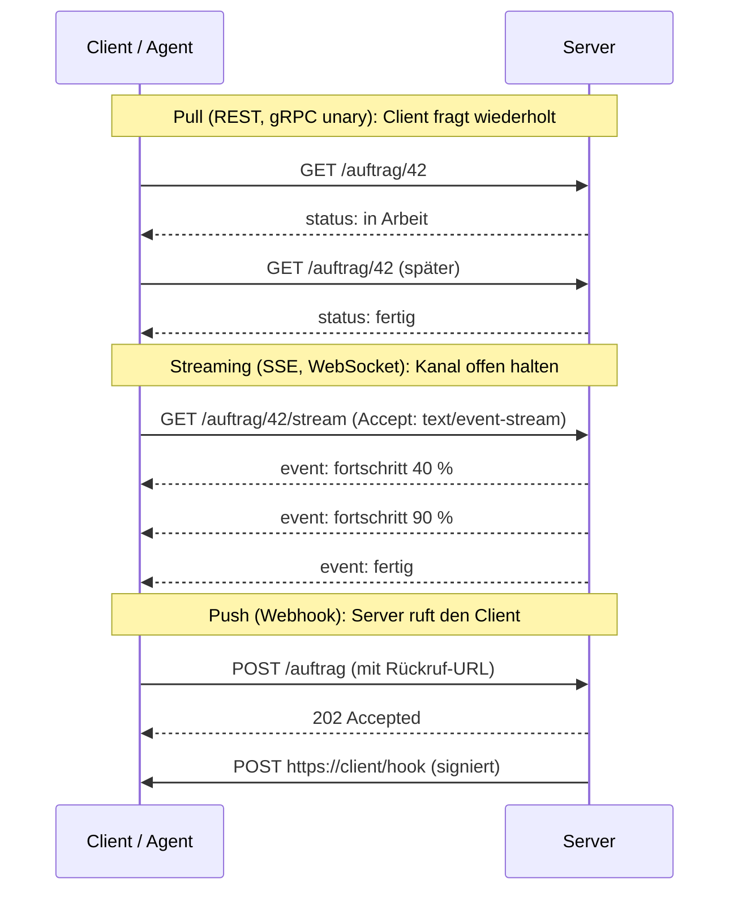

Agenten arbeiten oft lange: Eine Aufgabe kann Sekunden oder Stunden dauern. Deshalb enthalten MCP und A2A alle drei Muster. MCP streamt Antworten per SSE und hat mit der Tasks-Erweiterung ein Polling-Modell für lange Aufrufe; A2A kennt Polling (`GetTask`), Streaming (`SendStreamingMessage`) und Push-Benachrichtigungen an eine Webhook-URL.[^a2a-streaming] Wer die klassischen Muster versteht, erkennt sie in den neuen Protokollen wieder.

### Wann bleibt das Klassische die richtige Wahl?

Kurz gesagt: **fast immer, wenn kein Sprachmodell im Spiel ist.** Ein Batch-Job, der nachts Daten abgleicht, braucht kein MCP. Zwei Microservices, die sich Bestellungen zuschieben, brauchen kein A2A. Die agentischen Protokolle lösen ein spezifisches Problem – ein Sprachmodell soll zur Laufzeit *entdecken*, welche Fähigkeiten es gibt, und sie mit natürlichsprachlicher Beschreibung auswählen. Wo der Aufrufer ein Programm ist, das genau weiß, was es will, ist eine REST-API mit OpenAPI-Beschreibung schneller, billiger, sicherer und besser zu betreiben.

Die Umkehrung gilt allerdings auch: Wer einem Agenten „einfach die REST-API gibt“, muss die Beschreibung, die Auswahl und die Fehlerbehandlung selbst bauen – und landet meist bei einem Eigenbau von MCP.

---

## 4. MCP – der Agent und seine Werkzeuge

Das **Model Context Protocol** wurde im November 2024 von Anthropic veröffentlicht und hat sich in unter zwei Jahren zum Standard dafür entwickelt, wie ein KI-Modell an Werkzeuge und Daten kommt. Seit dem 9. Dezember 2025 liegt es bei der Agentic AI Foundation (AAIF), einem Fonds unter dem Dach der Linux Foundation, den Anthropic, Block und OpenAI gemeinsam gegründet haben und den Google, Microsoft, AWS, Cloudflare und Bloomberg mittragen. Zum Zeitpunkt der Übergabe nannte das Projekt über 97 Millionen monatliche SDK-Downloads und Unterstützung in ChatGPT, Claude, Cursor und Gemini.[^mcp-aaif] OpenAI hatte MCP bereits im März 2025 in sein Agents SDK aufgenommen,[^openai-mcp] Google betreibt seit Dezember 2025 verwaltete MCP-Server für Maps, BigQuery und weitere Dienste.[^google-mcp]

Die Spezifikation wird datiert versioniert. Aktuell gilt die Revision **2026-07-28**, die größte seit dem Start; davor gab es 2024-11-05, 2025-03-26, 2025-06-18 und 2025-11-25.[^mcp-spec] Wer MCP 2025 gelernt hat, sollte die Änderungen kennen – dazu gleich mehr.

### Die Architektur: Host, Client, Server

MCP hat drei Rollen. Der **Host** ist die Anwendung, in der das Modell läuft (Claude Desktop, ein IDE, ein eigener Agent). Der Host erzeugt pro Verbindung einen **Client**, der genau mit einem **Server** spricht. Ein Server stellt Fähigkeiten bereit: einen Datei-Zugriff, ein CRM, eine Datenbank, eine Suche. Der Host kann viele Server gleichzeitig eingebunden haben; das Modell sieht deren Werkzeuge in einer gemeinsamen Liste.

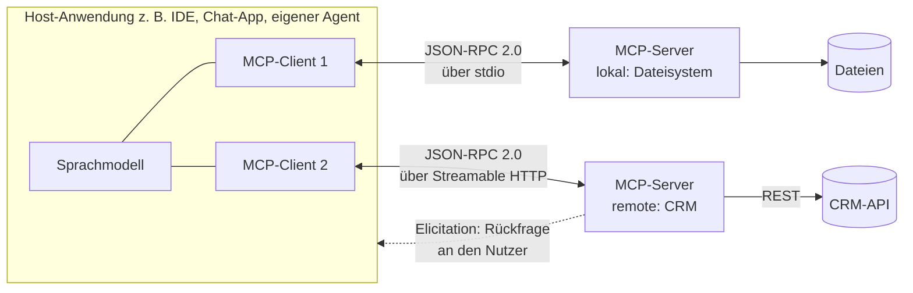

### Die Bausteine: Was MCP ausmacht

Das Herz von MCP sind drei **Server-Primitive**, die sich darin unterscheiden, *wer* sie steuert:[^mcp-spec]

| Primitiv | Wer steuert | Was es ist | Beispiel |
|---|---|---|---|
| **Tools** | das Modell | Funktionen mit JSON-Schema-Eingabe (und optional -Ausgabe), die das Modell selbst aufruft | `create_ticket`, `search_customers` |
| **Resources** | die Anwendung | Inhalte mit URI, die der Host als Kontext bereitstellt – Dateien, Datensätze, Logs | `file:///projekt/README.md`, `crm://kunde/4711` |
| **Prompts** | der Mensch | vorbereitete Vorlagen, die der Nutzer auswählt, oft mit Parametern | „Erstelle einen Wochenbericht für Kunde X“ |

Dazu kommt auf der Client-Seite die **Elicitation**: Ein Server kann während eines Aufrufs strukturierte Rückfragen an den Nutzer stellen („Welches Konto meinst du?“), seit der Revision 2025-11-25 auch als *URL-Modus*, der den Nutzer für eine Anmeldung oder Freigabe in den Browser schickt.[^mcp-2025-11] Zwei weitere Client-Primitive der Anfangszeit, **Roots** (welche Verzeichnisse darf der Server sehen) und **Sampling** (der Server bittet das Modell des Hosts um eine Vervollständigung), sind seit 2026-07-28 als *veraltet* markiert – mit mindestens zwölf Monaten Übergangsfrist.[^mcp-2026-07]

Rund um diesen Kern gibt es seit 2025-11-25 ein **Erweiterungsmodell**. Die wichtigsten offiziellen Erweiterungen:

- **Tasks** für lange laufende Aufrufe mit Zuständen `working`, `input_required`, `completed`, `failed`, `cancelled` und Polling per `tasks/get`.[^mcp-tasks]
- **MCP Apps**: Ein Server liefert eine kleine HTML-Oberfläche mit, die der Host in einer Sandbox rendert – gemeinsam mit OpenAI entwickelt und seit Januar 2026 offizielle Erweiterung.[^mcp-apps]
- **Enterprise-Managed Authorization** und **Client Credentials** für die Unternehmens-Anmeldung (Abschnitt 9).

  <article class="proto-card is-neu">
    
MCPNeu, etabliert

    
Anthropic, Nov 2024 · Agentic AI Foundation (Linux Foundation) seit Dez 2025 · Spezifikation 2026-07-28

    <dl>
      <dt>Verbindet</dt><dd>Agent ↔ Werkzeuge, Daten, Vorlagen</dd>
      <dt>Konvention</dt><dd>JSON-RPC 2.0</dd>
      <dt>Transport</dt><dd>stdio (lokal) · Streamable HTTP (remote)</dd>
      <dt>Kern</dt><dd>Tools · Resources · Prompts · Elicitation · Erweiterungen (Tasks, Apps, Auth)</dd>
      <dt>Auth</dt><dd>OAuth 2.1 vorgeschrieben (HTTP); Server ist Resource Server nach RFC 9728</dd>
      <dt>Reife</dt><dd>Tier-1-SDKs für TypeScript, Python, Go, C#; offizielle Registry seit Sep 2025 (Preview)</dd>
    </dl>
  </article>

### Transport: stdio und Streamable HTTP

MCP definiert zwei Standardtransporte. **stdio** startet den Server als Unterprozess und schickt JSON-RPC-Nachrichten zeilenweise über dessen Standard-Ein- und -Ausgabe – ideal für lokale Werkzeuge, die auf Dateien oder die Shell des Nutzers zugreifen. **Streamable HTTP** ist der Transport für entfernte Server: ein einziger HTTP-Endpunkt, jede Nachricht ein POST, die Antwort wahlweise als einzelnes JSON-Objekt oder als SSE-Strom (`Content-Type: text/event-stream`).[^mcp-transports] Der ursprüngliche Transport „HTTP+SSE“ mit getrenntem Ereignis-Endpunkt ist veraltet.[^mcp-2026-07]

### Was sich 2026-07-28 geändert hat

Die Juli-Revision hat den Kern **zustandslos** gemacht: Der `initialize`-Handshake und die Sitzungskennung `Mcp-Session-Id` sind weg; jede Anfrage trägt Protokollversion und Client-Fähigkeiten selbst mit. Server-Benachrichtigungen laufen über einen optionalen, lang lebenden Strom (`subscriptions/listen`). Rückfragen mitten in einem Tool-Aufruf werden nicht mehr als Server-initiierte Anfrage gestellt, sondern über **Multi Round-Trip Requests**: Der Server antwortet mit `resultType: "input_required"`, der Client ruft mit den fehlenden Eingaben erneut auf. Zwei neue HTTP-Header, `Mcp-Method` und `Mcp-Name`, erlauben Gateways das Routing, ohne den JSON-Body zu parsen. Und Tasks wurden vom Kern in eine Erweiterung verschoben.[^mcp-2026-07]

Für die Praxis heißt das: MCP ist reifer geworden und lässt sich hinter API-Gateways betreiben wie jede andere HTTP-API. Aber Werkzeuge, die auf Sitzungen, Roots oder Sampling gebaut haben, brauchen bis Mitte 2027 eine Anpassung.

### Autorisierung: der am stärksten standardisierte Teil

Kein anderes Protokoll in diesem Beitrag legt die Anmeldung so genau fest wie MCP. Für HTTP-Transporte ist **OAuth 2.1** Pflicht, und zwar mit einer Kette bekannter IETF-Bausteine:[^mcp-auth]

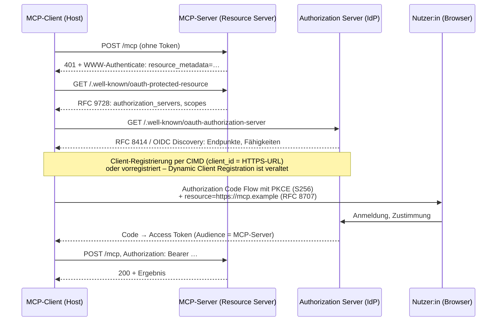

Die Regeln im Einzelnen: Der MCP-Server ist ein *Resource Server* und muss **Protected Resource Metadata (RFC 9728)** veröffentlichen, in der steht, welche Authorization Server für ihn zuständig sind. Der Client muss beide Discovery-Verfahren beherrschen (RFC 8414 und OpenID Connect Discovery), muss **PKCE** verwenden, muss per **Resource Indicator (RFC 8707)** sagen, für welchen Server das Token bestimmt ist – damit ein Token für Server A nicht bei Server B funktioniert –, und muss den `iss`-Parameter nach RFC 9207 prüfen. Für die Registrierung unbekannter Clients ist seit 2026-07-28 das **Client ID Metadata Document** der bevorzugte Weg: Die `client_id` ist eine HTTPS-URL, unter der der Client seine Metadaten veröffentlicht. Die ältere Dynamic Client Registration (RFC 7591) ist als veraltet markiert.[^mcp-auth] Für stdio-Server gilt das alles nicht: Sie holen Zugangsdaten aus der Umgebung, etwa aus Umgebungsvariablen.[^mcp-auth]

Für Unternehmen wichtig ist die Erweiterung **Enterprise-Managed Authorization**, seit Juni 2026 als stabil erklärt. Sie setzt den IETF-Entwurf *Identity Assertion Authorization Grant* um, besser bekannt als **Cross App Access**: Der Nutzer meldet sich einmal beim Unternehmens-IdP an, und der IdP stellt daraus Tokens für jeden freigegebenen MCP-Server aus – ohne dass für jeden Server ein eigener Zustimmungsdialog aufgeht und ohne dass die Fachabteilung im Alleingang Verbindungen anlegt. Okta, Anthropic, VS Code sowie Atlassian, Figma, Linear und weitere Server-Anbieter unterstützen das.[^mcp-ema]

### Die bekannten Schwächen

MCP hat ein Sicherheitsproblem, das kein Protokoll lösen kann: Tool-Beschreibungen sind Text, und Text liest das Modell als Anweisung. Invariant Labs hat im April 2025 gezeigt, wie ein bösartiger Server per **Tool Poisoning** versteckte Anweisungen in Beschreibungen legt, sie nach der Freigabe austauscht („Rug Pull“) oder die Werkzeuge anderer Server überschattet.[^invariant] Trail of Bits beschrieb wenig später das „Line Jumping“: Die Injektion wirkt schon beim Laden der Beschreibung, bevor ein einziges Werkzeug aufgerufen wurde.[^tob] Das ist die Prompt Injection aus [meinem Beitrag über manipulierte Produktseiten](/blog/how-to-mislead-ai/), nur dass der Angreifer jetzt ein Werkzeug statt einer Webseite ist. Die Konsequenz ist organisatorisch: MCP-Server sind Software von Dritten und brauchen dieselbe Freigabe wie jede andere Abhängigkeit.

---

## 5. A2A – Agenten unter sich

Das **Agent2Agent Protocol** hat Google am 9. April 2025 mit über fünfzig Partnern vorgestellt – darunter Atlassian, Salesforce, SAP, ServiceNow, PayPal und Workday.[^a2a-launch] Schon am 23. Juni 2025 hat Google es an die Linux Foundation übergeben, mit AWS, Cisco, Microsoft, Salesforce, SAP und ServiceNow als Gründungsmitgliedern.[^a2a-lf] Version 1.0 erschien am 12. März 2026, die aktuelle 1.0.1 am 28. Mai 2026.[^a2a-releases] Zum ersten Geburtstag nannte die Linux Foundation über 150 unterstützende Organisationen und SDKs in Python, JavaScript, Java, Go und .NET.[^a2a-year] IBMs konkurrierendes *Agent Communication Protocol* ist im August 2025 in A2A aufgegangen.[^acp-ibm]

Der Grundgedanke: Agenten sind **opak**. Sie tauschen Aufgaben und Ergebnisse aus, aber nicht ihre Gedanken, Pläne oder Werkzeuge. Ein Reise-Agent von Anbieter A kann einen Spesen-Agenten von Anbieter B beauftragen, ohne zu wissen, mit welchem Modell oder Framework der gebaut ist.[^a2a-spec]

### Die Bausteine: Agent Card, Skills, Tasks, Artifacts

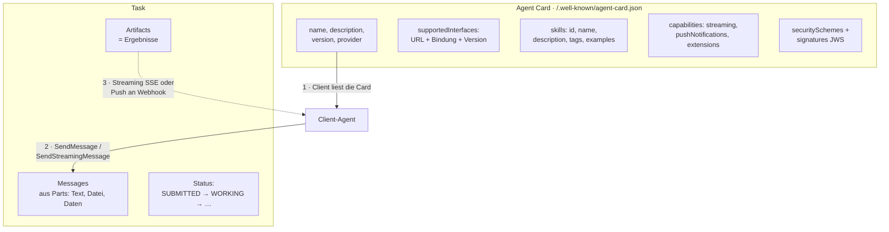

Die **Agent Card** ist die Visitenkarte: ein JSON-Dokument unter `/.well-known/agent-card.json`, das Name, Beschreibung, Anbieter, die angebotenen Schnittstellen (URL, Bindung, Protokollversion), die Fähigkeiten und die Sicherheitsverfahren nennt. Sie kann per JWS signiert sein, damit ein Client prüfen kann, dass sie wirklich vom genannten Anbieter stammt, und es gibt eine **erweiterte Agent Card**, die erst nach Authentifizierung mehr Details preisgibt.[^a2a-spec]

**Skills** beschreiben, *was* ein Agent kann – mit Kennung, Name, Beschreibung, Tags, Beispielen und den unterstützten Ein- und Ausgabemodi. Das ist das Gegenstück zu MCP-Tools, aber gröber: Ein Skill ist „Reisen buchen“, kein einzelner Funktionsaufruf mit Schema. Der Client-Agent entscheidet anhand der Skills, welchem Agenten er eine Aufgabe gibt, und formuliert die Aufgabe dann in natürlicher Sprache.

Die **Task** ist die Arbeitseinheit. Sie hat einen Lebenszyklus mit festen Zuständen:[^a2a-spec]

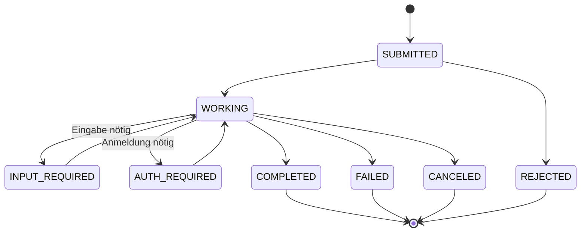

Innerhalb einer Task fließen **Messages**, die aus **Parts** bestehen – Text, Dateien oder strukturierte Daten; seit 1.0 ein vereinheitlichter Part-Typ. Ergebnisse kommen als **Artifacts** zurück, ebenfalls aus Parts. Fortschritt bekommt der Client auf drei Wegen: Polling per `GetTask`, Streaming per SSE oder **Push-Benachrichtigungen** an eine Webhook-URL, die er beim Start mitgibt.[^a2a-streaming] Version 1.0 hat außerdem `tasks/list` mit Cursor-Paginierung und Mandantenfähigkeit ergänzt.[^a2a-v1]

  <article class="proto-card is-neu">
    
A2ANeu, etabliert

    
Google, Apr 2025 · Linux Foundation seit Jun 2025 · Version 1.0.1 (Mai 2026)

    <dl>
      <dt>Verbindet</dt><dd>Agent ↔ Agent, über Organisationsgrenzen hinweg</dd>
      <dt>Konvention</dt><dd>drei Bindungen: JSON-RPC 2.0, gRPC, HTTP+JSON/REST</dd>
      <dt>Transport</dt><dd>HTTP(S); Streaming per SSE, Push per Webhook</dd>
      <dt>Kern</dt><dd>Agent Card · Skills · Tasks mit Zuständen · Messages/Parts · Artifacts</dd>
      <dt>Auth</dt><dd>deklariert in der Card (API-Key, Bearer, OAuth 2, OIDC, mTLS); signierte Cards</dd>
      <dt>Reife</dt><dd>Normative Definition in Protobuf; SDKs in fünf Sprachen; 150+ Organisationen</dd>
    </dl>
  </article>

### Drei Bindungen, eine Semantik

Seit Version 0.3 (Juli 2025) ist A2A nicht mehr an JSON-RPC gebunden. Die Datentypen sind normativ in einer Protobuf-Datei definiert, und es gibt drei gleichwertige **Bindungen**: JSON-RPC 2.0 über HTTP, gRPC und eine REST-artige HTTP+JSON-Variante.[^a2a-spec] Ein Agent nennt in seiner Card, welche er anbietet. Das ist ein bewusster Unterschied zu MCP, das auf JSON-RPC festgelegt ist – und es macht A2A für Umgebungen attraktiv, die intern längst auf gRPC laufen.

### Authentifizierung in A2A: deklariert, nicht vorgeschrieben

A2A geht bei der Anmeldung den umgekehrten Weg von MCP. Statt ein Verfahren vorzuschreiben, **deklariert** jeder Agent in seiner Card, was er akzeptiert – mit denselben `securitySchemes`, die man aus OpenAPI kennt: API-Key, HTTP-Auth (etwa Bearer), OAuth 2 (Version 1.0 hat die Implicit- und Password-Flows gestrichen, den Device-Code-Flow ergänzt und ein `pkce_required`-Flag eingeführt), OpenID Connect oder mutual TLS.[^a2a-spec] Der Client muss sich dann auf HTTP-Ebene entsprechend ausweisen. Braucht der Agent mitten in einer Aufgabe zusätzliche Rechte – etwa für ein Drittsystem –, wechselt die Task in den Zustand `AUTH_REQUIRED`.

Diese Flexibilität ist Stärke und Schwäche zugleich. Zwischen zwei Unternehmen, die ohnehin ihre IdPs federieren, ist sie genau richtig. Wer aber viele fremde Agenten anbindet, bekommt viele verschiedene Anmeldeverfahren – und muss selbst dafür sorgen, dass ein Token für Agent A nicht bei Agent B landet. MCP hat diese Frage per RFC 8707 im Protokoll beantwortet; bei A2A ist es Sache der Implementierung.

---

## 6. MCP, A2A oder doch nur eine API? Das Zusammenspiel

Die Projekte selbst beschreiben das Verhältnis so: MCP gibt einem Agenten *Tiefe* (Zugriff auf Werkzeuge), A2A gibt einem System *Reichweite* (Zusammenarbeit zwischen Agenten).[^a2a-mcp] In der Praxis stellt sich aber meist eine dritte Frage: Braucht es überhaupt eines von beiden, oder reicht die vorhandene API?

| Frage | REST/GraphQL/gRPC direkt | MCP | A2A |
|---|---|---|---|
| Wer ruft auf? | ein Programm, das genau weiß, was es will | ein Sprachmodell, das zur Laufzeit auswählt | ein Agent, der eine Aufgabe delegiert |
| Was wird ausgetauscht? | Daten nach festem Vertrag | Werkzeugaufrufe mit Schema, Ressourcen, Rückfragen | Aufgaben in natürlicher Sprache, Artefakte |
| Granularität | Funktion/Ressource | Funktion (Tool) | Fähigkeit (Skill) |
| Wer hält den Zustand? | meist niemand (zustandslos) | seit 2026-07-28 der Aufrufer bzw. die Tasks-Erweiterung | die Task auf dem Server-Agenten |
| Gegenstelle ist … | ein System | ein Adapter vor Systemen | ein eigenständiger, opaker Agent |
| Typische Latenz | Millisekunden | Sekunden (Modell + Werkzeug) | Sekunden bis Stunden |

Drei Faustregeln, die sich aus der Tabelle ergeben:

1. **Ein Werkzeug, das genau eine Sache tut, ist ein MCP-Tool, kein Agent.** Wer „Ticket anlegen“ als A2A-Agent baut, hat einen Agenten ohne Entscheidungsspielraum – teurer, langsamer und schwerer zu testen als ein Tool.
2. **Ein A2A-Agent lohnt sich, wenn die Gegenstelle selbst überlegt, mehrere Schritte braucht oder einem anderen Team gehört.** Die Opazität ist dann kein Nachteil, sondern die Schnittstelle: Das andere Team darf seinen Agenten umbauen, solange die Skills gleich bleiben.
3. **Ein MCP-Server ist fast immer ein Adapter vor einer bestehenden API.** Er ersetzt REST nicht, sondern übersetzt: aus zwanzig Endpunkten werden fünf gut beschriebene Tools, aus Fehlercodes werden Texte, die ein Modell versteht, aus Paginierung wird ein einziger Aufruf. Wer seine REST-API nur eins zu eins spiegelt, überfordert das Modell mit Auswahl und bekommt schlechtere Ergebnisse als mit einer kuratierten Tool-Menge.

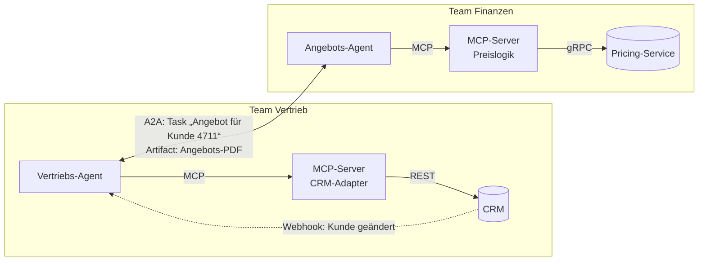

Die Grafik zeigt das Muster, das sich in großen Organisationen durchsetzt: Jedes Team betreibt seinen Agenten mit eigenen MCP-Servern vor eigenen Systemen. Die Teams verbinden sich über A2A, und die Agent Card ist dabei das, was früher das WSDL oder die OpenAPI-Datei war: der Vertrag, den man veröffentlicht, ohne Interna preiszugeben.

---

## 7. Agent und Oberfläche: AG-UI, A2UI und MCP Apps

Eine Lücke blieb lange offen: Wie kommt das, was ein Agent tut, *auf den Bildschirm*? Ein Chat-Fenster, das Text streamt, reicht nicht, sobald der Agent Formulare, Tabellen, Freigabe-Dialoge oder Fortschritt anzeigen soll. Drei Ansätze konkurrieren – alle jung.

  <article class="proto-card is-experimentell">
    
AG-UIExperimentell

    
CopilotKit, Mai 2025 · MIT · Version 0.0.x

    <dl>
      <dt>Verbindet</dt><dd>Agent-Backend ↔ Frontend</dd>
      <dt>Idee</dt><dd>ein <strong>Ereignisstrom</strong>: RUN_STARTED, TEXT_MESSAGE_CONTENT, TOOL_CALL_START/ARGS/END, STATE_SNAPSHOT/STATE_DELTA (JSON Patch) u. v. m.</dd>
      <dt>Transport</dt><dd>egal – SSE, WebSocket, Webhook</dd>
      <dt>Wer</dt><dd>LangGraph, CrewAI, Mastra, Google ADK, Microsoft Agent Framework, AWS Strands</dd>
    </dl>
    <ul><li><strong>Wann:</strong> eigene Web-Oberfläche über einem Agenten-Framework, die Zwischenstände, Tool-Aufrufe und geteilten Zustand live zeigen soll</li></ul>
  </article>
  <article class="proto-card is-experimentell">
    
A2UIExperimentell

    
Google, Dez 2025 · Apache 2.0 · v0.9.1 stabil, v1.0 als Release Candidate

    <dl>
      <dt>Verbindet</dt><dd>Agent ↔ Client-Oberfläche (Web, Flutter, Android/iOS geplant)</dd>
      <dt>Idee</dt><dd>der Agent beschreibt die <strong>Oberfläche deklarativ als JSON</strong>; der Client rendert aus einem Katalog nativer Komponenten – kein Code wird ausgeführt</dd>
      <dt>Transport</dt><dd>egal; als A2A-Erweiterung in einem DataPart (<code>application/a2ui+json</code>), über AG-UI oder in MCP Apps</dd>
    </dl>
    <ul><li><strong>Wann:</strong> ein fremder Agent soll in der eigenen App Oberflächen erzeugen, ohne dass man ihm HTML oder JavaScript erlaubt</li></ul>
  </article>
  <article class="proto-card is-experimentell">
    
MCP AppsExperimentell

    
MCP-Erweiterung (mit OpenAI), offiziell seit Jan 2026

    <dl>
      <dt>Verbindet</dt><dd>MCP-Server ↔ Host-Oberfläche</dd>
      <dt>Idee</dt><dd>der Server liefert eine <strong>HTML-Oberfläche</strong> mit, die der Host in einem Sandbox-iframe anzeigt</dd>
      <dt>Wer</dt><dd>Claude, ChatGPT, Goose, VS Code</dd>
    </dl>
    <ul><li><strong>Wann:</strong> ein MCP-Server soll in Chat-Produkten ein eigenes Widget zeigen (Karte, Diagramm, Formular)</li></ul>
  </article>

Die Unterschiede sind leicht zu merken: AG-UI standardisiert den **Strom** zwischen Backend und Frontend (was gerade passiert), A2UI standardisiert die **Beschreibung** der Oberfläche (was angezeigt werden soll), MCP Apps liefern **fertiges HTML** in einer Sandbox. Die drei schließen sich nicht aus – A2UI-Nachrichten können in AG-UI-Ereignissen transportiert werden.[^a2ui] Alle drei sind für die Bewertung „experimentell“: AG-UI ist noch bei Version 0.0.x,[^agui] A2UI hat seine 1.0 als Release Candidate mit Ziel Ende 2026,[^a2ui] MCP Apps ist wenige Monate alt.[^mcp-apps] Wer heute eine Oberfläche baut, sollte den Zugriff auf diese Protokolle in einer eigenen Schicht kapseln.

---

## 8. Agentische Zahlungen und agentischer Handel: x402, AP2, ACP, UCP

Sobald ein Agent nicht nur sucht, sondern *kauft*, stellt sich jede Frage aus Abschnitt 9 doppelt: Wer ist der Agent? In wessen Auftrag handelt er? Hat der Mensch genau *das* gewollt? Wer haftet, wenn nicht? Und wer ist Händler – der Shop oder die Plattform, in der der Agent läuft? Die Zahlungsprotokolle sind der Versuch, diese Fragen maschinenlesbar zu beantworten. Es sind vier Ansätze mit unterschiedlicher Herkunft, die sich seit Mitte 2026 gegenseitig annähern.

Zur Orientierung, wo die vier ansetzen:

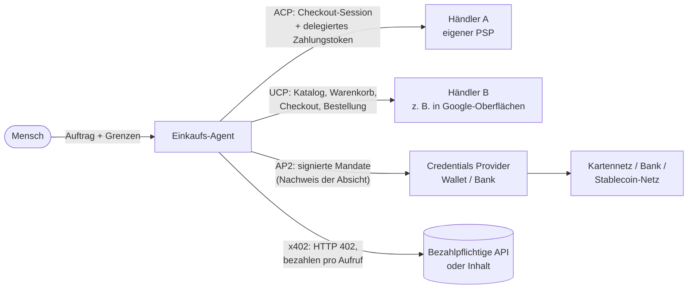

### 8.1 x402 – Bezahlen per HTTP-Statuscode

HTTP hat seit den Neunzigern einen reservierten Statuscode **402 Payment Required**, der nie standardisiert wurde. Coinbase hat ihn im Mai 2025 mit x402 wiederbelebt, gemeinsam mit AWS, Anthropic, Circle und NEAR als Startpartnern.[^x402-launch] Die Idee ist bestechend einfach: Ein Client fragt eine Ressource an, der Server antwortet mit 402 und einer maschinenlesbaren Zahlungsaufforderung, der Client signiert eine Zahlung und wiederholt die Anfrage, ein **Facilitator** prüft die Signatur und wickelt die Zahlung ab – und der Server liefert.[^x402-spec]

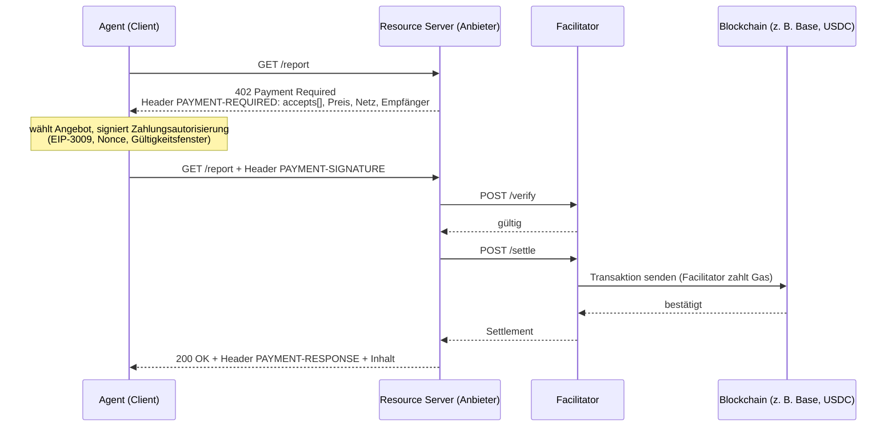

Was x402 ausmacht:

- **Kein Konto, keine Anmeldung, kein Abrechnungsvertrag.** Der Agent zahlt pro Aufruf mit einem Stablecoin (in der Praxis fast immer USDC) aus seiner Wallet. Das macht x402 zur ersten praktikablen Lösung für **Mikrozahlungen zwischen Maschinen** – ein API-Aufruf für einen Zehntelcent.
- **Version 2 seit Dezember 2025**: Die Zahlungsaufforderung wanderte aus dem Body in den Base64-kodierten Header `PAYMENT-REQUIRED`, die Signatur heißt `PAYMENT-SIGNATURE`, die Abrechnungsbestätigung `PAYMENT-RESPONSE`.[^x402-v2] Die Spezifikation ist transportunabhängig und definiert Bindungen für HTTP, MCP und A2A.[^x402-spec]
- **Schemes**: `exact` (fester Betrag), `upto` (Obergrenze, tatsächlicher Verbrauch wird abgerechnet), Batch-Settlement mit Gutscheinen. Der Facilitator kann Betrag und Empfänger nicht ändern, weil beides in der signierten Autorisierung steckt.[^x402-spec]
- **Governance**: Im September 2025 kündigten Coinbase und Cloudflare eine x402 Foundation an;[^x402-cf] am 2. April 2026 hat die Linux Foundation sie mit 22 Mitgliedern gestartet, darunter Adyen, AWS, American Express, Circle, Google, Mastercard, Microsoft, Shopify, Stripe und Visa; seit dem 14. Juli 2026 ist sie mit 40 Mitgliedern operativ.[^x402-lf] Das ist eine eigene Stiftung, nicht Teil der AAIF, die MCP trägt.
- **Zahlen**: Chainalysis zählte bis Ende des ersten Quartals 2026 über 100 Millionen x402-Transaktionen allein auf Base – mit dem Hinweis, dass ein großer Teil der Spitze Ende 2025 auf einen einzelnen Memecoin-Mint zurückging.[^chainalysis] Das kumulierte Volumen lag Mitte 2026 nach Coinbase-Angaben, die nur über Sekundärquellen belegt sind, bei rund 50 Millionen US-Dollar: sehr viele, sehr kleine Zahlungen.

Und die Grenzen:

- **Nur Krypto.** x402 kennt keine Karte, kein Lastschriftverfahren, kein Girokonto. Wer in Euro abrechnen will, braucht einen Euro-Stablecoin und einen Anbieter, der ihn annimmt. Unter MiCA sind USDC und EURC als E-Geld-Token in der EU zugelassen,[^circle-mica] die Abrechnung bleibt aber ein Krypto-Vorgang mit allen Buchhaltungs- und Compliance-Folgen – das ist meine Einschätzung, keine Aussage des Protokolls.
- **Keine Rückabwicklung.** Eine bestätigte Transaktion ist endgültig; Chargebacks, Streitfälle oder Rückerstattungen muss der Anbieter selbst anbieten.
- **Der Facilitator ist eine Vertrauensstelle außerhalb des Protokolls.** Eine auf der USENIX Security 2026 vorgestellte Untersuchung von 15 Facilitators fand in allen Verstöße und vier Angriffsklassen: kostenloser Bezug, Diebstahl von Guthaben, Blockieren des Dienstes, Missbrauch der Gasgebühren. Die Lücken wurden gemeldet, Coinbase hat Gegenmaßnahmen übernommen.[^usenix-x402] Eine weitere Arbeit zeigte, dass `/verify` zustandslos ist und einen Nachweis nicht reserviert, sodass er bei gleichzeitigen Anfragen mehrfach verwendet werden konnte.[^freeride]
- **Kein Nachweis menschlicher Absicht.** x402 beweist, dass eine Wallet gezahlt hat – nicht, dass ein Mensch diesen Kauf wollte. Genau diese Lücke füllt AP2.

Neben x402 gibt es seit März 2026 mit dem **Machine Payments Protocol (MPP)** von Stripe und Tempo einen zweiten HTTP-402-Ansatz, der statt eigener Header das HTTP-Auth-Schema `WWW-Authenticate: Payment` nutzt und neben Stablecoins auch Karten und Lightning als Zahlweg kennt; dazu gibt es einen individuellen IETF-Entwurf.[^mpp] Visa und Mastercard unterstützen beide Ansätze; für x402 selbst existiert kein IETF-Dokument.

### 8.2 AP2 – der Nachweis, dass der Mensch das wollte

Das **Agent Payments Protocol** hat Google am 16. September 2025 mit über sechzig Partnern vorgestellt – Adyen, American Express, Coinbase, Etsy, Mastercard, PayPal, Revolut, Salesforce, ServiceNow, UnionPay, Worldpay und andere.[^ap2-launch] AP2 ist bewusst zahlungsartagnostisch: Karten, Echtzeitüberweisungen und Stablecoins sind alle vorgesehen; für Krypto gibt es eine gemeinsam mit Coinbase gebaute A2A-x402-Erweiterung.[^a2a-x402]

Der Kern von AP2 sind **Mandate**: kryptografisch signierte, überprüfbare Nachweise darüber, was der Nutzer erlaubt hat. In der Startversion hießen sie Intent Mandate (Vorab-Auftrag mit Grenzen, für den Fall „Mensch nicht anwesend“), Cart Mandate (der Nutzer signiert den exakten Warenkorb) und Payment Mandate (verknüpft die Zahlungsart mit dem Kauf).[^ap2-launch] Die aktuelle Spezifikation v0.2 vom April 2026 hat das Modell auf zwei Mandat-Typen zusammengezogen, jeweils in einem *offenen* Zustand (mit Bedingungen, vom Nutzer signiert) und einem *geschlossenen* Zustand (final): das **Checkout Mandate** als Nachweis gegenüber dem Händler und das **Payment Mandate** als Nachweis gegenüber Wallet, Zahlungsnetz und Zahlungsabwickler des Händlers. Technisch sind es SD-JWT Verifiable Credentials mit Schlüsselbindung, wie sie aus der digitalen Identität bekannt sind.[^ap2-spec]

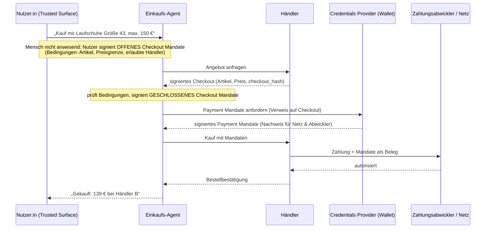

Was AP2 ausmacht: Es beantwortet die Frage nach **Autorisierung, Authentizität und Verantwortlichkeit** mit einem nicht abstreitbaren Beleg, den alle Beteiligten – Händler, Wallet, Kartennetz, Bank – prüfen können. Der Unterschied „Mensch anwesend“ (der Nutzer bestätigt den finalen Warenkorb) versus „Mensch nicht anwesend“ (der Agent schließt innerhalb vorab signierter Grenzen selbst ab) ist explizit im Protokoll abgebildet.[^ap2-spec] Und AP2 ist kein eigener Transport, sondern läuft als Erweiterung über A2A, MCP oder UCP.

Zur Reife: AP2 steht bei Version 0.2. Am 28. April 2026 hat Google das Protokoll an die **FIDO Alliance** übergeben, Mastercard hat sein kompatibles „Verifiable Intent“ beigesteuert. Die FIDO Alliance hat dafür zwei Arbeitsgruppen gegründet – eine zur Agenten-Authentifizierung mit Vorsitzenden von CVS Health, Google und OpenAI, eine zu Zahlungen unter Vorsitz von Mastercard und Visa.[^fido] Das ist bemerkenswert: Es ist das erste Gremium, in dem OpenAI, Google und beide Kartennetze gemeinsam an einem Zahlungsstandard für Agenten arbeiten. Produktiv genutzt wird AP2 heute vor allem als Mandat-Erweiterung von UCP (Abschnitt 8.4).

### 8.3 ACP – der Checkout im Chat (OpenAI und Stripe)

Das **Agentic Commerce Protocol** – nicht zu verwechseln mit IBMs gleichnamigem, inzwischen in A2A aufgegangenem Agentenprotokoll – haben OpenAI und Stripe am 29. September 2025 veröffentlicht, zusammen mit dem Produkt **Instant Checkout** in ChatGPT: Nutzer in den USA konnten Artikel von Etsy-Verkäufern, später von Shopify-Händlern, direkt im Chat kaufen.[^acp-launch] ACP ist Apache-2.0-lizenziert; die Governance liegt bei OpenAI und Stripe mit dem erklärten Ziel einer neutralen Stiftung, die es bisher nicht gibt.[^acp-repo]

ACP besteht aus mehreren Teilen, die zusammen den Weg von der Produktsuche bis zur Bestellung abdecken (aktueller Stand der Spezifikation: 2026-04-17):[^acp-repo]

- Ein **Produkt-Feed**, mit dem Händler ihren Katalog an die KI-Plattform liefern.
- Eine **Checkout-API** mit Sitzungen: anlegen, aktualisieren, abschließen, abbrechen – der Händler bleibt Betreiber des Checkouts und **Merchant of Record**; die Plattform ist nie Vertragspartner des Kaufs.
- **Delegated Payment**: Der Zahlungsdienstleister des Nutzers stellt ein einmal nutzbares, auf Betrag, Währung, Händler, Sitzung und Ablaufzeit begrenztes Token aus (bei Stripe „Shared Payment Token“), das der Händler über seinen eigenen Zahlungsdienstleister einlöst. Die Kartendaten verlassen die Wallet nie.
- Seit 2026: Discovery über `/.well-known/acp.json`, Pflicht-Idempotenzschlüssel, Warenkorb-API, 3-D-Secure-Delegation, Bestell- und Rückgabe-Objekte und eine **MCP-Bindung** mit fünf Checkout-Tools.

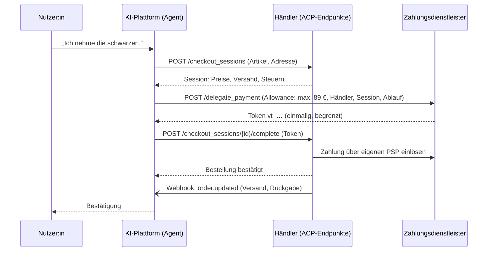

Der wichtigste Punkt für die Einordnung: Das Protokoll lebt, das Produkt hat sich verändert. Im März 2026 hat OpenAI Instant Checkout zurückgenommen – die erste Version habe „nicht die Flexibilität geboten, die wir anstreben“ – und lässt Händler seitdem ihre eigene Checkout-Erfahrung in ChatGPT einbetten, während OpenAI sich auf die Produktsuche konzentriert.[^acp-retire] Berichte nennen als Gründe eine geringe Zahl angebundener Händler und schwache Abschlussquoten; das sind Sekundärquellen. Die ACP-Spezifikation ist danach trotzdem weiter gewachsen (die Revision 2026-04-17 kam nach der Rücknahme), PayPal hat sich per Partnerschaft angebunden, Händler wie Target und Sephora nutzen ACP Berichten zufolge für die Produktsuche, und Visa hat im Juni 2026 eine Zusammenarbeit mit OpenAI angekündigt, die Kaufgrenzen und Händlerlisten des Nutzers in ChatGPT bringen soll.[^paypal-acp]

### 8.4 UCP – der Google-Weg, mit den Händlern

Das **Universal Commerce Protocol** hat Google am 11. Januar 2026 auf der Handelsmesse NRF vorgestellt, gemeinsam mit Shopify, Etsy, Wayfair, Target und Walmart entwickelt und von über zwanzig weiteren Unternehmen unterstützt, darunter Adyen, American Express, Best Buy, Mastercard, Stripe, Visa und Zalando.[^ucp-launch] UCP ist der Versuch, den *gesamten* Handelsvorgang zu standardisieren, nicht nur die Zahlung: Katalog-Suche, Warenkorb, Checkout, Identitätsverknüpfung per OAuth 2.0, Bestell-Lebenszyklus mit Webhooks und Zahlungstoken-Austausch. Es ist modular aus **Capabilities** und **Extensions** aufgebaut und läuft über REST, MCP oder A2A. Die AP2-Mandate sind als Erweiterung `dev.ucp.shopping.ap2_mandate` eingebunden.[^ucp-repo]

Anders als ACP ist UCP vom ersten Tag an produktiv: Der Checkout im KI-Modus der Google-Suche und in der Gemini-App läuft in den USA über UCP und Google Pay; Händler binden sich über das Merchant Center an. Im Mai 2026 kündigte Google den „Universal Cart“ über Suche, Gemini, YouTube und Gmail an, dazu Hotels, Lieferdienste und die Ausweitung auf Kanada, Australien und Großbritannien.[^ucp-gml] Die Spezifikation wird schnell weiterentwickelt: Die Version 2026-08-25 brachte Branchen-Erweiterungen für Gastronomie und Hotels, Ratenzahlung, Loyalty-Programme und eine Überarbeitung der Käufer-Einwilligung – mit Breaking Changes.[^ucp-repo]

### 8.5 Die Kartennetze: Visa, Mastercard und der Nachweis, wer da einkauft

Parallel zu den Protokollen der Plattformen bauen die Kartennetze ihre eigene Infrastruktur. Sie beantworten eine Frage, die keines der vier Protokolle allein löst: **Wie erkennt ein Händler, dass der Besucher ein legitimer Agent ist und nicht ein Bot?**

- **Visa Intelligent Commerce** (April 2025) führt „AI-Ready Cards“ ein – tokenisierte Kartendaten, die an einen Agenten gebunden werden.[^visa-ic] Das **Trusted Agent Protocol** (Oktober 2025, mit Cloudflare) lässt Agenten ihre HTTP-Anfragen nach **RFC 9421 HTTP Message Signatures** signieren; Händler prüfen die Signatur gegen ein von Visa betriebenes Schlüsselverzeichnis und bekommen dabei Absicht des Agenten und Wiedererkennung des Kunden mitgeliefert.[^visa-tap]
- **Mastercard Agent Pay** (April 2025) arbeitet mit „Agentic Tokens“: Ein Kartentoken wird an Agent, Händler und die erteilte Zustimmung gebunden.[^mc-agentpay] Mastercard hat sein „Verifiable Intent“ gemeinsam mit AP2 in die FIDO Alliance eingebracht[^fido] und im Juni 2026 „Agent Pay for Machines“ für Zahlungen zwischen Maschinen vorgestellt, das mit x402 und MPP kompatibel sein soll.[^mc-machines]
- Die technische Basis für die Agenten-Erkennung ist **Web Bot Auth**: ein Satz IETF-Entwürfe von Cloudflare und Google, seit Oktober 2025 mit eigener Arbeitsgruppe, bei dem sich ein Agent mit einem Ed25519-Schlüssel ausweist, der unter `/.well-known/http-message-signatures-directory` veröffentlicht ist.[^webbotauth] Cloudflare setzt es produktiv ein; die Dokumente sind noch individuelle Entwürfe.

### 8.6 Vergleich und Einordnung

| | x402 | AP2 | ACP | UCP |
|---|---|---|---|---|
| **Träger** | x402 Foundation (Linux Foundation), von Coinbase | FIDO Alliance, von Google | OpenAI + Stripe | Google + Shopify, Etsy, Wayfair, Target, Walmart |
| **Löst** | Bezahlen pro Aufruf ohne Konto | Nachweis der menschlichen Absicht | Checkout in einer KI-Plattform | den ganzen Handelsvorgang |
| **Geld** | Stablecoins on-chain | agnostisch (Karte, Überweisung, Krypto via x402) | Fiat über delegiertes Token beim PSP | Fiat über Google Pay und Zahlungs-Handler |
| **Merchant of Record** | Anbieter der Ressource | Händler | Händler, nie die Plattform | Händler |
| **Nachweis der Absicht** | keiner, nur Wallet-Signatur | signierte offene/geschlossene Mandate (SD-JWT VC) | Checkout-Session + begrenzte Allowance | OAuth-Identität + optional AP2-Mandat |
| **Streitfälle** | keine, endgültig | bestehende Netzregeln, Mandate als Beweis | bestehende Kartennetz-Regeln, Rückgabe-Objekte | bestehende Regeln, Bestell-Capability |
| **Transport** | HTTP-Header; Bindungen für MCP, A2A | Erweiterung über A2A, MCP, UCP | REST + Webhooks; MCP-Bindung | REST, MCP, A2A |
| **Reife (Sep 2026)** | produktiv für Mikrozahlungen, geringe Volumina, Facilitator-Angriffe belegt | v0.2, Standardisierung bei FIDO begonnen | Spezifikation aktiv, Vorzeigeprodukt zurückgenommen | produktiv in Google-Oberflächen (USA), schnelle Breaking Changes |

Meine Einordnung: Die vier stehen weniger in Konkurrenz, als es die Ankündigungen vermuten lassen. x402 und AP2 lösen orthogonale Probleme (Zahlen ohne Konto versus Beweis der Absicht) und werden gemeinsam eingesetzt. ACP und UCP sind die Handelsprotokolle *der jeweiligen Plattform* – wer in ChatGPT verkaufen will, kommt an ACP nicht vorbei, wer in Google-Oberflächen verkaufen will, nicht an UCP. Die Zahlungsdienstleister überbrücken das: PayPal und Stripe sprechen beide,[^paypal-acp] Visa und Mastercard sitzen in allen Gremien. Für ein Unternehmen, das heute plant, ist deshalb nicht die Protokollwahl entscheidend, sondern die Frage, ob der eigene Checkout, der Katalog und die Bestellprozesse **so gebaut sind, dass sich jede dieser Bindungen als dünne Schicht davorlegen lässt**: sauber getrennte Preisberechnung, idempotente Bestellanlage, Zahlungstoken statt Kartendaten, ein Bestellstatus, der per Webhook nach außen geht. Genau das sind die klassischen API-Tugenden aus Abschnitt 3.

---

## 9. Querschnittsthemen: Authentifizierung, Autorisierung und die anderen Pain Points

Egal welches Protokoll: In der Praxis scheitern Integrationen selten an der Nachrichtenstruktur und fast immer an den Themen, die quer dazu liegen. Das erste und wichtigste ist die Identität.

### 9.1 Authentifizierung und Autorisierung: der Standard ist OAuth

Der Standard für Autorisierung im Web ist seit 2012 **OAuth 2.0** (RFC 6749) mit Bearer-Tokens (RFC 6750).[^oauth2] Über die Jahre kam eine Familie von Ergänzungen dazu: PKCE gegen das Abfangen von Autorisierungscodes (RFC 7636), Discovery-Metadaten (RFC 8414), Resource Indicators (RFC 8707), Token Exchange (RFC 8693), DPoP für an Schlüssel gebundene Tokens (RFC 9449) und zuletzt Protected Resource Metadata (RFC 9728, April 2025).[^oauth-family] **OAuth 2.1** fasst die Best Practices zusammen – PKCE Pflicht, Implicit- und Password-Flow gestrichen –, ist aber bis heute ein Internet-Draft (Stand: Entwurf 16 vom 2. September 2026) und kein RFC.[^oauth21] Für Authentifizierung, also die Frage *wer* jemand ist, liegt darüber **OpenID Connect**.[^oidc]

So setzen die Protokolle das um:

| Protokoll | Was der Standard vorschreibt | Typische Praxis |
|---|---|---|
| **REST / GraphQL** | nichts – OpenAPI kann Schemata *beschreiben* (apiKey, http, oauth2, openIdConnect, mutualTLS) | OAuth 2.0 Bearer-Tokens, API-Keys, mTLS zwischen Diensten |
| **SOAP** | WS-Security: Signatur und Verschlüsselung der Nachricht selbst (OASIS, 2004–2012)[^wss] | X.509-Zertifikate, SAML-Tokens im Header |
| **gRPC** | nichts vorgeschrieben; Token als Metadaten, TLS/mTLS eingebaut | mTLS im Service-Mesh, JWT in Metadaten |
| **Webhooks** | Standard Webhooks: HMAC-SHA256 über `id.timestamp.payload`, Header `webhook-id`, `webhook-timestamp`, `webhook-signature`[^stdwebhooks] | providerspezifische Signaturen (GitHub, Stripe), Zeitfenster gegen Replay |
| **MCP** | **OAuth 2.1 Pflicht** für HTTP; Server = Resource Server mit RFC 9728; PKCE, RFC 8707, RFC 9207 Pflicht; CIMD bevorzugt; stdio: Umgebung[^mcp-auth] | Authorization Code + PKCE; im Unternehmen Cross App Access über den IdP |
| **A2A** | **deklariert** in der Agent Card: API-Key, HTTP, OAuth 2 (ohne Implicit/Password), OIDC, mTLS; Card optional JWS-signiert[^a2a-spec] | Bearer-Tokens aus dem Unternehmens-IdP; mTLS zwischen Organisationen |
| **AG-UI / A2UI** | nichts – Sache des Transports | Sitzung der Web-App |
| **x402** | kryptografische Signatur der Zahlung (EIP-712/EIP-3009); optional HTTP Message Signatures[^x402-spec] | Wallet-Schlüssel des Agenten |
| **AP2** | SD-JWT Verifiable Credentials mit Schlüsselbindung; Delegation per OpenID4VP oder Trusted Agent Provider[^ap2-spec] | Wallet/Passkey des Nutzers auf einer vertrauenswürdigen Oberfläche |
| **ACP** | Bearer-Tokens zwischen Plattform und Händler; delegierte Zahlungstoken mit Allowance[^acp-repo] | API-Keys pro Händler, Webhook-Signaturen |
| **UCP** | Identitätsverknüpfung per OAuth 2.0 (Scopes); Signaturen für Nachrichten[^ucp-repo] | Google-Konto ↔ Händlerkonto |
| **Web Bot Auth / Visa TAP** | RFC 9421 HTTP Message Signatures mit veröffentlichtem Schlüssel[^webbotauth] | Cloudflare-Verifikation, Visa-Schlüsselverzeichnis |

Der Befund ist eindeutig: **MCP ist das am stärksten standardisierte Protokoll dieser Liste**, was Anmeldung angeht. Es schreibt nicht nur OAuth vor, sondern legt bis ins Detail fest, wie Discovery, Registrierung und Token-Bindung funktionieren. Das ist ein Grund, warum MCP in Unternehmensumgebungen so schnell akzeptiert wurde: Die IAM-Abteilung erkennt jeden Baustein wieder. A2A ist flexibler, verlagert aber die Verantwortung auf den Implementierer. Und die klassischen Protokolle haben nie etwas vorgeschrieben – REST-APIs mit Basic Auth und unbefristeten API-Keys gibt es bis heute zuhauf.

### 9.2 Das eigentliche Problem: Im Auftrag von wem?

Die klassische Frage in Service-Landschaften lautet: Ruft Dienst B den Dienst C als *sich selbst* auf (Client Credentials, Service-Identität) oder *im Auftrag* des Nutzers, der A angestoßen hat? Bei Agenten wird sie zur zentralen Sicherheitsfrage, weil ein Agent Werkzeuge aufruft, die er selbst ausgewählt hat – auf Basis von Text, der manipuliert sein könnte.

Zwei Muster, die man auseinanderhalten muss:

- **Impersonation**: Der Agent tritt *als* der Nutzer auf, mit dessen vollem Token. Bequem, aber gefährlich: Jede Prompt Injection wirkt dann mit allen Rechten des Menschen.
- **Delegation**: Der Agent bekommt ein eigenes, eingeschränktes Token, in dem steht, *für wen* und *wofür* er handelt. Das ist der Zweck von **Token Exchange (RFC 8693)**: Ein Token wird gegen ein anderes mit anderer Zielgruppe und anderem Umfang eingetauscht, und das Ergebnis trägt einen `act`-Claim, der die Delegationskette dokumentiert.[^rfc8693]

Genau hier setzt die aktuelle Standardisierungsarbeit an. Der IETF-Entwurf **Identity Assertion Authorization Grant** (Okta, Ping; Entwurf 04 vom Mai 2026) – die Basis von MCPs Enterprise-Managed Authorization – lässt den Unternehmens-IdP aus einer Anmeldung Tokens für Drittdienste ausstellen, ohne Nutzer-Passwörter oder Zustimmungsdialoge pro Dienst.[^idjag] Der Entwurf **Identity and Authorization Chaining Across Domains** (Entwurf 17, Juli 2026) beschreibt dasselbe über Vertrauensgrenzen hinweg – also genau den A2A-Fall.[^idchain] Beide sind Arbeitsgruppen-Dokumente, keine RFCs. Wer heute baut, sollte Delegation mit RFC 8693 umsetzen und den Agenten als *eigenen* Principal führen: mit eigener Identität, eigenen Scopes und einem Audit-Log, das den Menschen dahinter nennt.

> **💡 Faustregel:** Ein Agent bekommt nie das Token des Menschen. Er bekommt ein eigenes, kurzlebiges Token mit den Rechten, die die Aufgabe braucht – ausgestellt von einem IdP, der weiß, dass da ein Agent handelt. Das ist die Übersetzung des Least-Privilege-Prinzips und der [Lethal Trifecta](/blog/how-to-mislead-ai/#5-vom-chatbot-zum-agenten--die-lethal-trifecta) in IAM-Sprache.

### 9.3 Die übrigen Pain Points

Sechs Themen, die jedes Protokoll treffen – und wie die neuen damit umgehen:

| Pain Point | Klassisch | MCP | A2A |
|---|---|---|---|
| **Discovery** – wie finde ich die Gegenstelle und ihren Vertrag? | OpenAPI-Datei, API-Portal, WSDL | `tools/list` u. a. zur Laufzeit; offizielle Registry (Preview); seit 2026-07-28 `server/discover`[^mcp-2026-07] | Agent Card unter `/.well-known/`; Registries sind außerhalb der Spezifikation |
| **Lange Vorgänge** | 202 Accepted + Polling oder Webhook | Streaming per SSE; Tasks-Erweiterung mit Zuständen[^mcp-tasks] | Task-Lebenszyklus, Streaming, Push-Benachrichtigungen[^a2a-streaming] |
| **Fehler** | HTTP-Statuscodes, Problem Details (RFC 9457) | JSON-RPC-Fehler plus `isError` im Tool-Ergebnis, damit das Modell lesbaren Text bekommt | `google.rpc.Status`-Fehler; Zustände FAILED/REJECTED |
| **Versionierung** | URL-Pfad, Header, Semantic Versioning | datierte Revisionen, seit 2026-07-28 mit 12-Monats-Deprecation-Politik[^mcp-2026-07] | `protocolVersion` je Schnittstelle in der Card |
| **Beobachtbarkeit** | Logs, Traces, Metriken pro Aufruf | `Mcp-Method`/`Mcp-Name`-Header für Gateways; sonst Sache des Hosts | Task-IDs und Kontext-IDs als Korrelation |
| **Angriffsfläche** | Injection, BOLA (OWASP API Top 10)[^owasp-api] | Tool Poisoning, Rug Pulls, Prompt Injection über Ergebnisse[^invariant] | Goal Hijack, unsichere Agent-zu-Agent-Kommunikation, „Rogue Agents“ (OWASP Top 10 für agentische Anwendungen)[^owasp-agentic] |

Der letzte Punkt verdient einen Satz mehr. OWASP hat im Dezember 2025 eine eigene Top-10-Liste für agentische Anwendungen veröffentlicht; darin sind *unsichere Kommunikation zwischen Agenten* und *Rogue Agents* eigene Kategorien.[^owasp-agentic] Die klassischen Kontrollen – Netzsegmentierung, Least Privilege, Signaturen, Audit – gelten weiter. Neu ist, dass die *Inhalte* der Kommunikation Angriffsvektor sind, nicht nur der Kanal. Kein Protokoll dieser Liste kann das lösen; sie können nur dafür sorgen, dass ein Angriff nicht mehr Rechte bekommt, als die Aufgabe braucht.

---

## 10. Entscheidungsbaum: Wann nutze ich was?

Der folgende Baum fasst die Empfehlungen dieses Beitrags zusammen. Er ist bewusst konservativ: Im Zweifel gewinnt das ältere, besser verstandene Protokoll. Er ist in zwei Teile geteilt, damit er auch auf dem Handy lesbar bleibt.

**Teil 1 – kein Sprachmodell als Aufrufer:**

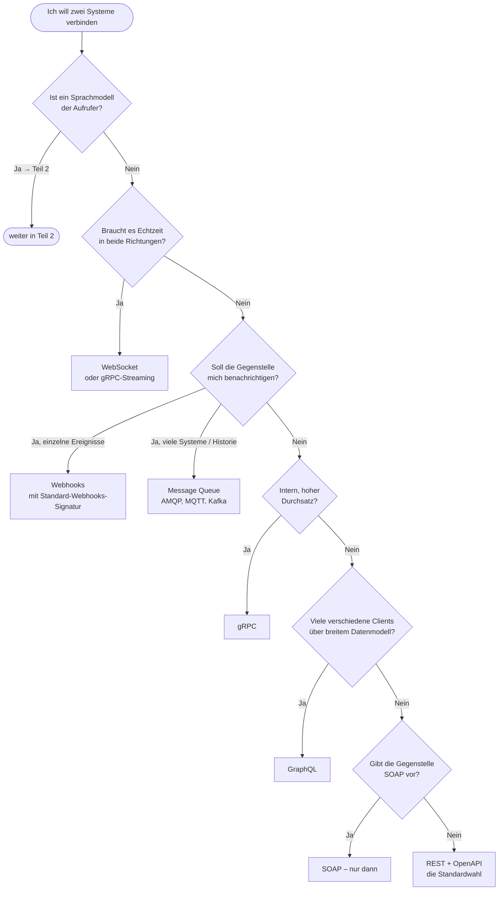

**Teil 2 – ein Sprachmodell ist der Aufrufer:**

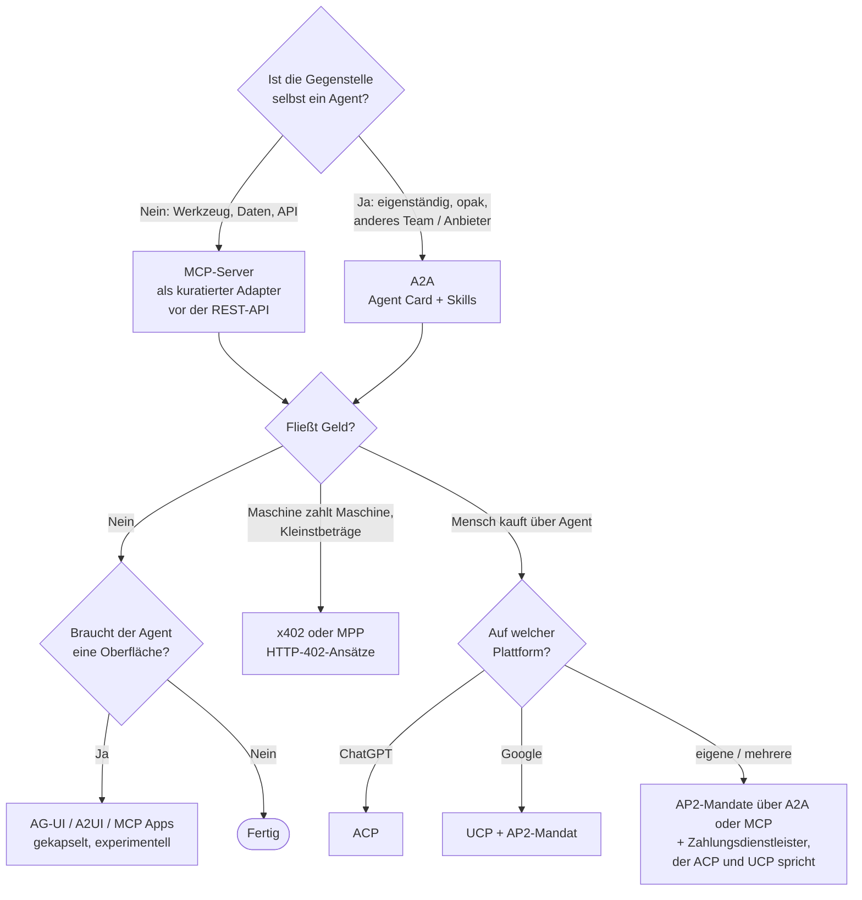

Ein paar Ergänzungen zum Baum, die ein Diagramm nicht tragen kann:

- **„Ist ein Sprachmodell der Aufrufer?“** ist die entscheidende Weiche. Sie ist mit Nein zu beantworten, wenn die Logik deterministisch ist – auch dann, wenn ein Modell *irgendwo* im System steckt. Ein Agent, der am Ende einen Bestellauftrag an die Warenwirtschaft übergibt, sollte das über die bestehende REST-API tun, nicht über einen zweiten Agenten.
- **MCP vor der eigenen API** heißt: kuratieren. Fünf Tools mit guten Beschreibungen schlagen fünfzig automatisch generierte.
- **A2A über Organisationsgrenzen** funktioniert nur mit geklärter Identität. Bevor man die erste Agent Card veröffentlicht, sollte feststehen, welcher IdP welche Tokens ausstellt und wie die Delegationskette im Audit-Log aussieht (Abschnitt 9.2).
- **Bei Geld gilt: Bindungen kapseln.** Jedes der vier Zahlungsprotokolle hat 2026 Breaking Changes gehabt. Ein Checkout, der sauber in Katalog, Warenkorb, Zahlung und Bestellung getrennt ist, überlebt sie; einer, der um ein bestimmtes Protokoll herumgebaut ist, nicht.

---

## 11. Fazit

Die agentischen Protokolle erfinden die Kommunikation nicht neu. Sie laufen über dieselben Leitungen wie alles andere – HTTP, JSON, TLS – und übernehmen die Muster, die REST, Webhooks und Message Queues seit Jahrzehnten vorleben: Anfrage und Antwort, Streaming, Push, Zustandsautomaten für lange Vorgänge. Neu ist die Bedeutungsebene: **Werkzeuge mit Beschreibung**, die ein Modell zur Laufzeit auswählt (MCP); **Aufgaben und Fähigkeiten**, die ein Agent an einen anderen delegiert, ohne dessen Innenleben zu kennen (A2A); **Mandate**, die beweisen, dass ein Mensch einen Kauf wollte (AP2); und ein **HTTP-Statuscode**, der nach dreißig Jahren endlich eine Bedeutung bekommt (x402).

Drei Dinge sollte man aus diesem Beitrag mitnehmen:

1. **Die Ebenen trennen.** JSON ist kein Protokoll, HTTP ist kein Protokoll im hier gemeinten Sinn, und MCP ist keine Alternative zu XML. Wer die drei Ebenen sauber auseinanderhält, führt bessere Architekturgespräche.
2. **Reife ernst nehmen.** MCP und A2A sind unter zwei Jahre alt, haben aber Stiftungs-Governance, mehrere SDKs und produktiven Einsatz – man kann darauf bauen, sollte aber die Revisionen verfolgen. AG-UI, A2UI, x402, AP2, ACP und UCP sind spannend und teils produktiv, aber in Bewegung: kapseln, nicht einbetonieren. REST, Webhooks, gRPC und Message Queues bleiben für alles ohne Sprachmodell die richtige Wahl.
3. **Identität zuerst.** Die Frage „im Auftrag von wem handelt dieser Agent, mit welchen Rechten, und wo steht das?“ entscheidet mehr über Sicherheit und Skalierbarkeit als jede Protokollwahl. MCP hat sie mit OAuth 2.1 am gründlichsten beantwortet, A2A überlässt sie dem Implementierer, und die Zahlungsprotokolle zeigen, wie viel Aufwand ein belastbarer Nachweis der Absicht kostet.

Wer diese drei Dinge beachtet, kann jedes der hier beschriebenen Protokolle einsetzen – und, wichtiger, wieder ablösen, wenn das nächste kommt.

---

## Einen Workshop dazu buchen

Die Protokolllandschaft, die OAuth-Tokenflows im Detail und die Skalierungsprobleme aus echten Umgebungen sind Bausteine meiner [Bildungsangebote für Unternehmen und Universitäten](/companies/): zugeschnitten auf die eigene Rolle, das ganze Unternehmen oder einen konkreten Engpass. [Melde dich](/#kontakt), wenn du das Thema mit deinem Team vertiefen willst.

---

## 12. Quellen

Jede Quelle ist mit ihrem **Veröffentlichungsdatum** und dem **Abrufdatum (11.09.2026)** versehen. Bei Spezifikationen, die laufend überarbeitet werden, ist die zitierte Revision genannt. Das Feld bewegt sich schnell – im Zweifel die aktuelle Fassung heranziehen.

[^json]: T. Bray (Hrsg.), „The JavaScript Object Notation (JSON) Data Interchange Format“, RFC 8259 / STD 90, IETF. *Veröffentlicht Dezember 2017; abgerufen 11.09.2026.* <https://www.rfc-editor.org/rfc/rfc8259>

[^xml]: W3C, „Extensible Markup Language (XML) 1.0 (Fifth Edition)“, W3C Recommendation. *Veröffentlicht 26.11.2008; abgerufen 11.09.2026.* <https://www.w3.org/TR/xml/>

[^cbor]: C. Bormann, P. Hoffman, „Concise Binary Object Representation (CBOR)“, RFC 8949 / STD 94, IETF. *Veröffentlicht Dezember 2020; abgerufen 11.09.2026.* <https://www.rfc-editor.org/rfc/rfc8949>

[^mcp-tools]: Model Context Protocol, Spezifikation, Abschnitt „Tools“ (`inputSchema` und `outputSchema` als JSON Schema, Standard 2020-12 seit SEP-1613). *Revision 2025-11-25 / 2026-07-28; abgerufen 11.09.2026.* <https://modelcontextprotocol.io/specification/2026-07-28/server/tools>

[^fielding]: R. T. Fielding, „Architectural Styles and the Design of Network-based Software Architectures“, Dissertation, University of California, Irvine, Kapitel 5 „Representational State Transfer (REST)“. *Veröffentlicht 2000; abgerufen 11.09.2026.* <https://ics.uci.edu/~fielding/pubs/dissertation/rest_arch_style.htm> · Zur Einordnung der Reifegrade: M. Fowler, „Richardson Maturity Model“, 18.03.2010, <https://martinfowler.com/articles/richardsonMaturityModel.html>

[^jsonrpc]: JSON-RPC Working Group, „JSON-RPC 2.0 Specification“. *Ursprungsdatum 26.03.2010, zuletzt aktualisiert 04.01.2013; abgerufen 11.09.2026.* <https://www.jsonrpc.org/specification>

[^http]: IETF HTTP Working Group: RFC 9110 „HTTP Semantics“, RFC 9112 „HTTP/1.1“, RFC 9113 „HTTP/2“, RFC 9114 „HTTP/3“. *Alle veröffentlicht Juni 2022; abgerufen 11.09.2026.* <https://www.rfc-editor.org/rfc/rfc9110> · QUIC: RFC 9000, Mai 2021, <https://www.rfc-editor.org/rfc/rfc9000> · TLS 1.3: RFC 8446, August 2018, <https://www.rfc-editor.org/rfc/rfc8446>

[^ws]: I. Fette, A. Melnikov, „The WebSocket Protocol“, RFC 6455, IETF. *Veröffentlicht Dezember 2011; abgerufen 11.09.2026.* <https://www.rfc-editor.org/rfc/rfc6455>

[^sse]: WHATWG, „HTML Living Standard“, Abschnitt „Server-sent events“. *Living Standard; abgerufen 11.09.2026.* <https://html.spec.whatwg.org/multipage/server-sent-events.html>

[^mcp-transports]: Model Context Protocol, Spezifikation 2026-07-28, „Transports“ (stdio, Streamable HTTP). *Veröffentlicht 28.07.2026; abgerufen 11.09.2026.* <https://modelcontextprotocol.io/specification/2026-07-28/basic/transports>

[^a2a-mcp]: A2A Project, „A2A and MCP“ (Themenseite der Dokumentation: MCP „vertikal“, A2A „horizontal“). *Abgerufen 11.09.2026.* <https://a2a-protocol.org/latest/topics/a2a-and-mcp/>

[^a2a-streaming]: A2A Project, „Streaming & Asynchronous Operations“ (SSE-Streaming, Polling, Push-Benachrichtigungen an Webhooks). *Abgerufen 11.09.2026.* <https://a2a-protocol.org/latest/topics/streaming-and-async/>

[^postman]: Postman, „2025 State of the API Report“ (7. Ausgabe, über 5.700 Befragte: REST 93 %, Webhooks 50 %, WebSockets 35 %, GraphQL 33 %; MCP: 70 % kennen es, 10 % nutzen es regelmäßig). *Veröffentlicht Oktober 2025; abgerufen 11.09.2026.* <https://www.postman.com/state-of-api/2025/>

[^mcp-aaif]: Model Context Protocol Blog, „MCP joins the Agentic AI Foundation“ (Gründung durch Anthropic, Block und OpenAI unter der Linux Foundation; 97 Mio. monatliche SDK-Downloads). *Veröffentlicht 09.12.2025; abgerufen 11.09.2026.* <https://blog.modelcontextprotocol.io/posts/2025-12-09-mcp-joins-agentic-ai-foundation/>

[^openai-mcp]: OpenAI, „openai-agents-python“ Release v0.0.7 (MCP-Unterstützung im Agents SDK). *Veröffentlicht 26.03.2025; abgerufen 11.09.2026.* <https://github.com/openai/openai-agents-python/releases/tag/v0.0.7>

[^google-mcp]: Google Cloud Blog, „Announcing official MCP support for Google services“ (verwaltete Remote-MCP-Server für Maps, BigQuery, Compute Engine, GKE). *Veröffentlicht 10.12.2025; abgerufen 11.09.2026.* <https://cloud.google.com/blog/products/ai-machine-learning/announcing-official-mcp-support-for-google-services>

[^mcp-spec]: Model Context Protocol, „Specification 2026-07-28“ (Architektur, Primitive Tools/Resources/Prompts/Elicitation, JSON-RPC 2.0). *Veröffentlicht 28.07.2026; abgerufen 11.09.2026.* <https://modelcontextprotocol.io/specification/2026-07-28>

[^mcp-2025-11]: Model Context Protocol Blog, „One Year of MCP: November 2025 Spec Release“ (Tasks, CIMD, URL-Elicitation, Erweiterungsmodell, Registry-Zahlen). *Veröffentlicht 25.11.2025; abgerufen 11.09.2026.* <https://blog.modelcontextprotocol.io/posts/2025-11-25-first-mcp-anniversary/>

[^mcp-2026-07]: Model Context Protocol Blog, „The 2026-07-28 Specification“ und zugehöriges Changelog (zustandsloser Kern, Multi Round-Trip Requests, `Mcp-Method`/`Mcp-Name`, Tasks als Erweiterung, Deprecation von Roots, Sampling, Logging, HTTP+SSE und Dynamic Client Registration). *Veröffentlicht 28.07.2026; abgerufen 11.09.2026.* <https://blog.modelcontextprotocol.io/posts/2026-07-28/> · Changelog: <https://modelcontextprotocol.io/specification/2026-07-28/changelog>

[^mcp-tasks]: Model Context Protocol, Erweiterung „Tasks“ (`io.modelcontextprotocol/tasks`: Zustände, `tasks/get`, `tasks/update`, `tasks/cancel`). *Abgerufen 11.09.2026.* <https://modelcontextprotocol.io/extensions/tasks/overview>

[^mcp-apps]: Model Context Protocol Blog, „MCP Apps“ (Ankündigung mit OpenAI, 21.11.2025) und „MCP Apps is now an official extension“ (26.01.2026). *Abgerufen 11.09.2026.* <https://blog.modelcontextprotocol.io/posts/2025-11-21-mcp-apps/> · <https://blog.modelcontextprotocol.io/posts/2026-01-26-mcp-apps/>

[^mcp-auth]: Model Context Protocol, Spezifikation 2026-07-28, „Authorization“ und „Client Registration“ (OAuth 2.1 draft-13, RFC 9728, RFC 8414, OIDC Discovery, PKCE, RFC 8707, RFC 9207, Client ID Metadata Documents; stdio-Server holen Zugangsdaten aus der Umgebung). *Veröffentlicht 28.07.2026; abgerufen 11.09.2026.* <https://modelcontextprotocol.io/specification/2026-07-28/basic/authorization>

[^mcp-ema]: Model Context Protocol Blog, „Enterprise-Managed Authorization: Zero-touch OAuth for MCP“ (SEP-990, Cross App Access / Identity Assertion Authorization Grant; Unterstützer Okta, Anthropic, VS Code, Atlassian, Figma, Linear u. a.). *Veröffentlicht 18.06.2026; abgerufen 11.09.2026.* <https://blog.modelcontextprotocol.io/posts/enterprise-managed-auth/>

[^invariant]: Invariant Labs, „MCP Security Notification: Tool Poisoning Attacks“ (Tool Poisoning, Rug Pulls, Cross-Server Shadowing; Demonstration mit Cursor). *Veröffentlicht 01.04.2025; abgerufen 11.09.2026.* <https://invariantlabs.ai/blog/mcp-security-notification-tool-poisoning-attacks>

[^tob]: Trail of Bits, „How MCP servers can steal your conversation history“ (Line Jumping: Prompt Injection über Tool-Beschreibungen vor dem ersten Aufruf). *Veröffentlicht 23.04.2025; abgerufen 11.09.2026.* <https://blog.trailofbits.com/2025/04/23/how-mcp-servers-can-steal-your-conversation-history/>

[^a2a-launch]: Google Cloud Blog, „Building the best agentic ecosystem: helping partners build AI agents“ (Vorstellung von A2A auf der Cloud Next mit über 50 Partnern). *Veröffentlicht 09.04.2025; abgerufen 11.09.2026.* <https://cloud.google.com/blog/topics/partners/best-agentic-ecosystem-helping-partners-build-ai-agents-next25>

[^a2a-lf]: Linux Foundation, „Linux Foundation Launches the Agent2Agent Protocol Project“ (Gründungsmitglieder AWS, Cisco, Google, Microsoft, Salesforce, SAP, ServiceNow). *Veröffentlicht 23.06.2025; abgerufen 11.09.2026.* <https://www.linuxfoundation.org/press/linux-foundation-launches-the-agent2agent-protocol-project-to-enable-secure-intelligent-communication-between-ai-agents>

[^a2a-releases]: A2A Project, GitHub Releases (v0.3.0 vom 30.07.2025, v1.0.0 vom 12.03.2026, v1.0.1 vom 28.05.2026). *Abgerufen 11.09.2026.* <https://github.com/a2aproject/A2A/releases>

[^a2a-year]: Linux Foundation, „A2A Protocol Surpasses 150 Organizations, Lands in Major Cloud Platforms and Sees Enterprise Production Use in First Year“. *Veröffentlicht 09.04.2026; abgerufen 11.09.2026.* <https://www.linuxfoundation.org/press/a2a-protocol-surpasses-150-organizations-lands-in-major-cloud-platforms-and-sees-enterprise-production-use-in-first-year>

[^acp-ibm]: IBM BeeAI, „ACP Joins Forces with A2A Under the Linux Foundation“ (Zusammenführung des Agent Communication Protocol in A2A). *Veröffentlicht 25.08.2025; abgerufen 11.09.2026.* <https://github.com/orgs/i-am-bee/discussions/5>

[^a2a-spec]: A2A Project, „Agent2Agent (A2A) Protocol Specification“, Version 1.0 (Agent Card unter `/.well-known/agent-card.json`, Skills, Task-Zustände, Parts, Artifacts, drei Bindungen, `securitySchemes`, JWS-Signaturen, erweiterte Agent Card). *Veröffentlicht 12.03.2026 (v1.0.1: 28.05.2026); abgerufen 11.09.2026.* <https://a2a-protocol.org/latest/specification/>

[^a2a-v1]: A2A Project, „What's New in A2A v1.0“ (vereinheitlichter Part-Typ, `supportedInterfaces`, `tasks/list`, Mandantenfähigkeit, `google.rpc.Status`). *Veröffentlicht März 2026; abgerufen 11.09.2026.* <https://a2a-protocol.org/latest/whats-new-v1/>

[^agui]: AG-UI Protocol (CopilotKit), Repository und Ereignis-Referenz (Lifecycle-, Text-, Tool-Call-, State-Ereignisse; transportagnostisch; Integrationen LangGraph, CrewAI, Mastra, Google ADK, Microsoft Agent Framework, AWS Strands). Aktuelle Paketversion `@ag-ui/core` 0.0.59. *Start Mai 2025; abgerufen 11.09.2026.* <https://github.com/ag-ui-protocol/ag-ui> · <https://docs.ag-ui.com/concepts/events>

[^a2ui]: A2UI Project (Google), Spezifikation v1.0 (Release Candidate), Roadmap und A2A-Erweiterung (Transport von A2UI-Nachrichten als A2A-DataPart mit `application/a2ui+json`; Übersetzung in AG-UI-Ereignisse). *Start 15.12.2025; abgerufen 11.09.2026.* <https://github.com/a2ui-project/a2ui> · <https://a2ui.org/>

[^x402-launch]: Coinbase Developer Platform, „Introducing x402“ (Startpartner AWS, Anthropic, Circle, NEAR). *Veröffentlicht Mai 2025; abgerufen 11.09.2026.* <https://www.coinbase.com/developer-platform/discover/launches/x402>

[^x402-spec]: x402 Foundation, „x402 Specification v2“, Schemes (`exact` mit EIP-3009, `upto`, Batch-Settlement) und Erweiterungen (u. a. HTTP Message Signatures), Repository. *Abgerufen 11.09.2026.* <https://github.com/x402-foundation/x402/blob/main/specs/x402-specification-v2.md>

[^x402-v2]: x402.org, „Introducing x402 V2“ (Header `PAYMENT-REQUIRED`, `PAYMENT-SIGNATURE`, `PAYMENT-RESPONSE`). *Veröffentlicht 11.12.2025; abgerufen 11.09.2026.* <https://www.x402.org/writing/x402-v2-launch>

[^x402-cf]: Coinbase, „Coinbase and Cloudflare Will Launch the x402 Foundation“. *Veröffentlicht 23.09.2025; abgerufen 11.09.2026.* <https://www.coinbase.com/blog/coinbase-and-cloudflare-will-launch-x402-foundation>

[^x402-lf]: Linux Foundation, „Linux Foundation is Launching the x402 Foundation and Welcoming the Contribution of the x402 Protocol“ (02.04.2026, 22 Mitglieder) und „Linux Foundation Announces Operational Launch of x402 Foundation“ (14.07.2026, 40 Mitglieder). *Abgerufen 11.09.2026.* <https://www.linuxfoundation.org/press/linux-foundation-is-launching-the-x402-foundation-and-welcoming-the-contribution-of-the-x402-protocol>

[^chainalysis]: Chainalysis, „Inside x402: 100M Agentic Payments on Base“ (über 100 Mio. Transaktionen bis Ende Q1 2026; Einordnung der Spitze Ende 2025). *Veröffentlicht 03.06.2026; abgerufen 11.09.2026.* <https://www.chainalysis.com/blog/x402-agentic-payments-adoption/>

[^circle-mica]: Circle, „Circle in the European Economic Area“ (USDC und EURC als MiCA-konforme E-Geld-Token). *Abgerufen 11.09.2026.* <https://www.circle.com/circle-eea>

[^usenix-x402]: Q. Wang, Y. Yang, X. Chen, S. Ji, M. Payer, „When HTTP 402 Meets the Blockchain: Risks on Emerging x402 Payments“, USENIX Security Symposium 2026 (15 Facilitators untersucht; Angriffsklassen Free Shopping, Asset Theft, Service Denial, Gas Abuse). *Veröffentlicht 2026; abgerufen 11.09.2026.* <https://www.usenix.org/conference/usenixsecurity26/presentation/wang-qinying>

[^freeride]: „Free-Riding the Agentic Web“ (arXiv 2605.30998; zustandsloses `/verify`, fehlende Nonce-Reservierung, Mehrfachverwendung von Nachweisen bei gleichzeitigen Anfragen). *Veröffentlicht Mai 2026; abgerufen 11.09.2026.* <https://arxiv.org/abs/2605.30998>

[^mpp]: Stripe, „Introducing the Machine Payments Protocol“ (mit Tempo; HTTP 402 + `WWW-Authenticate: Payment`; Zahlwege Tempo, Karte, Lightning). *Veröffentlicht 18.03.2026; abgerufen 11.09.2026.* <https://stripe.com/blog/machine-payments-protocol> · IETF-Entwurf: <https://datatracker.ietf.org/doc/draft-ryan-httpauth-payment/>

[^ap2-launch]: Google Cloud Blog, „Announcing Agent Payments Protocol (AP2)“ (über 60 Partner; Intent-, Cart- und Payment-Mandate; Erweiterung von A2A und MCP). *Veröffentlicht 16.09.2025; abgerufen 11.09.2026.* <https://cloud.google.com/blog/products/ai-machine-learning/announcing-agents-to-payments-ap2-protocol>

[^a2a-x402]: Google Agentic Commerce, „A2A x402 Extension“ (mit Coinbase, Ethereum Foundation, MetaMask). *Veröffentlicht 16.09.2025; abgerufen 11.09.2026.* <https://github.com/google-agentic-commerce/a2a-x402>

[^ap2-spec]: Google Agentic Commerce, „Agent Payments Protocol Specification v0.2“ (Checkout Mandate und Payment Mandate, jeweils offen/geschlossen; SD-JWT VC mit Schlüsselbindung; Delegation per OpenID4VP oder Trusted Agent Provider; Human-Present/Human-Not-Present). *Release v0.2.0 vom 28.04.2026; abgerufen 11.09.2026.* <https://github.com/google-agentic-commerce/AP2/blob/main/docs/ap2/specification.md> · <https://ap2-protocol.org/>

[^fido]: FIDO Alliance, „FIDO Alliance to Develop Standards for Trusted AI Agent Interactions“ (Übergabe von AP2 durch Google und von Verifiable Intent durch Mastercard; Arbeitsgruppen Agentic Authentication und Payments). *Veröffentlicht 28.04.2026; abgerufen 11.09.2026.* <https://fidoalliance.org/fido-alliance-to-develop-standards-for-trusted-ai-agent-interactions/>

[^acp-launch]: OpenAI, „Buy it in ChatGPT: Instant Checkout and the Agentic Commerce Protocol“ und Stripe, „Stripe and OpenAI launch Instant Checkout“. *Veröffentlicht 29.09.2025; abgerufen 11.09.2026.* <https://openai.com/index/buy-it-in-chatgpt/> · <https://stripe.com/newsroom/news/stripe-openai-instant-checkout>

[^acp-repo]: Agentic Commerce Protocol, Repository mit Spezifikation (aktuelle Revision 2026-04-17: Checkout-Sessions, Delegated Payment mit Allowance, Feed, `/.well-known/acp.json`, MCP-Bindung), Changelog und Governance. *Abgerufen 11.09.2026.* <https://github.com/agentic-commerce-protocol/agentic-commerce-protocol> · <https://www.agenticcommerce.dev/>

[^acp-retire]: OpenAI, „Powering Product Discovery in ChatGPT“ (Rücknahme von Instant Checkout zugunsten händlereigener Checkout-Erfahrungen). *Veröffentlicht März 2026; abgerufen 11.09.2026.* <https://openai.com/index/powering-product-discovery-in-chatgpt/>

[^paypal-acp]: PayPal Newsroom, „OpenAI and PayPal“ (Partnerschaft: PayPal-Wallet in ChatGPT, Händleranbindung über ACP) sowie PayPal „Agent Ready“ (Braintree-Integration für ACP und Google-Pay-Handler in UCP). *Veröffentlicht 28.10.2025; abgerufen 11.09.2026.* <https://newsroom.paypal-corp.com/2025-10-28-OpenAI-and-PayPal-Partner-to-Bring-PayPal-Wallet-to-ChatGPT> · Stripe, „Agentic Commerce Suite“ (ACP, MCP, MPP, x402), 11.12.2025, <https://stripe.com/blog/agentic-commerce-suite>

[^ucp-launch]: Google Developers Blog, „Under the Hood: Universal Commerce Protocol (UCP)“ (Vorstellung auf der NRF 2026; Mitentwickler Shopify, Etsy, Wayfair, Target, Walmart; Capabilities und Extensions; AP2-Mandat-Erweiterung). *Veröffentlicht Januar 2026; abgerufen 11.09.2026.* <https://developers.googleblog.com/under-the-hood-universal-commerce-protocol-ucp/>

[^ucp-repo]: Universal Commerce Protocol, Repository und Releases (v2026-01-11 bis v2026-08-25; Checkout, Identity Linking per OAuth 2.0, Order, Payment Token Exchange; Breaking Changes in 2026-08-25). *Abgerufen 11.09.2026.* <https://github.com/Universal-Commerce-Protocol/ucp/releases> · <https://ucp.dev/>

[^ucp-gml]: Google, „Shopping updates from Google Marketing Live“ (Universal Cart über Suche, Gemini, YouTube, Gmail; Hotels, Lieferdienste; Ausweitung auf weitere Länder). *Veröffentlicht 20.05.2026; abgerufen 11.09.2026.* <https://blog.google/products-and-platforms/products/shopping/shopping-updates-google-marketing-live/>

[^visa-ic]: Visa, „Visa Intelligent Commerce“ (AI-Ready Cards, Partner OpenAI, Microsoft, Anthropic, Stripe). *Veröffentlicht 30.04.2025; abgerufen 11.09.2026.* <https://usa.visa.com/about-visa/newsroom/press-releases.releaseId.21361.html>

[^visa-tap]: Visa, „Visa Unveils Trusted Agent Protocol for AI Commerce“ (mit Cloudflare; RFC 9421 HTTP Message Signatures; Schlüsselverzeichnis; 12 Startpartner). *Veröffentlicht 14.10.2025; abgerufen 11.09.2026.* <https://corporate.visa.com/en/sites/visa-perspectives/newsroom/visa-unveils-trusted-agent-protocol-for-ai-commerce.html> · Spezifikation: <https://github.com/visa/trusted-agent-protocol>

[^mc-agentpay]: Mastercard, „Mastercard Unveils Agent Pay“ (Agentic Tokens; Partner Microsoft, IBM). *Veröffentlicht 29.04.2025; abgerufen 11.09.2026.* <https://www.mastercard.com/global/en/news-and-trends/press/2025/april/mastercard-unveils-agent-pay-pioneering-agentic-payments-technology-to-power-commerce-in-the-age-of-ai.html>

[^mc-machines]: Mastercard, „Mastercard Launches Agent Pay for Machines“ (Zahlungen zwischen Maschinen mit Karten und Stablecoins; Kompatibilität mit x402 und MPP). *Veröffentlicht 10.06.2026; abgerufen 11.09.2026.* <https://www.mastercard.com/us/en/news-and-trends/press/2026/june/mastercard-launches-agent-pay-for-machines.html>

[^webbotauth]: T. Meunier (Cloudflare), D. Major (Google), „HTTP Message Signatures for automated traffic Architecture“, draft-meunier-web-bot-auth-architecture-05, IETF (Arbeitsgruppe webbotauth seit 23.10.2025). *Entwurf vom 02.03.2026; abgerufen 11.09.2026.* <https://datatracker.ietf.org/doc/draft-meunier-web-bot-auth-architecture/> · Basis: A. Backman, J. Richer, M. Sporny, „HTTP Message Signatures“, RFC 9421, Februar 2024, <https://www.rfc-editor.org/rfc/rfc9421>

[^oauth2]: D. Hardt (Hrsg.), „The OAuth 2.0 Authorization Framework“, RFC 6749, und M. Jones, D. Hardt, „Bearer Token Usage“, RFC 6750, IETF. *Beide veröffentlicht Oktober 2012; abgerufen 11.09.2026.* <https://www.rfc-editor.org/rfc/rfc6749>

[^oauth-family]: IETF: RFC 7636 „Proof Key for Code Exchange“ (September 2015), RFC 8414 „Authorization Server Metadata“ (Juni 2018), RFC 8707 „Resource Indicators“ (Februar 2020), RFC 9449 „DPoP“ (September 2023), RFC 9728 „Protected Resource Metadata“ (April 2025). *Abgerufen 11.09.2026.* <https://www.rfc-editor.org/rfc/rfc9728>

[^oauth21]: D. Hardt, A. Parecki, T. Lodderstedt, „The OAuth 2.1 Authorization Framework“, draft-ietf-oauth-v2-1-16, IETF OAuth Working Group (Internet-Draft, kein RFC). *Entwurf vom 02.09.2026; abgerufen 11.09.2026.* <https://datatracker.ietf.org/doc/draft-ietf-oauth-v2-1/>

[^oidc]: OpenID Foundation, „OpenID Connect Core 1.0 incorporating errata set 2“. *Veröffentlicht 08.11.2014, Errata 15.12.2023; abgerufen 11.09.2026.* <https://openid.net/specs/openid-connect-core-1_0.html>

[^wss]: OASIS, „Web Services Security: SOAP Message Security Version 1.1.1“. *Veröffentlicht 26.06.2012 (1.0: 2004, 1.1: 2006); abgerufen 11.09.2026.* <https://docs.oasis-open.org/wss-m/wss/v1.1.1/os/wss-SOAPMessageSecurity-v1.1.1-os.html> · SOAP 1.2: W3C Recommendation, 27.04.2007, <https://www.w3.org/TR/2007/REC-soap12-part1-20070427/>

[^stdwebhooks]: Standard Webhooks, „Standard Webhooks Specification“ v1.0.0 (HMAC-SHA256-Signatur, Header, Wiederholungen mit exponentiellem Backoff; initiiert von Svix mit Zapier, Twilio, Kong u. a.). *Veröffentlicht 13.12.2023; abgerufen 11.09.2026.* <https://github.com/standard-webhooks/standard-webhooks/blob/main/spec/standard-webhooks.md> · Ursprung des Begriffs: J. Lindsay, „Web hooks to revolutionize the web“, 03.05.2007, <https://progrium.github.io/blog/2007/05/03/web-hooks-to-revolutionize-the-web/>

[^rfc8693]: M. Jones, A. Nadalin, B. Campbell, J. Bradley, C. Mortimore, „OAuth 2.0 Token Exchange“, RFC 8693, IETF (Delegation mit `act`-Claim, Impersonation). *Veröffentlicht Januar 2020; abgerufen 11.09.2026.* <https://www.rfc-editor.org/rfc/rfc8693>

[^idjag]: A. Parecki, K. McGuinness, B. Campbell, „Identity Assertion Authorization Grant“, draft-ietf-oauth-identity-assertion-authz-grant-04, IETF OAuth Working Group (Basis von „Cross App Access“ und der MCP-Erweiterung Enterprise-Managed Authorization). *Entwurf vom 21.05.2026; abgerufen 11.09.2026.* <https://datatracker.ietf.org/doc/draft-ietf-oauth-identity-assertion-authz-grant/>

[^idchain]: IETF OAuth Working Group, „OAuth Identity and Authorization Chaining Across Domains“, draft-ietf-oauth-identity-chaining-17. *Entwurf vom 19.07.2026; abgerufen 11.09.2026.* <https://datatracker.ietf.org/doc/draft-ietf-oauth-identity-chaining/>

[^owasp-api]: OWASP, „API Security Top 10 2023“. *Veröffentlicht 05.06.2023; abgerufen 11.09.2026.* <https://owasp.org/API-Security/editions/2023/en/0x00-toc/>

[^owasp-agentic]: OWASP GenAI Security Project, „OWASP Top 10 for Agentic Applications for 2026“ (u. a. Goal Hijack, Insecure Inter-Agent Communication, Rogue Agents). *Veröffentlicht 09.12.2025; abgerufen 11.09.2026.* <https://genai.owasp.org/resource/owasp-top-10-for-agentic-applications-for-2026/>
