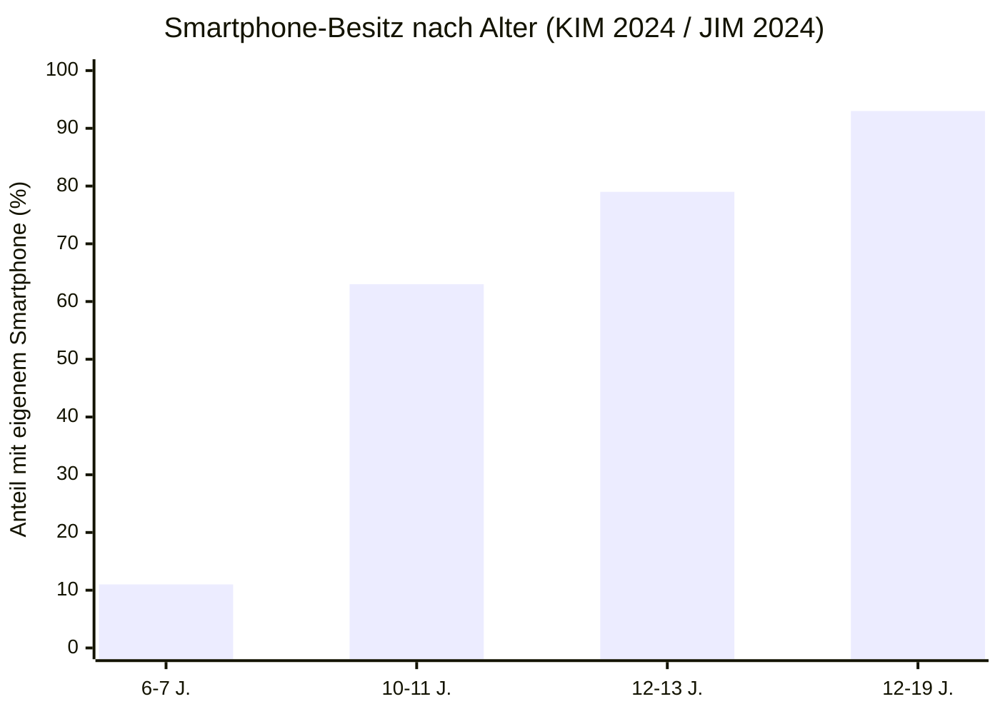
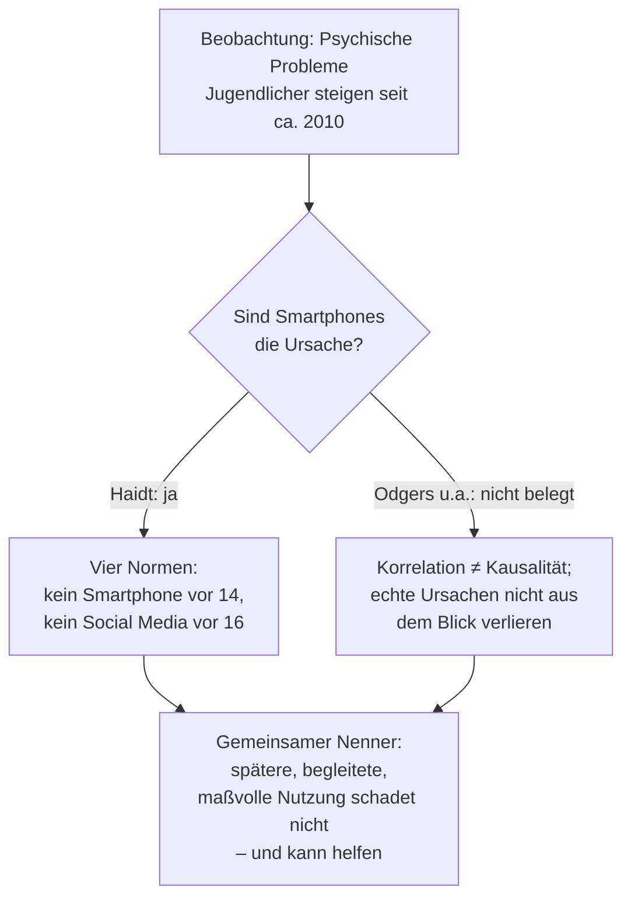
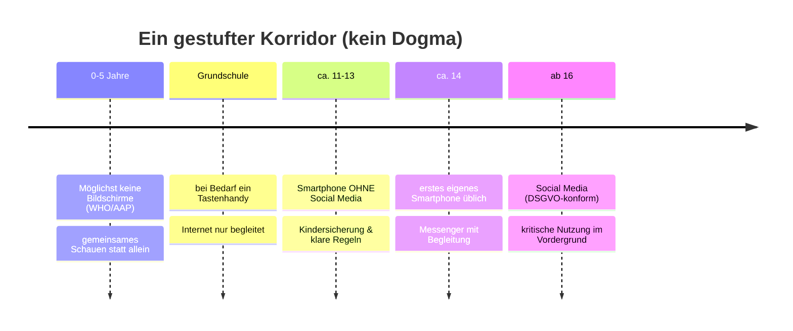
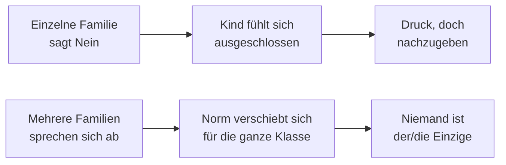
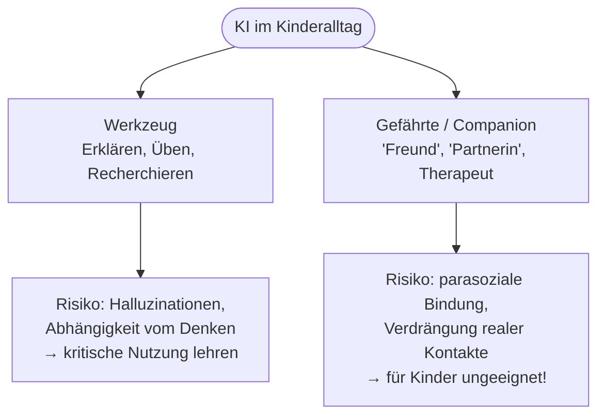
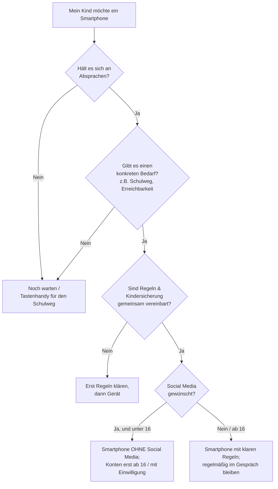

Kaum eine Frage bekomme ich auf Elternabenden so oft gestellt wie diese: „Ab welchem Alter sollte mein Kind ein Handy haben?" Dahinter stecken in Wahrheit drei Fragen: Hilft ein frühes Smartphone der digitalen Bildung oder schadet es? Wird mein Kind sozial ausgeschlossen, wenn es als Einziges keins hat? Und ab wann sollte es überhaupt mit KI in Berührung kommen? Ich nehme die Fragen ernst – und gebe gleich vorweg die unbequeme Antwort: **Es gibt keine einzige richtige Zahl, und die Wissenschaft ist hier ehrlich gesagt noch nicht fertig.** Was es gibt, sind belastbare Daten, eine offene Forschungsdebatte und ein paar gut begründete, praktische Wege. Genau die sortiere ich hier.

> **Hinweis zur Methode:** Der wissenschaftliche Kern dieses Themas – ob Smartphones und Social Media die psychische Gesundheit Jugendlicher tatsächlich *verschlechtern* – ist umstritten. Ich stelle die Debatte deshalb in beide Richtungen dar (Jonathan Haidt auf der einen, Kritikerinnen wie Candice Odgers auf der anderen Seite) und behaupte nicht, sie sei entschieden. Die deutschen Nutzungszahlen stammen aus den repräsentativen Studien JIM und KIM (mpfs) sowie von Bitkom; rechtliche Aussagen stützen sich auf DSGVO und die Nutzungsbedingungen der Plattformen. Ich bin Informatiker, kein Mediziner und kein Jurist – das hier ist eine fundierte Orientierung, keine medizinische oder rechtliche Beratung. Achte bei jeder Zahl auf das Erhebungsdatum; dieses Feld altert schnell.

## Gliederung

1. [Wie sieht die Realität aus? (Zahlen statt Bauchgefühl)](#1-wie-sieht-die-realität-aus)
2. [Die große Streitfrage: Schaden Smartphones und Social Media der Psyche?](#2-die-große-streitfrage-schaden-smartphones-und-social-media-der-psyche)
3. [Handy ist nicht gleich Smartphone ist nicht gleich Social Media (inkl. Rechtslage & EU-Ausblick)](#3-handy-ist-nicht-gleich-smartphone-ist-nicht-gleich-social-media)
4. [Der gestufte Weg: ein Plan nach Alter](#4-der-gestufte-weg-ein-plan-nach-alter)
5. [„Aber alle haben eins!" – das Problem der kollektiven Handlung](#5-aber-alle-haben-eins--das-problem-der-kollektiven-handlung)
6. [Pornografie: die ungewollte Konfrontation](#6-pornografie-die-ungewollte-konfrontation)
7. [Und die KI? Hausaufgabenhilfe vs. KI-Gefährten](#7-und-die-ki-hausaufgabenhilfe-vs-ki-gefährten)
8. [Entscheidungshilfe: Ist mein Kind bereit?](#8-entscheidungshilfe-ist-mein-kind-bereit)
9. [Fazit](#9-fazit)
10. [Konkrete Hilfe: Jugendschutz-Einstellungen der Plattformen](#10-konkrete-hilfe-jugendschutz-einstellungen-der-plattformen)
11. [Quellen](#11-quellen)

---

## 1. Wie sieht die Realität aus?

Bevor wir über das *Sollte* reden, lohnt der Blick auf das *Ist*. Die KIM-Studie 2024 (repräsentativ, 1.225 Kinder von 6–13 Jahren und ihre Erziehungspersonen, **Erhebung 18.09.–07.11.2024**) zeigt für die jüngere Gruppe:[^kim]

- **46 %** aller 6- bis 13-Jährigen besitzen ein eigenes Smartphone.
- Aufgeschlüsselt nach Alter: **11 %** der 6- bis 7-Jährigen, **63 %** der 10- bis 11-Jährigen, **79 %** der 12- bis 13-Jährigen.
- Das durchschnittliche Alter beim ersten eigenen Handy liegt bei **8,5 Jahren**.

Bei den Jugendlichen ist das Smartphone dann praktisch universell. Die JIM-Studie 2024 (repräsentativ, 1.200 Jugendliche von 12–19 Jahren, **Erhebung 05.06.–14.07.2024**) berichtet:[^jim]

- **93 %** der Jugendlichen besitzen ein eigenes Smartphone.
- **96 %** nutzen WhatsApp täglich oder mehrmals pro Woche.

Die Kurve sagt das Entscheidende: **Zwischen etwa neun und zwölf wechselt das Smartphone vom Ausnahme- zum Normalfall.** Genau in diesem Fenster fällt die Entscheidung – und genau hier ist der soziale Druck am größten (Abschnitt 5).

## 2. Die große Streitfrage: Schaden Smartphones und Social Media der Psyche?

Das ist das Herz des Themas – und hier muss ich besonders sorgfältig sein, denn hier wird am meisten übertrieben, in beide Richtungen.

### 2.1 Die These: Jonathan Haidt, „The Anxious Generation"

Der Sozialpsychologe Jonathan Haidt argumentiert in seinem 2024 erschienenen Bestseller *The Anxious Generation*, eine „große Umverdrahtung der Kindheit" durch Smartphones und Social Media habe seit etwa 2010 eine Epidemie psychischer Erkrankungen bei Jugendlichen ausgelöst. Er leitet daraus vier Normen ab:[^haidt]

1. Kein Smartphone vor der weiterführenden Schule (etwa vor 14).
2. Keine Social-Media-Konten vor 16.
3. Handyfreie Schulen.
4. Mehr unbeaufsichtigtes Spiel und reale Selbstständigkeit.

Die Vorschläge klingen intuitiv plausibel, und viele Eltern erleben den Sog der Geräte täglich selbst. Deshalb verkauft sich das Buch so gut – und deshalb ist Vorsicht geboten.

### 2.2 Die Gegenrede: Candice Odgers und die Frage nach der Kausalität

In der Fachzeitschrift *Nature* veröffentlichte die Psychologin Candice Odgers am **29.03.2024** eine vielbeachtete kritische Rezension. Ihr Kernvorwurf: Die wiederholte Behauptung, digitale Technik „verdrahte die Gehirne der Kinder um" und verursache eine Epidemie psychischer Erkrankungen, **sei wissenschaftlich nicht belegt.**[^odgers] Die vorliegenden Studien zeigten überwiegend *Korrelationen*, keine sauberen *Kausalnachweise*. Ihre Sorge: Eine „aufkommende Hysterie" könne davon ablenken, die *tatsächlichen* Ursachen der Krise (etwa Armut, Einsamkeit, fehlende Hilfsangebote) anzugehen.

Haidt hält dem entgegen, er und sein Mitautor hätten neben Korrelationsstudien auch experimentelle Belege gesammelt, und das zeitliche und internationale Muster spreche für einen ursächlichen Zusammenhang.[^haidt]

> **Hinweis zur Methode:** Worin sich beide Seiten einig sind: Es *gibt* eine messbare Verschlechterung der psychischen Gesundheit Jugendlicher seit etwa 2010. Umstritten ist allein, *ob die Smartphones die Ursache sind*. Korrelation ist nicht Kausalität – zwei Dinge können gleichzeitig steigen, ohne dass eines das andere verursacht. Genau diese Lücke ist bis heute nicht geschlossen.

### 2.3 Was bleibt als ehrliches Fazit?

Mein Standpunkt als Praktiker: Auch wenn die starke Kausalbehauptung *nicht* bewiesen ist, ist der vorsichtige, gestufte Weg klug – nicht aus Angst, sondern weil er **kein nennenswertes Risiko birgt** und nebenbei Schlaf, Konzentration und Familienzeit schützt. „Später, begleitet und maßvoll" ist eine Empfehlung, die beide Seiten der Debatte mittragen können.

## 3. Handy ist nicht gleich Smartphone ist nicht gleich Social Media

Der häufigste Denkfehler: alles in einen Topf zu werfen. Es sind drei verschiedene Entscheidungen mit drei verschiedenen Risikoprofilen.

| Stufe | Was es kann | Hauptrisiko | Sinnvoll ab |
|---|---|---|---|
| **Tasten-/„Dumbphone"** | Anrufen, SMS, ggf. Notruf | praktisch keins | Grundschulalter, bei Bedarf (Schulweg) |
| **Smartphone *ohne* Social Media** | Apps, Messenger, Internet, Kamera | offenes Internet, Messenger-Kontakte | ca. 11–13, mit Kindersicherung |
| **Social-Media-Konten** | öffentliche Profile, Algorithmus-Feeds | Vergleichsdruck, Inhalte, Kontakte | ab 14–16, begleitet |

### 3.1 Die Rechtslage in Deutschland

Hier wird es oft verwechselt, deshalb sauber getrennt:

- **Nutzungsbedingungen der Plattformen:** Instagram und TikTok erlauben die Nutzung ab **13 Jahren**; WhatsApp hat das Mindestalter in der EU im April 2024 von 16 auf **13 Jahre** gesenkt.[^klicksafe]
- **DSGVO (das rechtlich Verbindliche):** In Deutschland dürfen Kinder erst ab **16 Jahren** selbst wirksam in die Verarbeitung ihrer personenbezogenen Daten einwilligen. Darunter ist die **Einwilligung der Eltern** erforderlich.[^klicksafe]

> **💡 Tipp:** Das „Mindestalter 13" auf der Plattform ist kein grünes Licht. Rechtlich braucht dein unter 16-jähriges Kind in Deutschland deine Zustimmung – und damit auch deinen Anspruch, beim Einrichten dabei zu sein und die Privatsphäre-Einstellungen gemeinsam vorzunehmen.

### 3.2 Ausblick: Die EU arbeitet an einem gestuften Mindestalter (Stand Juli 2026)

Diese Rechtslage ist in Bewegung. Am **13. Juli 2026** legte eine Expertenkommission im Auftrag von EU-Kommissionspräsidentin Ursula von der Leyen ihre Vorschläge für einen besseren Onlineschutz Minderjähriger vor.[^eukommission] Der Kern: ein **gestuftes Mindestalter für soziale Medien – mit Ausnahmen**. Empfohlen wird eine EU-weit harmonisierte **Zugangsbeschränkung für Kinder unter 13 Jahren**, aber eben nicht als striktes Verbot: Bis zum dritten Lebensjahr sollen Kinder gar keine Bildschirmzeit haben, zwischen 3 und 12 nur **elterlich kontrolliert oder pädagogisch angeleitet** und zeitlich begrenzt, und 13- bis 18-Jährige sollen von den Plattformen „besonders sicher gemachte" Nutzungsmöglichkeiten bekommen. Das deckt sich fast eins zu eins mit dem gestuften Korridor, den ich in Abschnitt 4 beschreibe.

Zwei Gedanken der Kommission sind für Eltern besonders aufschlussreich:

- **Beweislastumkehr statt Elternproblem.** Von der Leyen formulierte es so, es gehe darum, „wann Social Media auf Kinder zugreifen kann, nicht wann Kinder auf Social Media zugreifen können". Nicht die Familie soll beweisen, dass ein Dienst ungefährlich ist, sondern die **Plattform** soll eine „technisch sichere und altersangemessene Nutzung" nachweisen müssen, bevor ihr Angebot uneingeschränkt in der EU zulässig ist (Prinzip „Safety by Design" aus dem Digital Services Act). Ko-Vorsitzende Maria Melchior nennt dabei besonders **süchtig machende Funktionen** wie Endlos-Scrollen und „Rabbit-Hole"-Algorithmen als das eigentliche Problem.[^eukommission]
- **Altersnachweis ohne Datenpreisgabe.** Wie ein Mindestalter überhaupt geprüft werden soll, ist noch offen. Im Gespräch sind **privatsphäreschützende** Verfahren wie eine „Mini-Wallet" der EU oder die deutsche **EUDI-Wallet** (bis Ende 2026), die auf die Frage „Mindestalter erfüllt?" nur mit „ja/nein" antworten, statt Name und Geburtsdatum an die Plattform zu geben.[^eukommission]

Wichtig zur Einordnung: Das sind **Empfehlungen**, noch kein geltendes Recht. Erste Regulierungsvorschläge der EU-Kommission sind nach der Sommerpause 2026 angekündigt, und die konkrete Altersgrenze festzulegen ist bislang Sache der Mitgliedstaaten. Für die häusliche Entscheidung ändert sich also kurzfristig nichts – aber die politische Richtung bestätigt genau das, was ich hier empfehle: **später, begleitet und altersgerecht.**

### 3.3 Was die Plattformen selbst bieten: Jugendschutz am Beispiel TikTok

Bis die Regulierung greift, sind die **Bordmittel der Plattformen** dein wichtigstes Werkzeug. Am Beispiel von TikTok – bei Jugendlichen besonders beliebt – lohnt sich der genaue Blick, denn die Einstellungen sind besser, als viele Eltern denken (Stand: 2025/26):[^tiktok]

- **Familienbegleitung („Begleiteter Modus"/Family Pairing).** Du verknüpfst dein eigenes TikTok-Konto mit dem deines Kindes und steuerst aus der Ferne: Bildschirmzeit, wer Nachrichten schreiben darf, Stichwortfilter, Suchfunktion und Benachrichtigungen. Das ist der zentrale Hebel – und er funktioniert nur, wenn du selbst ein Konto hast.
- **Strengere Standard­einstellungen für Minderjährige.** Konten von unter 16-Jährigen sind **automatisch privat**; **Direktnachrichten sind erst ab 16** möglich (darunter gar keine DMs); Videos jüngerer Teenager werden **nicht im „Für dich"-Feed** empfohlen und lassen sich nicht per Duett/Stitch weiterverwenden.
- **60-Minuten-Standardlimit.** Für alle unter 18 ist die tägliche Bildschirmzeit standardmäßig auf **60 Minuten** begrenzt; danach braucht es einen Code, den bei der Familienbegleitung du vergibst.
- **Eingeschränkter Modus (Restricted Mode).** Blendet nicht altersgerechte Inhalte aus; zusätzlich lassen sich Stichwörter filtern und ein kuratierter **STEM-Feed** (Wissenschaft/Technik) aktivieren.
- **„Time Away" und Ruhezeiten.** Eltern können TikTok zu bestimmten Zeiten pausieren (Schule, Nacht, Familienzeit) und sehen, wem das Kind folgt, wer ihm folgt und welche Konten es blockiert hat.
- **„Wind Down".** Für unter 18-Jährige unterbricht ab 22 Uhr standardmäßig eine geführte Meditation den Feed – ein sanfter Schubs Richtung Schlaf.

> **💡 Tipp:** Richte die Familienbegleitung **gemeinsam** mit deinem Kind ein, nicht heimlich. Erkläre, *warum* ihr eine Grenze setzt – das verwandelt Kontrolle in eine Vereinbarung und beugt dem Reiz vor, sie zu umgehen. Und denk daran: Kein Filter ist perfekt. Vergleichbare Einstellungen gibt es auch bei Instagram, Snapchat und YouTube – das Prinzip bleibt gleich.

## 4. Der gestufte Weg: ein Plan nach Alter

Statt eines Stichtags hilft ein Stufenmodell. Es orientiert sich an internationalen Empfehlungen und an der deutschen Rechtslage – und ist bewusst als *Korridor*, nicht als Gesetz gedacht.

Die Empfehlungen für die Kleinsten sind dabei die am besten abgesicherten:

- Die **WHO** empfiehlt für Kinder **unter 1 Jahr gar keine** Bildschirmzeit und für 2- bis 4-Jährige höchstens eine Stunde täglich, „weniger ist besser".[^who]
- Die **American Academy of Pediatrics (AAP)** rät, **unter 18 Monaten** außer Videotelefonie keine Bildschirmmedien zu nutzen, und für 2- bis 5-Jährige etwa eine Stunde hochwertiges Programm – am besten gemeinsam angeschaut.[^aap]

> **💡 Tipp:** Wichtiger als die exakte Minutenzahl ist das *gemeinsame* Schauen und Besprechen. Ein Kind, das gelernt hat, mit dir über Bildschirminhalte zu reden, ist später besser gerüstet als eines, das nur eine strenge Zeitvorgabe kannte.

Für das erste Smartphone gilt: Es spricht viel dafür, mit einem Gerät *ohne* Social Media zu starten, die Kindersicherung (Bildschirmzeit/Family Link bzw. Apple-Familienfreigabe) gemeinsam einzurichten und die Regeln nicht als Verbot, sondern als gemeinsame Vereinbarung zu formulieren.

## 5. „Aber alle haben eins!" – das Problem der kollektiven Handlung

Das ist kein Vorwand, sondern ein echtes Problem. Wenn 93 % der Jugendlichen ein Smartphone haben und 96 % über WhatsApp kommunizieren,[^jim] dann findet ein erheblicher Teil des sozialen Lebens dort statt. Ein Kind komplett auszuschließen, kann real isolieren – diese Sorge ist berechtigt.

Die Lösung ist meist *nicht*, als Einzelfamilie nachzugeben oder hart zu verbieten, sondern das Problem **kollektiv** zu lösen: Wenn sich mehrere Eltern einer Klasse absprechen, verschiebt sich die Norm für alle. Dann ist nicht mehr „mein Kind das einzige ohne", sondern „in unserer Klasse bekommen die meisten ihr Smartphone später".

In Deutschland organisiert das z. B. die Initiative **„Smarter Start ab 14"** mit einem freiwilligen **Elternpakt**: Eltern vereinbaren gemeinsam das erste eigene Smartphone nicht vor 14 und eigene Social-Media-Konten nicht vor 16.[^smarterstart] Ob man genau diese Grenzen zieht, ist zweitrangig – der Mechanismus ist der Punkt.

> **💡 Tipp:** Bring das Thema beim nächsten Elternabend auf. Ein kurzer Konsens – „Wir geben Smartphones in unserer Klasse eher später" – nimmt allen einzelnen Familien den Druck. Das ist der wirksamste Hebel, den du hast.

## 6. Pornografie: die ungewollte Konfrontation

Ein Thema, das viele Eltern lieber aussparen – und das gerade deshalb hierher gehört. Denn anders als beim Smartphone ist Pornografie selten eine bewusste „Entscheidung" des Kindes, sondern meist eine **Konfrontation**: ein weitergeleitetes Video im Klassenchat, ein Pop-up, ein falsch verstandener Suchbegriff, ein Link von älteren Kindern. Die Zahlen sind eindeutig genug, um das ernst zu nehmen:

- Laut **JIM-Studie 2023** wurden **23 %** der Jugendlichen im Monat vor der Befragung online mit pornografischen Inhalten konfrontiert.[^porno]
- Nach der Studie **EU Kids Online** kamen in Deutschland **42 %** der 12- bis 14-Jährigen und **65 %** der 15- bis 17-Jährigen innerhalb eines Jahres mit sexuellen Darstellungen in Kontakt.[^porno]
- Der erste Kontakt passiert oft früher, als Eltern vermuten – teils schon im Grundschulalter, meist ungewollt.

Das Problem ist nicht nur der Anblick an sich, sondern das **Bild von Sexualität, Körpern und Zustimmung**, das kommerzielle Pornografie vermittelt: inszeniert, oft grob, ohne Bezug zu echten Beziehungen. Für ein Kind ohne Einordnung kann das verstörend wirken oder ein schiefes Vorbild setzen. Die Bundeszentrale für Kinder- und Jugendmedienschutz (BzKJ) und die Initiative klicksafe warnen deshalb ausdrücklich vor der frühen, unbegleiteten Konfrontation.[^porno]

Was hilft – und was nicht:

- **Technische Filter helfen, sind aber kein Schutzschild.** Jugendschutz-Einstellungen (Google SafeSearch, Kindersicherung, altersgerechte Profile) reduzieren zufällige Treffer deutlich. Über Klassenchats und die Geräte anderer Kinder sind sie aber leicht zu umgehen – Filter kaufen Zeit, ersetzen aber kein Gespräch.
- **Reden, bevor es passiert.** Ein ruhiger, wertfreier Satz vorab („Es kann sein, dass dir online mal Bilder oder Videos begegnen, die dich irritieren – das ist nicht deine Schuld, und du kannst immer zu mir kommen") nimmt dem Moment die Scham und macht dich zur Ansprechperson.
- **Nicht mit Strafe reagieren.** Ein Kind, das fürchtet, das Handy zu verlieren, wird den Vorfall verstecken. Dieselbe Regel wie überall in diesem Text: **Hilfe statt Bestrafung.**
- **Altersgerecht einordnen.** Bei jüngeren Kindern genügt „das ist nichts für dich, das sind gestellte Filme für Erwachsene". Bei älteren gehört das Thema in ein ehrliches Gespräch über echte Beziehungen, Respekt und Zustimmung.

> **💡 Tipp:** Warte nicht auf den „richtigen Moment" – der kommt selten. Bring das Thema einmal beiläufig und altersgerecht selbst an, bevor der Klassenchat es für dich tut. Wer einmal signalisiert hat „darüber darfst du mit mir reden", erfährt beim nächsten Mal davon.

## 7. Und die KI? Hausaufgabenhilfe vs. KI-Gefährten

KI ist im Alltag der Kinder längst angekommen. Laut JIM 2024 nutzen **62 %** der Jugendlichen KI-Anwendungen wie ChatGPT, **57 %** konkret ChatGPT (gegenüber 38 % im Vorjahr) – am häufigsten für schulische Zwecke (65 %).[^jim-ki] Die Frage ist also nicht *ob*, sondern *wie*. Und hier muss man zwei sehr unterschiedliche Nutzungen klar trennen.

### 7.1 KI als Werkzeug (Hausaufgabenhilfe) – beherrschbar

Als Hilfsmittel zum Erklären, Üben, Umformulieren oder Strukturieren ist KI wertvoll – vorausgesetzt, das Kind versteht ihre Grenzen: Ein Sprachmodell sagt nur das nächste *wahrscheinliche* Wort voraus, es „weiß" nichts und kann sehr überzeugend Falsches behaupten (Halluzination). Die wichtigste Lektion lautet deshalb: **kritisch prüfen statt blind übernehmen.** Das ist eher ein Erziehungs- als ein Verbotsthema.

> **💡 Tipp:** Setzt euch einmal zusammen und lasst die KI bewusst etwas Falsches behaupten – etwa eine erfundene Quelle oder eine falsche Jahreszahl. Wenn dein Kind den Fehler selbst entdeckt, hat es die wichtigste Kompetenz im Umgang mit KI verstanden.

### 7.2 KI-Gefährten (AI Companions) – hier ist Vorsicht geboten

Etwas grundlegend anderes sind **KI-Gefährten**: Chatbots, die als „Freund", „Partnerin" oder Therapeut auftreten und auf emotionale Bindung ausgelegt sind. Hier sind reale Schäden dokumentiert. In den USA führte der Fall des 14-jährigen Sewell Setzer, der sich Anfang 2024 nach intensiver Nutzung eines Character.AI-Begleiters das Leben nahm, zu einer Klage seiner Mutter (Oktober 2024); Google und Character.AI einigten sich Anfang 2026 auf einen Vergleich.[^characterai] Mehrere weitere Familien klagten 2025, und die US-Handelsbehörde FTC leitete im September 2025 eine Untersuchung gegen sieben Anbieter von KI-Chatbots ein.[^characterai] Character.AI untersagte daraufhin Ende 2025 offene Chats für unter 18-Jährige.[^characterai]

Das Problem ist die **parasoziale Bindung**: Ein auf maximale Bindung optimierter Chatbot kann echte Beziehungen verdrängen, statt sie zu ergänzen – gerade bei einsamen oder labilen Jugendlichen. Das ist kein Grund für Panik, aber ein klarer Grund, KI-Gefährten anders zu behandeln als eine Hausaufgaben-KI.

Unter diesem Druck reagieren inzwischen auch die Anbieter. Meta kündigte im Juli 2026 an, riskante Chats **den Eltern zu melden**: Spricht ein:e Jugendliche:r auf Instagram mit „Meta AI" auffällig oft über **Suizid oder Selbstverletzung**, soll der Chatbot die Gefahr einschätzen, Meta-Mitarbeitende prüfen den Fall, und bleibt der Verdacht bestehen, werden die Eltern informiert.[^metaai] Zusätzlich arbeitet Meta daran, dass der Chatbot bei akuter Suizidgefahr direkt Rettungsdienste verständigt – ein Mechanismus, der bei Facebook- und Instagram-Posts laut Meta 2025 bereits zu weltweit über 19.000 Notrufen geführt hat.[^metaai] So sinnvoll das klingt, es hat **Grenzen**, die Eltern kennen sollten: Die Elternalarme gibt es zunächst nur in Australien, Kanada, den USA und Großbritannien (der Rest soll bis Jahresende 2026 folgen), und sie greifen nur, wenn die Eltern **selbst ein Meta-Konto haben und die „Elternaufsicht" nutzen**. Solche Funktionen sind also eine Ergänzung – kein Ersatz für das Gespräch und für die Grundregel, dass KI-Gefährten nicht in Kinderhände gehören.

> **Hinweis:** Wenn es deinem Kind oder dir schlecht geht, findest du in Deutschland rund um die Uhr Hilfe bei der TelefonSeelsorge (0800 1110111, kostenfrei) und bei der „Nummer gegen Kummer" – Kinder- und Jugendtelefon 116 111. In Österreich hilft „Rat auf Draht" unter 147, in der Schweiz Pro Juventute ebenfalls unter 147.

### 7.3 Ab welchem Alter, mit welcher Begleitung?

Eine harte Altersgrenze für KI gibt es nicht, und die Forschung ist hier noch jünger und dünner als beim Thema Social Media. Als Orientierung:

- **Werkzeug-KI:** ab dem Schulalter sinnvoll – aber *begleitet*, mit der Halluzinations-Lektion und ohne personenbezogene Daten einzugeben.
- **KI-Gefährten:** für Kinder und jüngere Jugendliche nicht geeignet; wenn überhaupt, dann mit Wissen der Eltern und im Gespräch darüber, dass das Gegenüber kein Mensch ist.

Der rote Faden ist derselbe wie bei der Online-Sicherheit: **kritische Nutzung lehren schlägt verbieten.** Ein Verbot ist kaum durchsetzbar und nimmt dir die Chance, dabei zu sein.

## 8. Entscheidungshilfe: Ist mein Kind bereit?

Statt aufs Alter zu starren, hilft ein Blick auf die *Reife* und auf gemeinsame Regeln. Diese kleine Hilfe ersetzt kein Gespräch, ordnet aber die Entscheidung:

> **💡 Tipp:** Die beste „Kindersicherung" ist das Gespräch. Vereinbart von Anfang an: Wenn online etwas schiefgeht, gibt es zu Hause Hilfe, keine Bestrafung. Kinder, die fürchten, ihr Handy zu verlieren, verstecken Probleme, bis sie groß geworden sind.

## 9. Fazit

Es gibt keine magische Zahl. Was es gibt, ist eine ehrliche Lage: Die psychische Gesundheit Jugendlicher hat sich verschlechtert, aber dass *die Smartphones* die Ursache sind, ist **nicht bewiesen** – Korrelation ist nicht Kausalität. Daraus folgt kein Grund zur Panik und keiner zur Sorglosigkeit, sondern ein vernünftiger Mittelweg:

- **Trenne** Tastenhandy, Smartphone ohne Social Media und Social-Media-Konten – das sind drei Entscheidungen, nicht eine.
- **Geh gestuft vor**, orientiert an Reife statt Stichtag, und richte die Kindersicherung gemeinsam ein.
- **Löse den sozialen Druck kollektiv** über Absprachen mit anderen Eltern, statt allein nachzugeben oder allein zu verbieten.
- **Rechne mit Pornografie** als ungewollter Konfrontation – rede vorher, wertfrei und ohne Strafandrohung, statt nur auf Filter zu setzen.
- **Bei KI:** Werkzeug-Nutzung begleiten und kritisches Prüfen lehren; KI-Gefährten gehören nicht in Kinderhände.
- **Über allem steht das Gespräch.** Keine App schützt so gut wie ein Kind, das mit dir reden kann.

Und ja – die Wissenschaft ist hier noch nicht am Ziel. Wer dir eine einfache, endgültige Antwort verspricht, verkauft dir etwas. Ich verspreche dir nur einen begründeten, ehrlichen Weg.

## 10. Konkrete Hilfe: Jugendschutz-Einstellungen der Plattformen

Zum Schluss das Praktische – eine Kurzübersicht der wichtigsten Bordmittel, damit du nicht lange suchen musst. TikTok habe ich oben in [Abschnitt 3.3](#33-was-die-plattformen-selbst-bieten-jugendschutz-am-beispiel-tiktok) schon ausführlich behandelt; hier folgen Instagram, Snapchat, YouTube und Reddit. Zwei Dinge gelten für alle:

- **Fast jede Elternaufsicht setzt voraus, dass auch du ein Konto auf der Plattform hast** und es mit dem deines Kindes verknüpfst.
- **Kein Filter ist perfekt.** Die stärkste Ebene liegt oft *unter* der App – in der Kindersicherung des Betriebssystems (Apple Familienfreigabe/Bildschirmzeit, Google Family Link) und im Alter-Rating des App Stores. Die Plattform-Einstellungen sind eine wichtige zweite Schicht, kein Ersatz für das Gespräch.

### Instagram (Meta): „Teen Accounts" & Elternaufsicht

- **Teenager-Konten (Teen Accounts):** Wer sich als unter 18 anmeldet, bekommt automatisch ein Konto mit Jugendschutz: standardmäßig **privat**, strengste Nachrichteneinstellungen (Nachrichten nur von Personen, denen das Kind folgt oder mit denen es schon Kontakt hatte), begrenzte sensible Inhalte, Erinnerungen an Pausen.[^instagram]
- **Unter 16:** Schutzeinstellungen lassen sich nur **mit Erlaubnis der Eltern** lockern; kein eigener Livestream.
- **Elternaufsicht:** Verknüpfst du dein Profil, kannst du **Tageslimits** setzen (die das Kind nicht ändern kann), die Nutzungszeit sehen und wem dein Kind folgt/schreibt – **nicht** aber Chat-Inhalte oder Suchverlauf.
- Einrichten: Profil → Menü → *Elternaufsicht* (bzw. *Family Center*).

### Snapchat: Familienzentrum („Family Center")

- **Für 13- bis 18-Jährige;** du brauchst ein eigenes Snapchat-Konto und verknüpfst es mit dem deines Kindes.[^snapchat]
- Du siehst, **mit wem** dein Kind in den letzten sieben Tagen kommuniziert und wen es neu hinzugefügt hat – **nicht** die Inhalte der Chats (Snapchats sind ohnehin flüchtig).
- **Inhaltsbeschränkung:** sensible Inhalte in **Stories** und **Spotlight** ausblenden; direkt aus dem Familienzentrum melden.
- Achtung Standort: Die „Snap Map" kann den Aufenthaltsort teilen – gemeinsam auf **Geistmodus** (Ghost Mode) stellen.
- Einrichten: Profil → Einstellungen → *Familienzentrum*.

### YouTube (Google): YouTube Kids & betreute Konten

- **Zwei Wege je nach Alter:**[^youtube]
  - **YouTube Kids** (für jüngere Kinder): eigene App mit Altersstufen „Vorschulkinder", „Jünger" (5–8) und „Älter" (9–12); du kannst Videos/Kanäle blockieren und die Suche abschalten.
  - **YouTube mit Elternaufsicht** (betreutes Konto über **Family Link**, für ältere Kinder/Teens): drei Inhaltsstufen („Entdecken", „Mehr entdecken", „Fast alles auf YouTube").
- **Family Link** steuert zusätzlich geräteweit **Bildschirmzeit, Schlafenszeit und App-Freigaben** – nicht nur für YouTube.
- Einrichten: *Family Link*-App → Konto des Kindes → *Inhaltsbeschränkungen* → *YouTube*.

### Reddit: schwächere Elternwerkzeuge – hier zählt die Geräteebene

- **Mindestalter 13**, im App Store aber **ab 17**; Fachleute empfehlen frühestens 16.[^reddit]
- **Sichere Voreinstellungen für 13–18:** „Not Safe For Work"-Communitys (NSFW) werden aus dem Feed gefiltert, Direktnachrichten auf bekannte Kontakte beschränkt, reifebehaftete Communitys ausgeblendet.
- **Altersprüfung:** Für ausdrücklich nicht jugendfreie Inhalte verlangt Reddit einen **18+-Nachweis** (in der EU seit dem 24.06.2026 verpflichtend, teils per Ausweisfoto/Selfie über den Partner Persona); Teen-Konten in der EU stehen auf der restriktivsten Stufe.
- **Ehrliche Einordnung:** Reddit bietet **keine echte Eltern-Verknüpfung** wie ein Family Center, und viele Schutzeinstellungen kann der Kontoinhaber selbst zurücksetzen. Deshalb ist hier die **Geräte-/Netzwerkebene** entscheidend: App-Store-Altersfreigabe, Betriebssystem-Kindersicherung und ggf. ein Inhaltsfilter im Router.

> **💡 Tipp:** Richte diese Einstellungen einmal **gemeinsam** in einer ruhigen halben Stunde ein – am besten auf beiden Geräten nebeneinander. Das schafft Vertrauen, macht dich zur kompetenten Ansprechperson und ist wirksamer als jede heimlich installierte Überwachung.

## Einen Elternabend buchen

Du möchtest das mit anderen Eltern an deiner Schule vertiefen – inklusive der gemeinsamen Absprache, die den sozialen Druck nimmt? Ich halte dazu Elternabende, auf Deutsch oder Englisch. Wenn du das für deine Schule oder Klasse möchtest, [melde dich gern](/#kontakt) oder sieh dir das vollständige Programm auf [felix-paul.de/education](/education/) an.

---

## 11. Quellen

Jede Quelle ist mit ihrem **Veröffentlichungs- bzw. Erhebungsdatum** und dem **Abrufdatum (10.06.2026)** versehen. Statistiken in diesem Feld altern schnell – im Zweifel die jeweils aktuelle Ausgabe heranziehen.

[^kim]: Medienpädagogischer Forschungsverbund Südwest (mpfs), *KIM-Studie 2024* (repräsentativ, 1.225 Kinder 6–13 J. und Erziehungspersonen, Erhebung 18.09.–07.11.2024; u. a. 46 % Smartphone-Besitz, 8,5 J. beim ersten Handy). *Veröffentlicht Mai 2025; abgerufen 10.06.2026.* <https://mpfs.de/app/uploads/2025/05/KIM-Studie-2024.pdf>

[^jim]: Medienpädagogischer Forschungsverbund Südwest (mpfs), *JIM-Studie 2024* (repräsentativ, 1.200 Jugendliche 12–19 J., Erhebung 05.06.–14.07.2024; u. a. 93 % Smartphone-Besitz, 96 % WhatsApp). *Veröffentlicht November 2024; abgerufen 10.06.2026.* <https://mpfs.de/app/uploads/2024/11/JIM_2024_PDF_barrierearm.pdf>

[^jim-ki]: mpfs, *JIM-Studie 2024* – KI-Nutzung: 62 % nutzen KI-Anwendungen, 57 % ChatGPT (2023: 38 %), schulische Nutzung 65 %. Pressemitteilung des mpfs. *Veröffentlicht November 2024; abgerufen 10.06.2026.* <https://mpfs.de/app/uploads/2024/11/PM_JIM-2024.pdf>

[^haidt]: Jonathan Haidt, *The Anxious Generation: How the Great Rewiring of Childhood Is Causing an Epidemic of Mental Illness* (vier Normen u. a. kein Smartphone vor der weiterführenden Schule, kein Social Media vor 16). Überblick zur These und zur Debatte. *Buch veröffentlicht 26.03.2024; abgerufen 10.06.2026.* <https://en.wikipedia.org/wiki/The_Anxious_Generation>

[^odgers]: Candice L. Odgers, „The great rewiring: is social media really behind an epidemic of teenage mental illness?", Rezension in *Nature* (zentrale Aussage: die Behauptung einer durch digitale Technik verursachten Epidemie sei wissenschaftlich nicht belegt; Korrelation ≠ Kausalität). *Veröffentlicht 29.03.2024; abgerufen 10.06.2026.* <https://www.nature.com/articles/d41586-024-00902-2>

[^klicksafe]: klicksafe, „Mindestalter in sozialen Medien / Instagram ab 13, WhatsApp ab 16 und YouTube ab 18?" – Plattform-AGB (Instagram/TikTok ab 13; WhatsApp in der EU seit April 2024 ab 13) gegenüber DSGVO (in Deutschland eigenständige Einwilligung ab 16, darunter elterliche Einwilligung). *Aktualisierte Webseite ohne festes Einzeldatum; abgerufen 10.06.2026.* <https://www.klicksafe.eu/en/news/instagram-ab-13-whatsapp-ab-16-youtube-ab-18> · <https://www.klicksafe.eu/en/mindestalter>

[^who]: World Health Organization, „To grow up healthy, children need to sit less and play more" / *Guidelines on Physical Activity, Sedentary Behaviour and Sleep for Children under 5 Years of Age* (unter 1 J. keine Bildschirmzeit; 2–4 J. höchstens 1 Std./Tag). *Veröffentlicht 24.04.2019; abgerufen 10.06.2026.* <https://www.who.int/news/item/24-04-2019-to-grow-up-healthy-children-need-to-sit-less-and-play-more>

[^aap]: American Academy of Pediatrics, Empfehlungen zur Mediennutzung (unter 18 Monaten außer Videotelefonie keine Bildschirmmedien; 2–5 J. ca. 1 Std./Tag hochwertiges, gemeinsam geschautes Programm). Zusammenfassende Darstellung; vgl. auch AAP-Policy-Statement „Digital Ecosystems, Children, and Adolescents" (2025). *Empfehlungen seit 2016, AAP-Policy-Statement 2025; abgerufen 10.06.2026.* <https://publications.aap.org/pediatrics/article/157/2/e2025075320/206129/Digital-Ecosystems-Children-and-Adolescents-Policy>

[^smarterstart]: Smarter Start ab 14 e. V., „Smartphone-freie Kindheit" / Elternpakt (freiwillige Absprache: erstes eigenes Smartphone nicht vor 14, eigene Social-Media-Konten nicht vor 16; kollektive Handlung gegen den Gruppendruck). *Webseite ohne festes Einzeldatum, Initiative 2024/2025 stark gewachsen; abgerufen 10.06.2026.* <https://www.smarterstartab14.de/smartphone-freie-kindheit>

[^characterai]: Berichterstattung zu Klagen gegen Character.AI/Character Technologies und Google (Fall Sewell Setzer III, † Anfang 2024; Klage Megan Garcia Oktober 2024; Vergleich Januar 2026; weitere Familienklagen 2025; FTC-Untersuchung gegen sieben Anbieter September 2025; Sperrung offener Chats für unter 18-Jährige Ende 2025). *Berichte September 2025–Januar 2026; abgerufen 10.06.2026.* <https://www.cnn.com/2025/09/16/tech/character-ai-developer-lawsuit-teens-suicide-and-suicide-attempt> · <https://www.jurist.org/news/2026/01/google-and-character-ai-agree-to-settle-lawsuit-linked-to-teen-suicide/>

[^porno]: Zahlen und Einordnung zur Konfrontation Minderjähriger mit Pornografie: mpfs, *JIM-Studie 2023* (23 % der Jugendlichen im Vormonat mit pornografischen Inhalten konfrontiert); *EU Kids Online 2019* (Deutschland: 42 % der 12–14-Jährigen, 65 % der 15–17-Jährigen binnen eines Jahres in Kontakt mit sexuellen Darstellungen); Einordnung und Präventionshinweise von klicksafe („Let's talk about Porno", Safer Internet Day 2024) und der Bundeszentrale für Kinder- und Jugendmedienschutz (BzKJ). *Studien 2019 bzw. 2023, klicksafe-Materialien 2024; abgerufen 14.07.2026.* <https://www.klicksafe.eu/pornografie> · <https://www.bzkj.de/bzkj/service/alle-meldungen/konfrontation-mit-pornografie-potenzielle-gefahren-aus-sicht-der-bzkj-236164>

[^tiktok]: TikTok, Jugendschutz- und Familienbegleitungs-Funktionen (Begleiteter Modus/Family Pairing; unter 16 automatisch privat und keine Direktnachrichten; keine „Für dich"-Empfehlung und kein Duett/Stitch für unter 16; 60-Minuten-Standardlimit für unter 18; Eingeschränkter Modus/STEM-Feed; „Time Away" und erweiterte Transparenz seit 2025; „Wind Down"/geführte Meditation ab 22 Uhr). Quellen: TikTok Sicherheitszentrum „Leitfaden für Erziehungsberechtigte" und TikTok Newsroom „New ways we're supporting parents…" (2025) sowie Euronews-Bericht vom 19.11.2025. *Funktionsstand 2025/2026; abgerufen 17.07.2026.* <https://www.tiktok.com/safety/de-de/guardians-guide/> · <https://newsroom.tiktok.com/en-us/new-ways-we-are-supporting-parents-and-helping-teens-build-balanced-digital-habits> · <https://www.euronews.com/next/2025/11/19/tiktok-adds-digital-well-being-features-to-help-teens-manage-screen-time-and-limit-doomscr>

[^metaai]: Daniel AJ Sokolov, „Selbstverletzung, Suizid: Meta meldet riskante KI-Chats den Eltern", heise online (Meta AI schätzt Chats Jugendlicher zu Suizid/Selbstverletzung ein; Prüfung durch Meta-Mitarbeitende; Alarmierung der Eltern über die „Elternaufsicht", zunächst nur in Australien, Kanada, USA und Großbritannien, weltweit bis Jahresende 2026; direkte Verständigung von Rettungsdiensten bei akuter Gefahr; laut Meta 2025 bereits über 19.000 Notrufe über die entsprechende Funktion für Facebook-/Instagram-Posts). *Veröffentlicht 16.07.2026; abgerufen 17.07.2026.* <https://www.heise.de/news/Selbstverletzung-Suizid-Meta-meldet-riskante-KI-Chats-den-Eltern-11368138.html>

[^eukommission]: Falk Steiner, „Social-Media: EU-Expertenkommission fordert Mindestalter mit Ausnahmen", heise online (Expertenkommission im Auftrag von EU-Kommissionspräsidentin Ursula von der Leyen; Ko-Vorsitz Jörg Fegert und Maria Melchior; gestuftes Modell: keine Bildschirmzeit bis 3 J., begleitete/pädagogisch angeleitete Nutzung 3–12 J., besonders sicher gemachte Angebote 13–18 J.; EU-weite Zugangsbeschränkung unter 13 mit Beweislastumkehr; „Safety by Design"; privatsphäreschützende Altersverifikation via Mini-Wallet/EUDI-Wallet bis Ende 2026; erste EU-Regulierungsvorschläge nach der Sommerpause 2026). *Veröffentlicht 13.07.2026; abgerufen 14.07.2026.* <https://www.heise.de/news/Social-Media-EU-Expertenkommission-fordert-Mindestalter-mit-Ausnahmen-11362606.html>

[^instagram]: Instagram/Meta, „Teenager-Konten" (Teen Accounts) und Elternaufsicht (Konten Minderjähriger standardmäßig privat und mit strengsten Nachrichten-/Inhaltseinstellungen; unter 16 nur mit Elternerlaubnis änderbar, kein eigener Livestream; Elternaufsicht ermöglicht Zeitlimits und Einblick in Kontakte/Nutzungszeit, nicht in Chatinhalte). Darstellung u. a. bei klicksafe und im Instagram-Hilfebereich. *Funktionsstand 2024–2026; abgerufen 17.07.2026.* <https://www.klicksafe.eu/en/news/neue-instagram-teen-konten-mehr-kontrolle-fuer-eltern> · <https://www.medien-kindersicher.de/social-media/kindersicherung-fuer-instagram>

[^snapchat]: Snapchat, „Familienzentrum" (Family Center) für 13- bis 18-Jährige (Eltern benötigen eigenes Konto; Einblick, mit wem das Kind kommuniziert und wen es neu hinzufügt, nicht in Chatinhalte; Einschränkung sensibler Inhalte in Stories und Spotlight; Meldefunktion). Elterninformationen von Snap sowie Darstellung bei jugendschutz.net. *Funktionsstand 2024–2026; abgerufen 17.07.2026.* <https://parents.snapchat.com/family-center> · <https://www.medien-kindersicher.de/social-media/kindersicherung-fuer-snapchat>

[^youtube]: Google/YouTube, Jugendschutzfunktionen für Kinderkonten mit Elternaufsicht sowie YouTube Kids und Family Link (YouTube Kids mit Altersstufen „Vorschulkinder"/„Jünger" 5–8/„Älter" 9–12; betreutes YouTube-Konto mit Inhaltsstufen „Entdecken"/„Mehr entdecken"/„Fast alles auf YouTube"; Family Link steuert Bildschirmzeit, Schlafenszeit und App-Freigaben). YouTube-/Google-Hilfe. *Funktionsstand 2024–2026; abgerufen 17.07.2026.* <https://support.google.com/youtube/answer/13877231?hl=de> · <https://support.google.com/families/answer/10495678?hl=de>

[^reddit]: Reddit, Sicherheits- und Alterseinstellungen (Mindestalter 13, App-Store-Freigabe 17+; sichere Voreinstellungen für 13–18: NSFW-Filterung im Feed, eingeschränkte Direktnachrichten, Ausblenden reifer Communitys; 18+-Altersverifikation für nicht jugendfreie Inhalte, in der EU seit 24.06.2026 verpflichtend, teils via Partner Persona; keine dedizierte Eltern-Verknüpfung, viele Einstellungen vom Kontoinhaber rücksetzbar). Reddit-Hilfe und Berichterstattung. *Funktions- bzw. Regelungsstand 2025/2026; abgerufen 17.07.2026.* <https://support.reddithelp.com/hc/en-us/articles/36429514849428-Why-is-Reddit-asking-for-my-age> · <https://beencrypted.com/privacy/news/reddit-age-verification-eu-teens-nsfw-content>
