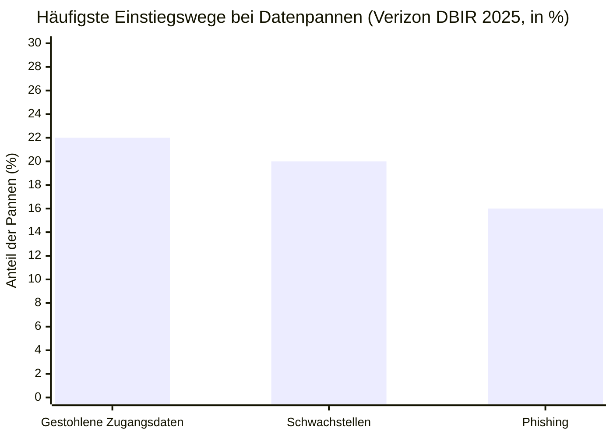
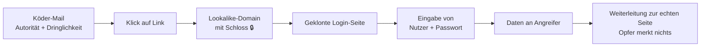
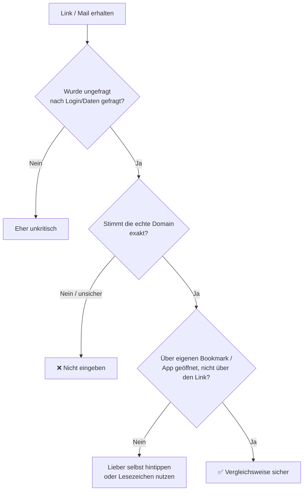
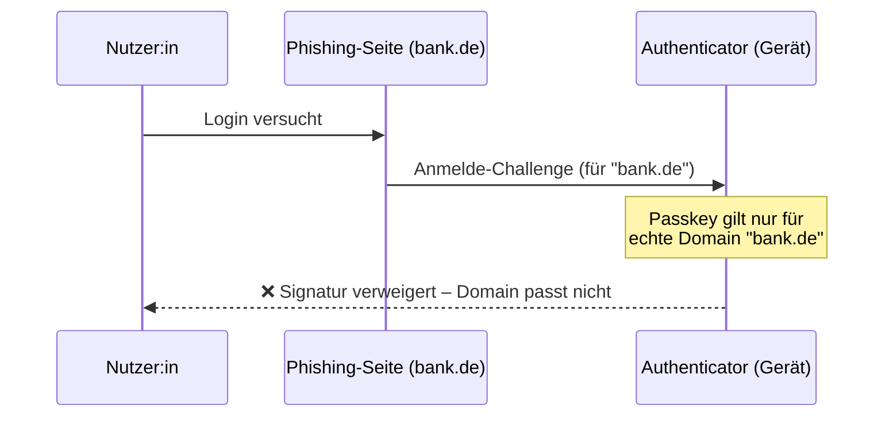

Eine E-Mail von „deiner Bank", ein Link, eine Login-Seite, die *exakt* aussieht wie immer – du tippst Benutzername und Passwort ein, und in dem Moment, in dem du auf „Anmelden" klickst, gehören deine Zugangsdaten jemand anderem. Phishing wirkt simpel, fast altmodisch. Und genau deshalb ist es bis heute einer der häufigsten Wege, über den Angriffe beginnen. Der beste Weg, das zu verstehen, ist nicht eine weitere Warnfolie – sondern einmal selbst (in einer sicheren Umgebung) nachzubauen, wie so eine Seite entsteht.

> **Hinweis zur Methode:** Die Häufigkeitszahlen stammen aus etablierten Lageberichten (Verizon DBIR, BSI, APWG) und sind jeweils mit Erhebungszeitraum und Quelle belegt – sie weichen je nach Methodik voneinander ab, das ist normal. Der „Selbst bauen"-Teil beschreibt das Vorgehen auf **Awareness-Niveau** und ausdrücklich nur in einer **abgeschotteten, einwilligungsbasierten Laborumgebung**. Ich bin Informatiker, kein Jurist – der Rechtsabschnitt ist eine fundierte Orientierung, keine Rechtsberatung. Jede Quelle trägt Veröffentlichungs- und Abrufdatum (10.06.2026).

## Gliederung

1. [Warum Phishing funktioniert – und wie häufig es ist](#1-warum-phishing-funktioniert--und-wie-häufig-es-ist)
2. [Die Psychologie: Autorität, Dringlichkeit, Vertrauen](#2-die-psychologie-autorität-dringlichkeit-vertrauen)
3. [Wie eine Phishing-Seite technisch entsteht](#3-wie-eine-phishing-seite-technisch-entsteht)
4. [Das sichere Labor: selbst bauen, ohne Opfer](#4-das-sichere-labor-selbst-bauen-ohne-opfer)
5. [Verteidigung in der Tiefe](#5-verteidigung-in-der-tiefe)
6. [Passkeys – warum sie Phishing strukturell aushebeln](#6-passkeys--warum-sie-phishing-strukturell-aushebeln)
7. [Ethik und Recht (sehr ernst gemeint)](#7-ethik-und-recht-sehr-ernst-gemeint)
8. [Quellen](#8-quellen)

---

## 1. Warum Phishing funktioniert – und wie häufig es ist

Phishing ist kein Randthema, sondern einer der **wichtigsten Einstiegspunkte** für Angriffe. Der *Verizon Data Breach Investigations Report 2025* (DBIR) – einer der meistzitierten Lageberichte der Branche – nennt für die untersuchten Datenpannen folgende Einstiegswege:[^dbir]

Phishing liegt mit **16 %** der Einstiegswege auf einem der vordersten Plätze – und ist eng mit dem Spitzenreiter verzahnt: Die meisten **gestohlenen Zugangsdaten (22 %)** stammen letztlich aus Phishing oder ähnlichem Datendiebstahl.[^dbir] Anders gesagt: Phishing ist oft der erste Dominostein.

Das Ausmaß zeigt auch die **Anti-Phishing Working Group (APWG)**, die weltweit Phishing-Angriffe zählt: Für das Gesamtjahr 2025 erfasste sie rund **3,8 Millionen** Phishing-Angriffe, mit einem Quartalshöchstwert von über 1,1 Millionen im zweiten Quartal.[^apwg]

Für Deutschland ordnet das **BSI** in seinem *Lagebericht 2025* (Berichtszeitraum Juli 2024 bis Juni 2025) ein: E-Mail-basierte Angriffe gehen leicht zurück, während Phishing zunehmend über Social Media und Messenger verbreitet wird – und ein erheblicher Teil der Phishing-Mails inzwischen **KI-generiert** ist (eine zitierte Erhebung nennt rund 82,6 %).[^bsi] Diese KI-Zahl stammt aus einer Fremdquelle (KnowBe4) und ist als **Tendenz** zu lesen; die Richtung – Phishing wird automatisierter und sprachlich fehlerfreier – ist aber unstrittig.

---

## 2. Die Psychologie: Autorität, Dringlichkeit, Vertrauen

Phishing zielt nicht auf die Technik, sondern auf den **Menschen**. Es nutzt drei psychologische Hebel:

| Hebel | Masche | Beispiel |
|---|---|---|
| **Autorität** | Eine vermeintliche Respektsperson oder Institution fordert etwas | „Ihre Bank", „die IT-Abteilung", „das Finanzamt" |
| **Dringlichkeit** | Künstlicher Zeitdruck schaltet das kritische Denken aus | „Ihr Konto wird in 24 h gesperrt!" |
| **Vertrauen** | Vertrautes Aussehen, bekannter Absender, Logo, Anrede | perfekt kopiertes Layout, korrekter Name |

Die gefährliche Kombination ist *Autorität + Dringlichkeit*: Wer glaubt, eine wichtige Stelle verlange sofortiges Handeln, prüft den Link nicht mehr. Genau hier setzt gute Aufklärung an – nicht beim „Klick nicht drauf", sondern beim Erkennen des Musters.

---

## 3. Wie eine Phishing-Seite technisch entsteht

Um sich zu schützen, hilft es zu verstehen, **wie wenig Aufwand** so eine Seite macht. Auf Awareness-Niveau, ohne Anleitung zum Missbrauch:

**Schritt 1 – Das Aussehen klauen.** Eine echte Login-Seite ist im Browser mit einem Klick als HTML speicherbar. Layout, Logos und Schriften sehen danach identisch aus, weil es schlicht *dieselben* Dateien sind.

**Schritt 2 – Eine täuschende Adresse besorgen.** Der Angreifer registriert eine Domain, die dem Original ähnelt. Tricks dabei:

- **Lookalike-Domains:** `sparkasse-sicherheit.com`, `paypal-login.net` – Zusätze, die seriös klingen.
- **Tippfehler-Domains (Typosquatting):** `gogle.com`, `amaz0n.com`.
- **IDN-Homograph-Angriffe:** Buchstaben aus anderen Schriftsystemen, die *pixelgleich* aussehen. 2017 registrierte ein Forscher eine Adresse, die in mehreren Browsern als „apple.com" angezeigt wurde – jeder Buchstabe war in Wahrheit kyrillisch (das kyrillische „а" ist vom lateinischen „a" mit bloßem Auge nicht zu unterscheiden).[^idn]

**Schritt 3 – Das Schloss-Symbol mitliefern.** Ein wichtiges Missverständnis: **Das Schloss (TLS/HTTPS) bedeutet nicht „echt", sondern nur „verschlüsselt".** Kostenlose TLS-Zertifikate bekommt heute jeder in Minuten – auch der Betrüger. Das Schloss sagt aus, dass niemand *mitliest*, nicht *mit wem* du sprichst.

**Schritt 4 – Das Formular umleiten.** Die kopierte Seite sieht aus wie das Original, aber ihr Login-Formular schickt die Eingaben nicht an die Bank, sondern an den Server des Angreifers (Credential Harvesting). Oft wird das Opfer danach unauffällig auf die echte Seite weitergeleitet – es merkt nichts.

**Schritt 5 – Fertige Baukästen (Phishing-Kits).** Das alles gibt es als vorgefertigte Pakete, die Klone, Formular-Logik und Datensammlung mitbringen. Phishing ist dadurch leider keine Frage von Expertenwissen mehr.

---

## 4. Das sichere Labor: selbst bauen, ohne Opfer

Im Workshop bauen die Teilnehmenden so eine Seite **selbst** – aber in einer komplett **abgeschotteten, offline laufenden** Umgebung, in der niemand zu Schaden kommt. Die Zutaten:

- **GoPhish** – ein quelloffenes Framework für Phishing-*Simulationen*, eigentlich für Sicherheitsschulungen in Unternehmen gedacht. Es verwaltet Kampagnen, Vorlagen und Landing-Pages und wird ausdrücklich *in-house* betrieben, sodass die Daten im eigenen Haus bleiben.[^gophish]
- **Ein lokales Ziel:** ein harmloses, erfundenes „SchoolPortal" als Login-Seite – kein echter Dienst, keine echte Marke.
- **MailHog:** ein lokaler Mail-Fänger, der ausgehende Mails *abfängt*, statt sie wirklich zu versenden. So landet keine einzige Mail im echten Internet.

Das Ergebnis: Teilnehmende erleben den vollständigen Ablauf – Köder-Mail, geklonte Seite, abgefangene „Zugangsdaten" – **ohne reale Opfer, ohne reale Marken, ohne Datenabfluss**. Genau dieser Perspektivwechsel („Ich habe es selbst gebaut") verändert das Sicherheitsbewusstsein nachhaltiger als jede Warnung.

> **⚠️** Das Labor ist bewusst **self-contained und offline**. Es nutzt erfundene Ziele und fängt jede Mail lokal ab. So wird der Lerneffekt erzielt, ohne je in den strafbaren Bereich (Abschnitt 7) zu geraten.

---

## 5. Verteidigung in der Tiefe

Schutz funktioniert in Schichten – keine einzelne Maßnahme reicht.

**1. Die Domain prüfen, nicht das Design.** Das Aussehen lässt sich perfekt fälschen, die Adresse nicht. Schau auf die **eigentliche Domain** (den Teil direkt vor dem ersten einzelnen `/`): Ist es wirklich `sparkasse.de` – oder `sparkasse.de.sicher-login.com`? Letzteres gehört zu `sicher-login.com`.

**2. Passwort-Manager als Frühwarnsystem.** Ein Passwort-Manager füllt Zugangsdaten nur auf der **exakt passenden Domain** automatisch aus. Schlägt das Autofill auf der vermeintlichen Bank-Seite fehl, ist das ein starkes Warnsignal: Die Domain stimmt nicht. Nebenbei verhindert er auch, dass dasselbe Passwort überall benutzt wird.

**3. Zwei-Faktor-Authentisierung (2FA) – gut, aber kein Allheilmittel.** 2FA (zusätzlicher Code per App oder SMS) hilft enorm gegen *gestohlene Passwörter*. Aber gegen modernes **Echtzeit-Phishing** schützt es nur begrenzt: Werkzeuge wie **Evilginx** schalten sich als unsichtbarer Vermittler (*Adversary-in-the-Middle*) zwischen Opfer und echte Seite. Tippst du Passwort *und* 2FA-Code in die gefälschte Seite, leitet das Werkzeug beides in Echtzeit ans Original weiter und **stiehlt die fertige Sitzung (das Session-Cookie)** – der Code ist dann wertlos geworden, weil der Angreifer bereits eingeloggt ist.[^evilginx] Klassisches 2FA per SMS oder App ist also kein sicherer Hafen mehr.

---

## 6. Passkeys – warum sie Phishing strukturell aushebeln

Hier kommt die wirklich gute Nachricht. **Passkeys** (auf Basis von WebAuthn/FIDO2) sind **phishing-resistent by design** – nicht, weil sie schwerer zu erraten sind, sondern weil sie den Angriff *technisch unmöglich* machen.

Das Prinzip: Beim Einrichten erzeugt dein Gerät ein Schlüsselpaar. Der private Schlüssel verlässt dein Gerät nie; der öffentliche liegt beim Dienst. Entscheidend ist die **Origin-Bindung**: Der Passkey ist kryptografisch an die **exakte Domain** gebunden, für die er angelegt wurde. Ein Passkey für `bank.de` **funktioniert auf `bаnk.de` (gefälscht) nicht** – der Browser bzw. die Authentisierung verweigert schlicht die Signatur, weil die Domain nicht passt.[^passkeys]

Der Clou: Selbst wenn das Opfer **alles richtig falsch macht** – auf den Link klickt, der Seite glaubt, sich anmelden will –, kann es seine Zugangsdaten gar nicht herausgeben, weil es keine eintippbaren Daten mehr gibt und der Schlüssel auf der falschen Domain nicht greift. Das hebelt auch das Echtzeit-Phishing aus Abschnitt 5 aus. Genau deshalb empfehlen Behörden und regulierte Branchen den Umstieg auf phishing-resistente Verfahren.[^passkeys]

> **💡 Tipp:** Wo immer ein Dienst Passkeys anbietet (viele große Anbieter tun das inzwischen), lohnt der Wechsel – gerade für E-Mail-Konto und Passwort-Manager, die als „Generalschlüssel" besonders schützenswert sind.

**Wie Passkeys im Detail funktionieren, warum der private Schlüssel sicher bleibt und wie man sie praktisch einrichtet, erkläre ich gerne in einem Workshop.**

---

## 7. Ethik und Recht (sehr ernst gemeint)

Das Verständnis der Angriffstechnik dient **ausschließlich der Verteidigung**. Eine echte Phishing-Seite zu bauen und gegen Menschen einzusetzen, ist in Deutschland strafbar – und zwar gleich mehrfach:

- **§ 263a StGB (Computerbetrug):** Das Erbeuten und Verwenden fremder Zugangsdaten, etwa fürs Online-Banking, erfüllt regelmäßig den Tatbestand des Computerbetrugs; das Phishing selbst gilt dabei als dessen Vorbereitungshandlung.[^stgb]
- **§ 202a StGB (Ausspähen von Daten):** Wer unbefugt gesicherte, nicht für ihn bestimmte Daten beschafft, macht sich strafbar (bis zu drei Jahre Haft oder Geldstrafe).[^stgb] Die rechtliche Einordnung des reinen „Erschleichens" ist im Detail umstritten – das ändert aber nichts daran, dass der Gesamtvorgang strafbar ist.

Die einzige zulässige Übungsumgebung ist daher: **eigene Infrastruktur, erfundene Ziele, ausdrückliche Einwilligung aller Beteiligten und keinerlei echte Daten** – genau so, wie das Workshop-Labor aus Abschnitt 4 aufgebaut ist. „Ich wollte nur lernen" ist vor Gericht keine Verteidigung; die abgeschottete Laborumgebung dagegen ist es.

---

## Einen Workshop buchen

Du möchtest erleben, wie eine Phishing-Seite entsteht – sicher, offline und ohne reale Opfer? In meinem Workshop bauen die Teilnehmenden mit GoPhish, einem lokalen „SchoolPortal" und MailHog selbst eine harmlose Übungsseite und verstehen danach genau, worauf sie achten müssen. Ich biete Workshops für eine einzelne Klasse, einen ganzen Jahrgang oder das Kollegium an, auf Deutsch oder Englisch. [Melde dich](/#kontakt) oder sieh dir das vollständige Programm auf [felix-paul.de/education](/education/) an.

---

## 8. Quellen

Jede Quelle ist mit ihrem **Veröffentlichungs- bzw. Erhebungsdatum** und dem **Abrufdatum (10.06.2026)** versehen. Sicherheitsstatistiken altern und weichen je nach Methodik ab – im Zweifel die aktuelle Ausgabe heranziehen.

[^dbir]: Verizon, *2025 Data Breach Investigations Report (DBIR)*: gestohlene Zugangsdaten 22 %, Schwachstellen-Ausnutzung 20 %, Phishing 16 % als Einstiegswege. *Veröffentlicht April/Mai 2025; abgerufen 10.06.2026.* <https://www.verizon.com/business/resources/reports/dbir/> · Zusammenfassung: <https://www.descope.com/blog/post/dbir-2025>

[^apwg]: Anti-Phishing Working Group (APWG), *Phishing Activity Trends Reports 2025* (Q1: ~1,00 Mio.; Q2: ~1,13 Mio.; Q3: ~0,89 Mio.; Q4: ~0,85 Mio.; Gesamtjahr ~3,8 Mio. Angriffe). *Quartalsberichte 2025; abgerufen 10.06.2026.* <https://apwg.org/trendsreports> · Q2-Report: <https://docs.apwg.org/reports/apwg_trends_report_q2_2025.pdf>

[^bsi]: Bundesamt für Sicherheit in der Informationstechnik (BSI), *Die Lage der IT-Sicherheit in Deutschland 2025* (Berichtszeitraum 01.07.2024–30.06.2025; Rückgang E-Mail-basierter Angriffe, Verlagerung auf Social Media/Messenger; zitierte KI-Anteil-Zahl ~82,6 % stammt aus einer Fremderhebung von KnowBe4 und ist als Tendenz zu werten). *Veröffentlicht November 2025; abgerufen 10.06.2026.* <https://www.bsi.bund.de/DE/Service-Navi/Publikationen/Lagebericht/lagebericht_node.html>

[^idn]: Xudong Zheng, „Phishing with Unicode Domains" (Demonstration einer als „apple.com" angezeigten, vollständig kyrillischen Domain); Hintergrund zum IDN-Homograph-Angriff. *Veröffentlicht 14.04.2017; abgerufen 10.06.2026.* <https://www.xudongz.com/blog/2017/idn-phishing/> · <https://en.wikipedia.org/wiki/IDN_homograph_attack>

[^gophish]: Gophish – Open-Source-Framework für Phishing-Simulationen und Security-Awareness, zum In-House-Betrieb gedacht. *Projektseite/Repository, laufend gepflegt; abgerufen 10.06.2026.* <https://getgophish.com/> · <https://github.com/gophish/gophish>

[^evilginx]: Evilginx – Reverse-Proxy-Framework für Adversary-in-the-Middle-Phishing, das durch Diebstahl des Session-Cookies in Echtzeit auch 2FA umgehen kann (u. a. von der Gruppe „Star Blizzard" eingesetzt). *Repository/Dokumentation, laufend gepflegt; abgerufen 10.06.2026.* <https://github.com/kgretzky/evilginx2> · Einordnung: <https://blog.talosintelligence.com/state-of-the-art-phishing-mfa-bypass/>

[^passkeys]: FIDO Alliance / WebAuthn-Spezifikation: Passkeys sind kryptografisch an die Origin (Domain) gebunden und damit phishing-resistent; ein Passkey signiert nur für die exakte Domain, für die er erstellt wurde. *FIDO-Alliance-Seite, laufend aktualisiert; abgerufen 10.06.2026.* <https://fidoalliance.org/passkeys/> · Technische Erläuterung der Origin-Bindung: <https://workos.com/blog/cryptographic-origin-binding>

[^stgb]: Zur Strafbarkeit von Phishing in Deutschland: § 263a StGB (Computerbetrug) als einschlägiger Tatbestand bei Verwendung erbeuteter Daten, Phishing als Vorbereitungshandlung; § 202a StGB (Ausspähen von Daten). *Darstellung u. a. hrr-strafrecht.de (Seidl/Fuchs, Februar 2010) und juristische Fachseiten; abgerufen 10.06.2026.* <https://www.hrr-strafrecht.de/archiv/10-02/index.php?sz=7> · <https://de.wikipedia.org/wiki/Aussp%C3%A4hen_von_Daten>
