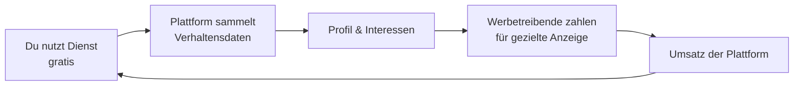
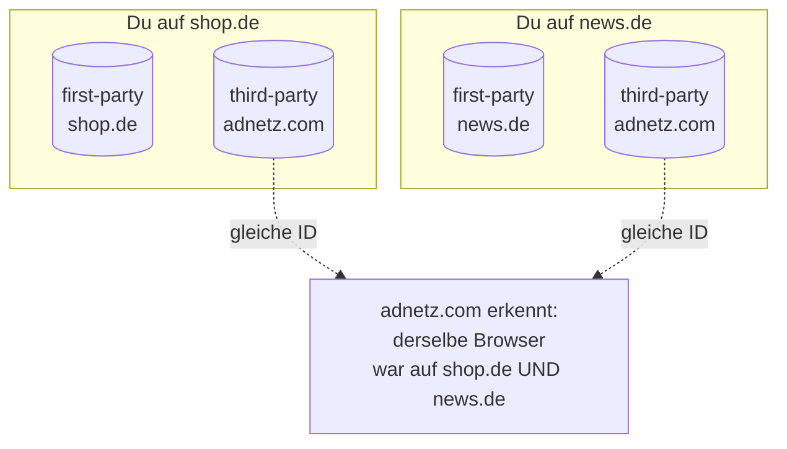
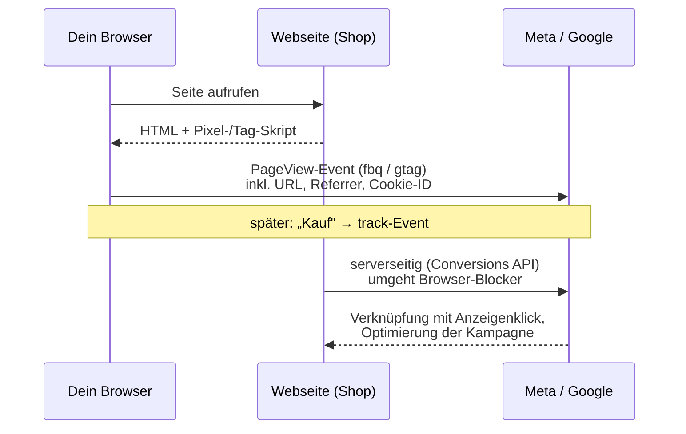
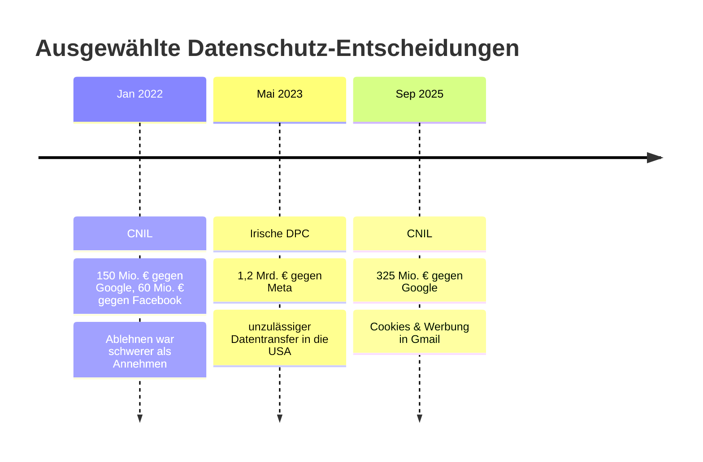
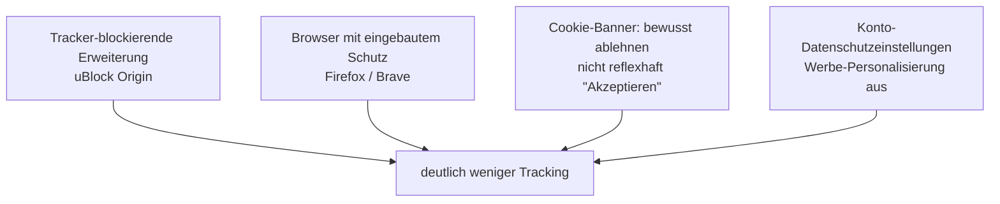

Wenn du eine beliebige Nachrichtenseite öffnest, lädst du nicht *eine* Website. Du lädst Dutzende: den Artikel selbst – und im Hintergrund ein gutes Dutzend fremder Skripte, die zählen, wer du bist, was du liest und worauf du klickst. Das ist kein Hackerangriff, sondern das normale, dokumentierte Geschäftsmodell des Webs. Dieser Beitrag erklärt die *Technik* dahinter – ohne Verschwörungston, aber präzise – und zeigt am Ende, was man konkret dagegen tun kann.

> **Hinweis zur Methode:** Wie Tracking-Werkzeuge funktionieren, ist erstaunlich offen dokumentiert – meist von den Anbietern selbst (Meta- und Google-Entwicklerdokumentation). Die rechtlichen Aussagen stützen sich auf den Verordnungstext der DSGVO, Urteile (EuGH, BGH) und Entscheidungen von Datenschutzbehörden (CNIL, irische DPC). Zahlen zum Fingerprinting stammen aus der wissenschaftlichen Forschung. Ich bin Informatiker, kein Jurist – die rechtlichen Abschnitte sind eine fundierte Orientierung, keine Rechtsberatung. Statistiken und Marktstände altern schnell; achte auf das jeweilige Datum.

## Gliederung

1. [Das Geschäftsmodell: Du bist das Produkt](#1-das-geschäftsmodell-du-bist-das-produkt)
2. [Cookies: first-party vs. third-party](#2-cookies-first-party-vs-third-party)
3. [Der Meta-Pixel und der Google-Tag](#3-der-meta-pixel-und-der-google-tag)
4. [Tracking-Pixel und Fingerprinting](#4-tracking-pixel-und-fingerprinting)
5. [Cross-Site-Tracking, RTB und das Schattenprofil](#5-cross-site-tracking-rtb-und-das-schattenprofil)
6. [Was beim Öffnen einer Nachrichtenseite passiert](#6-was-beim-öffnen-einer-nachrichtenseite-passiert)
7. [Der rechtliche Rahmen (DSGVO, ePrivacy, echte Bußgelder)](#7-der-rechtliche-rahmen)
8. [Verteidigung: Was man konkret tun kann](#8-verteidigung-was-man-konkret-tun-kann)
9. [Quellen](#quellen)

---

## 1. Das Geschäftsmodell: Du bist das Produkt

Google und Meta verdienen ihr Geld fast vollständig mit Werbung. Der Wert dieser Werbung steigt mit der Treffsicherheit: Wer genau weiß, *wer* du bist und *wofür* du dich interessierst, kann dir Anzeigen zeigen, die mit höherer Wahrscheinlichkeit klicken. Daten sind also kein Nebenprodukt, sondern der Rohstoff. Der oft zitierte Satz „Wenn du nicht für das Produkt bezahlst, bist du das Produkt" ist hier wörtlich gemeint: Verkauft wirst nicht *du*, sondern dein **Aufmerksamkeits-Slot** an Werbetreibende.

---

## 2. Cookies: first-party vs. third-party

Ein **Cookie** ist eine kleine Textdatei, die eine Website in deinem Browser ablegt und beim nächsten Besuch wieder ausliest. Der entscheidende Unterschied liegt darin, *wer* das Cookie setzt:

| | First-Party-Cookie | Third-Party-Cookie |
|---|---|---|
| Gesetzt von | der Seite in der Adresszeile | einer eingebundenen Fremddomain |
| Typischer Zweck | Login, Warenkorb, Spracheinstellung | seitenübergreifendes Tracking, Werbung |
| Sichtbar für | nur diese Seite | das Werbenetzwerk über *viele* Seiten hinweg |

Der Trick der Third-Party-Cookies: Wenn `adnetz.com` auf tausenden Seiten eingebunden ist, setzt und liest es überall *dasselbe* Cookie und erkennt deinen Browser so über alle diese Seiten hinweg wieder. Das ist die klassische Grundlage von Cross-Site-Tracking.

**Aktueller Stand (wichtig):** Google hatte angekündigt, Third-Party-Cookies in Chrome abzuschaffen, diesen Plan aber im April 2025 fallengelassen – sie bleiben vorerst erhalten.[^3pc] Im Oktober 2025 stellte Google zudem die verbliebenen Privacy-Sandbox-APIs ein.[^3pc] Third-Party-Cookies sind also nicht tot; das Tracking verlagert sich aber zunehmend auf serverseitige und cookie-unabhängige Techniken (siehe unten).

---

## 3. Der Meta-Pixel und der Google-Tag

Wie kommen die Daten von *deinem* Besuch auf einer x-beliebigen Seite zu Meta oder Google? Über ein Stück Code, das der Seitenbetreiber freiwillig einbaut.

Der **Meta-Pixel** ist laut Meta-Dokumentation ein JavaScript-Schnipsel, den der Betreiber in den `<head>` jeder Seite einbindet. Er lädt eine kleine Funktionsbibliothek; bei jedem Seitenaufruf feuert automatisch ein `PageView`-Ereignis über die Funktion `fbq()`. Weitere Aktionen – „Produkt angesehen", „gekauft" – meldet der Betreiber als **Standard-Events** über `fbq('track', ...)`.[^pixel] Meta verknüpft jedes Ereignis mit einem vorherigen Anzeigenklick desselben Nutzers innerhalb eines „Attributionsfensters".[^pixel]

Der **Google-Tag / Google Analytics** funktioniert nach demselben Prinzip: ein eingebettetes Skript meldet Seitenaufrufe und Ereignisse an Google.

Wichtig ist die jüngere Entwicklung weg vom Browser hin zum Server: Neben dem browserseitigen Pixel betreibt man heute oft die **Conversions API (CAPI)** – einen serverseitigen Kanal, über den der *Server* des Betreibers die Ereignisse direkt an Meta schickt.[^pixel] Das umgeht Browser-Blocker, weil die Daten gar nicht erst über dein Gerät an Meta fließen, sondern über den Webserver.

---

## 4. Tracking-Pixel und Fingerprinting

**Tracking-Pixel** (auch „Web-Beacons" oder „Zählpixel") sind die simpelste Variante: ein winziges, oft 1×1 Pixel großes, unsichtbares Bild. Allein dadurch, dass dein Browser dieses Bild von einem Fremdserver *anfordert*, überträgt er IP-Adresse, Zeitpunkt, aufgerufene Seite und User-Agent. Dieselbe Technik steckt in vielen E-Mails: „Pixel geöffnet" verrät dem Absender, dass und wann du die Mail gelesen hast.

**Fingerprinting** ist die heimtückischere Methode, weil sie *ganz ohne Cookie* auskommt. Statt etwas auf deinem Gerät zu speichern, setzt sie aus Eigenschaften, die dein Browser ohnehin jedem Server verrät, einen Wiedererkennungswert zusammen: Bildschirmauflösung, installierte Schriften, Spracheinstellung, Grafikkarte, und – besonders aussagekräftig – wie dein Gerät unsichtbar Grafiken oder Audio rendert (**Canvas-** und **Audio-Fingerprinting**).[^fp-survey] Die Kombination ist oft so individuell, dass sie einem einzelnen Gerät entspricht.

Wie wirksam das ist, zeigt die Grundlagenforschung: In Peter Eckersleys *Panopticlick*-Studie der EFF waren rund **83,6 %** der untersuchten Browser-Fingerprints eindeutig – das Gerät ließ sich also allein daran wiedererkennen.[^panopticlick] Der entscheidende Nachteil aus Nutzersicht: Cookies kann man löschen, einen Fingerprint nicht ohne Weiteres.

---

## 5. Cross-Site-Tracking, RTB und das Schattenprofil

Setzt man diese Bausteine zusammen, entsteht **Cross-Site-Tracking**: Ein Werbenetzwerk, das auf vielen Seiten eingebunden ist, erkennt denselben Browser überall wieder (per Cookie oder Fingerprint) und baut daraus ein Verhaltensprofil – welche Seiten, welche Themen, welche Uhrzeiten.

Der Punkt, an dem dieses Profil zu Geld wird, ist das **Real-Time Bidding (RTB)**. Während eine Seite lädt, wird der freie Werbeplatz in einer Auktion versteigert: Der Werbeplatz – samt Profilmerkmalen über dich – wird an viele Demand-Side-Plattformen ausgespielt, die in Millisekunden ein Gebot abgeben; der höchste Bieter darf seine Anzeige zeigen. Der gesamte Vorgang läuft typischerweise in **50 bis 100 Millisekunden** ab, bevor die Seite fertig geladen ist.[^rtb] Datenschützer kritisieren an RTB, dass dabei Profilmerkmale an eine Vielzahl von Unternehmen verteilt werden.

Ein **Schattenprofil** entsteht, wenn über dich Daten gesammelt werden, *obwohl du den Dienst gar nicht nutzt*: Besucht jemand eine Seite mit eingebautem Meta-Pixel, fließen Daten auch dann an Meta, wenn die Person kein Facebook-Konto hat. **Datenbroker** kaufen und verknüpfen zusätzlich Datensätze aus unterschiedlichsten Quellen zu umfangreichen Personenprofilen und verkaufen diese dann an Andere, sodass auch unbekannte Services teilweise Profile von dir verwalten.

---

## 6. Was beim Öffnen einer Nachrichtenseite passiert

Konzeptionell – als „Request-Wasserfall" gedacht – läuft beim Aufruf einer typischen werbefinanzierten Seite ungefähr Folgendes ab:

1. Der Browser lädt das **HTML** des Artikels von der eigentlichen Domain.
2. Beim Parsen stößt er auf eingebettete Skripte: ein **Consent-Banner**, **Google Analytics / Google-Tag**, oft einen **Meta-Pixel**, dazu Anzeigen-Slots.
3. Die Anzeigen-Slots lösen das **RTB** aus: Profilmerkmale gehen an Werbenetzwerke, eine Auktion läuft, die Gewinneranzeige wird nachgeladen – inklusive *deren* eigener Tracking-Pixel.
4. Tracking-**Pixel** verschiedener Drittparteien feuern und melden deinen Besuch.

Das Ergebnis: Ein einziger Seitenaufruf kann Verbindungen zu Dutzenden fremder Server auslösen – die meisten davon haben mit dem Artikel nichts zu tun.

### Selbst ausprobieren

Das Schöne an diesem Abschnitt: Du musst mir nichts glauben – du kannst den Wasserfall an einer echten Seite live sehen. Zwei Wege:

**1. Per Knopfdruck mit Blacklight.** [Blacklight von The Markup](https://themarkup.org/blacklight) scannt jede beliebige Website und listet auf, wie viele Third-Party-Cookies und Ad-Tracker laden, ob ein **Meta-Pixel** oder **Google Analytics** aktiv ist und ob die Seite sogar Maus- und Tastatureingaben mitschneidet („Session Recording"). Du gibst oben einfach die Adresse ein; der Report ist teilbar und damit gut zum Vergleichen und für Screenshots.

**2. Direkt im Browser (DevTools).** Drücke `F12`, öffne den Tab **„Netzwerk"** und lade eine Seite neu: Die lange Liste an Anfragen zu fremden Domains (`doubleclick.net`, `facebook.com`, diverse `ad`-Domains) ist genau dieser Wasserfall. Unter **„Anwendung" → „Cookies"** (Chrome) bzw. **„Speicher" → „Cookies"** (Firefox) siehst du zudem, wie nach einem Klick auf „Alle akzeptieren" schlagartig Dutzende Einträge dazukommen.

**Gute Testseiten** (tracking-schwer, zum Anfassen):

- [`weather.com`](https://weather.com) – international der Klassiker, Dutzende Tracker bei einem Aufruf.
- [`bild.de`](https://www.bild.de) – der Consent-Banner listet *mehrere hundert* „Partner" auf; allein das Durchscrollen der Liste ist eindrücklich.
- [`chip.de`](https://www.chip.de) / [`focus.de`](https://www.focus.de) – riesige Vendor-Listen, viele Werbe-Cookies direkt nach „Akzeptieren".
- Ein großer Shop wie [`otto.de`](https://www.otto.de) – zeigt schön den Unterschied zwischen *funktionalen* Cookies (Warenkorb) und *Marketing*-Cookies (Retargeting, Pixel).

Der lehrreichste Moment ist der **Vorher-Nachher-Vergleich**: dieselbe Seite einmal ohne und einmal mit aktivem uBlock Origin (siehe Abschnitt 8) scannen oder im Netzwerk-Tab betrachten – der Unterschied ist der ganze Abschnitt 6 in einem Bild.

> **⚠️ Bemerkung:** Die genaue Cookie- und Tracker-Zahl schwankt je nach Region, Einwilligung und laufenden A/B-Tests.

---

## 7. Der rechtliche Rahmen

In der EU ist dieses Sammeln nicht unreguliert. Zwei Regelwerke greifen ineinander: die **DSGVO** (Datenschutz-Grundverordnung) und die **ePrivacy-Richtlinie** (umgesetzt u. a. im deutschen TDDDG).

**Einwilligung ist Pflicht.** Der EuGH entschied im Fall *Planet49* (1. Oktober 2019), dass ein **vorangekreuztes Kästchen keine wirksame Einwilligung** ist; der BGH bestätigte das am 28. Mai 2020.[^planet49] Für nicht-notwendige Cookies (Tracking, Werbung) braucht es also eine aktive, informierte Einwilligung *vor* dem Setzen – das ist der Ursprung der allgegenwärtigen Cookie-Banner. Ein Banner, das nur einen „Akzeptieren"-Knopf hat, ist in der Regel unzulässig.

Dass das ernst gemeint ist, zeigen reale Bußgelder:

- **CNIL gegen Google und Facebook (Januar 2022):** 150 Mio. € bzw. 60 Mio. €, weil das *Ablehnen* von Cookies schwerer gemacht wurde als das Annehmen.[^cnil2022]
- **Irische DPC gegen Meta (Mai 2023):** **1,2 Mrd. €** – das bis dahin höchste DSGVO-Bußgeld – wegen unzulässiger Übermittlung personenbezogener Daten aus der EU in die USA (Verstoß gegen Art. 46 DSGVO).[^meta12]
- **CNIL gegen Google (2025):** 325 Mio. € wegen Cookies und in E-Mails eingeblendeter Werbung.[^cnil2025]

**Grenzen:** „Do Not Track", ein Browser-Signal, das Tracking ablehnen sollte, ist weitgehend gescheitert – die meisten Seiten ignorierten es schlicht, weil es nicht verbindlich war. Es ist ein gutes Beispiel dafür, dass eine technische Bitte ohne rechtliche Durchsetzung wenig bewirkt.

---

## 8. Verteidigung: Was man konkret tun kann

Vollständige Unsichtbarkeit ist illusorisch – aber man kann den Großteil des Trackings mit wenig Aufwand abstellen. Vom größten Hebel zum kleinsten:

- **uBlock Origin** (quelloffen, kostenlos) blockiert Tracker und Werbeskripte zuverlässig und ist der wirksamste Einzelschritt. Es blockt die Skripte aus Abschnitt 6, bevor sie feuern.
- **Browserwahl:** **Firefox** blockiert seitenübergreifende Tracker standardmäßig (Enhanced Tracking Protection); **Brave** bringt Tracker- und Werbeblocker von Haus aus mit. Beide haben außerdem Schutzmaßnahmen gegen Fingerprinting.
- **Cookie-Banner-Hygiene:** „Alle ablehnen" bzw. „Nur notwendige" wählen, statt reflexhaft zuzustimmen. Dank *Planet49* muss eine Ablehnung möglich sein.
- **Konto-Einstellungen:** Bei Google (`myactivity.google.com`, Einstellungen zur Werbepersonalisierung) und Meta lässt sich die Personalisierung einschränken und der Aktivitätsverlauf begrenzen.
- **Realistische Erwartung:** Fingerprinting und serverseitiges Tracking (CAPI) lassen sich nur teilweise verhindern – Browser mit Anti-Fingerprinting helfen, aber kein einzelnes Werkzeug ist lückenlos. Und: Verlasse dich nicht auf „Do Not Track".

> **💡 Tipp für Eltern und Lehrkräfte:** Der lehrreichste Einstieg ist der `F12`-Netzwerk-Tab aus Abschnitt 6, kombiniert mit dem Vorher-Nachher-Vergleich nach Installation von uBlock Origin. Wer einmal *sieht*, wie viele fremde Server bei einem Klick mitlesen, versteht das Geschäftsmodell sofort – ganz ohne Alarmismus.

---

## Einen Workshop buchen

Du möchtest mit deiner Klasse oder dem Kollegium praktisch durchgehen, wie Tracking technisch funktioniert – und wie man sich schützt? Ich biete dazu Workshops an, in denen wir den Request-Wasserfall live auseinandernehmen und Schutzmaßnahmen einrichten. Wenn das für dich interessant ist, [melde dich](/#kontakt) oder sieh dir das Programm auf [felix-paul.de/schools](/schools/) an.

---

## Quellen

Jede Quelle ist mit ihrem **Veröffentlichungs- bzw. Entscheidungsdatum** und dem **Abrufdatum (2026-06-10)** versehen. Marktstände (etwa zur Zukunft der Third-Party-Cookies) ändern sich schnell – im Zweifel die jeweils aktuelle Lage prüfen.

[^pixel]: Meta for Developers, „Meta Pixel" / „Conversion Tracking" (JavaScript-Snippet im `<head>`, `fbq()`-PageView, Standard-Events, Attributionsfenster) sowie zur serverseitigen Conversions API. *Laufend gepflegte Entwicklerdokumentation, ohne festes Datum; abgerufen 2026-06-10.* <https://developers.facebook.com/docs/meta-pixel/> · <https://developers.facebook.com/docs/meta-pixel/implementation/conversion-tracking/>

[^3pc]: Google / Privacy Sandbox, Kehrtwende bei Third-Party-Cookies: Abschaffung in Chrome aufgegeben (April 2025), Einstellung der verbliebenen Privacy-Sandbox-APIs (Oktober 2025). *Branchenberichterstattung, zusammenfassend; abgerufen 2026-06-10. Primärquelle: Privacy-Sandbox-Ankündigungen von Google.* <https://www.didomi.io/blog/google-chrome-third-party-cookies-april-2025>

[^fp-survey]: Pierre Laperdrix u. a., „Browser Fingerprinting: A Survey" (Überblick über Fingerprinting-Techniken, u. a. Canvas, WebGL, Schriften, Audio). *arXiv-Preprint, veröffentlicht 2019; abgerufen 2026-06-10.* <https://arxiv.org/pdf/1905.01051>

[^panopticlick]: Peter Eckersley / Electronic Frontier Foundation, *Panopticlick*-Studie: rund 83,6 % der untersuchten Browser-Fingerprints waren eindeutig. *Ursprüngliche Studie 2010; Projektseite fortlaufend; abgerufen 2026-06-10.* <https://panopticlick.org/about/>

[^rtb]: Branchendarstellungen zu Real-Time Bidding (Auktion in 50–100 ms während des Seitenladens; Verteilung von Impression- und Profildaten an Demand-Side-Plattformen). *Glossar-/Übersichtsartikel, fortlaufend; abgerufen 2026-06-10.* <https://www.fraudlogix.com/glossary/what-is-rtb-real-time-bidding/> · <https://en.wikipedia.org/wiki/Real-time_bidding>

[^planet49]: EuGH-Urteil C-673/17 *Planet49* (1. Oktober 2019) und bestätigendes BGH-Urteil I ZR 7/16 (28. Mai 2020): vorangekreuzte Kästchen sind keine wirksame Einwilligung; aktive Einwilligung vor dem Setzen nicht-notwendiger Cookies erforderlich. *Urteile 2019/2020; abgerufen 2026-06-10.* <https://www.baden-wuerttemberg.datenschutz.de/zum-einsatz-von-cookies-und-cookie-bannern-was-gilt-es-bei-einwilligungen-zu-tun-eugh-urteil-planet49/>

[^cnil2022]: CNIL (französische Datenschutzbehörde), Bußgelder vom 6. Januar 2022: 150 Mio. € gegen Google und 60 Mio. € gegen Facebook Ireland, weil das Ablehnen von Cookies schwerer gemacht wurde als das Annehmen. *Entscheidung 06.01.2022; abgerufen 2026-06-10.* <https://www.cnil.fr/en/cookies-google-fined-150-million-euros>

[^meta12]: Irische Data Protection Commission, Bußgeld vom 22. Mai 2023: 1,2 Mrd. € gegen Meta Platforms Ireland wegen unzulässiger Datenübermittlung in die USA (Art. 46 Abs. 1 DSGVO) – seinerzeit höchstes DSGVO-Bußgeld. *Entscheidung Mai 2023; abgerufen 2026-06-10.* <https://legal.pwc.de/de/news/fachbeitraege/rekordbussgeld-uber-12-milliarden-euro-gegen-meta-ireland>

[^cnil2025]: CNIL, Bußgeld 2025: 325 Mio. € gegen Google wegen Cookies und in Gmail eingeblendeter Werbung. *Entscheidung 2025 (EDPB-Meldung); abgerufen 2026-06-10.* <https://www.edpb.europa.eu/news/national-news/2025/french-sa-cookies-and-advertisements-inserted-between-emails-google-fined_en>
