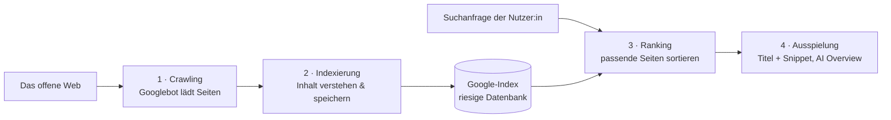
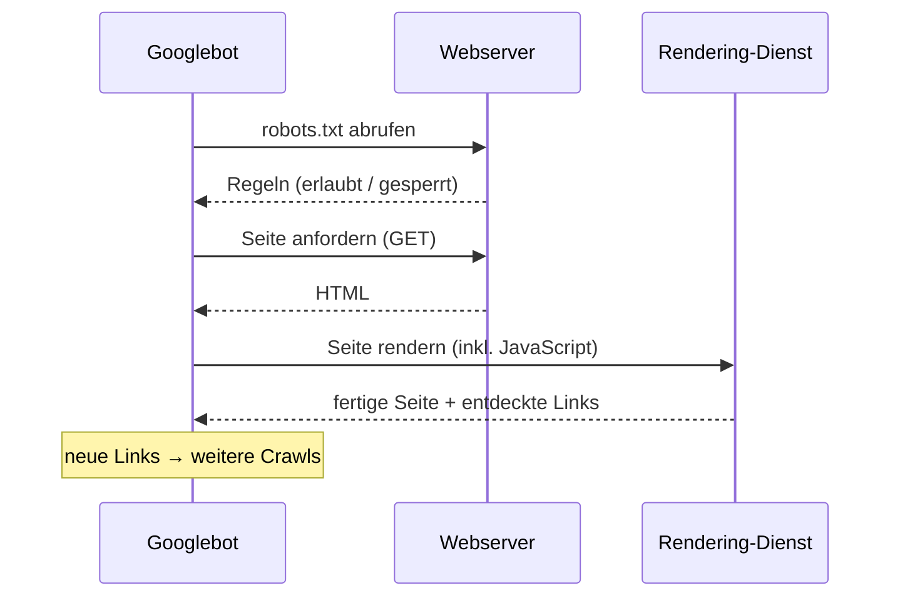
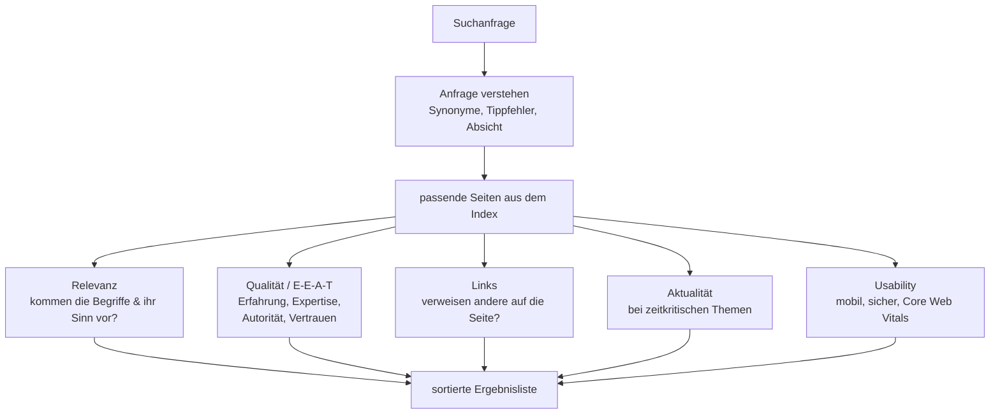
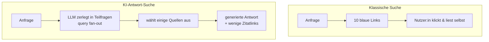
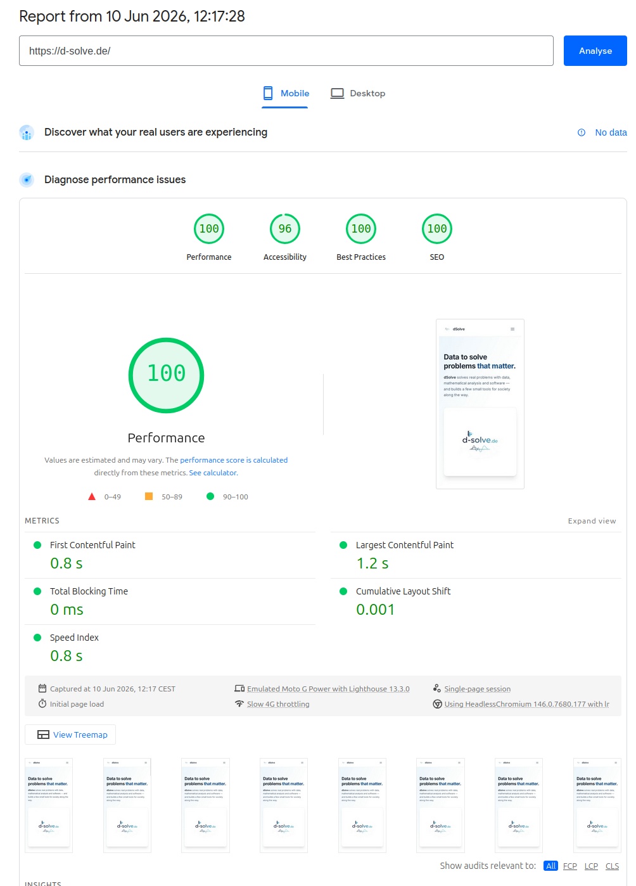

Fast jede:r tippt täglich etwas in ein Suchfeld – aber kaum jemand weiß, was zwischen dem Drücken der Eingabetaste und der Ergebnisliste passiert. Für Außenstehende wirkt die Google-Suche wie eine Blackbox, die geheimnisvoll entscheidet, wer oben steht. Das stimmt nur halb: Die *Mechanik* dahinter ist von Google öffentlich und überraschend nüchtern dokumentiert. Geheim ist nur die genaue Gewichtung der Signale. Dieser Beitrag erklärt die Pipeline Schritt für Schritt – am konkreten Beispiel meiner eigenen Website – und zeigt, was sich durch KI-Antworten gerade verschiebt.

> **Hinweis zur Methode:** Die Beschreibung der Pipeline stützt sich auf die offizielle *Google Search Central*-Dokumentation für Entwickler. Wo es um die KI-Suche (AI Overviews) und um „generative engine optimization" geht, ist die Quellenlage dünner und schnelllebiger – Google legt hier wenig offen, und vieles stammt aus Branchenanalysen, die ich als solche kennzeichne und nicht mit den offiziellen Docs gleichsetze. Ich bin Informatiker, kein Google-Mitarbeiter: Die exakte Rangfolge-Formel kennt niemand außerhalb von Google, und SEO bleibt grundsätzlich **probabilistisch** – es verschiebt Wahrscheinlichkeiten, es garantiert nichts.

## Gliederung

1. [Die vier Stufen: Crawling → Indexierung → Ranking → Ausspielung](#1-die-vier-stufen)
2. [Stufe 1 – Crawling: Wie Googlebot Seiten findet](#2-stufe-1--crawling)
3. [Stufe 2 – Indexierung: Was Google von der Seite versteht](#3-stufe-2--indexierung)
4. [Stufe 3 – Ranking: Wie Relevanz und Qualität bewertet werden](#4-stufe-3--ranking)
5. [Stufe 4 – Ausspielung: Vom Snippet zum Ergebnis](#5-stufe-4--ausspielung)
6. [SEO-Grundlagen ohne Marketing-Gerede](#6-seo-grundlagen-ohne-marketing-gerede)
7. [Der Bruch: KI-Antworten und AI Overviews (GEO)](#7-der-bruch-ki-antworten-und-ai-overviews)
8. [Worked Example: meine eigene Website](#8-worked-example-meine-eigene-website)
9. [Quellen](#quellen)

---

## 1. Die vier Stufen

Google beschreibt die eigene Suche selbst als einen Prozess in drei Phasen – Crawling, Indexierung und Ausspielung der Ergebnisse.[^how-search-works] Ich trenne hier die Ausspielung gedanklich in *Ranking* (Sortieren) und *Serving* (Anzeigen), weil das didaktisch klarer ist:



Wichtig vorweg, weil es ein hartnäckiger Mythos ist: **Man kann sich bei Google nicht in die organischen Ergebnisse einkaufen.** Crawling, Indexierung und das klassische Ranking sind kostenlos; bezahlt werden nur die als „Anzeige" gekennzeichneten Plätze. Ob eine Seite gut rankt, hängt am Inhalt – nicht am Geldbeutel.[^how-search-works]

| Stufe | Frage, die Google beantwortet | Stellschraube für dich |
|---|---|---|
| Crawling | „Gibt es diese Seite, darf ich sie laden?" | robots.txt, Sitemap, Verlinkung, Servergeschwindigkeit |
| Indexierung | „Worum geht es, ist das ein Duplikat?" | Title, Überschriften, strukturierte Daten, `noindex` |
| Ranking | „Welche Seite passt am besten zur Anfrage?" | Relevanz, Qualität/E-E-A-T, Links, Aktualität, Usability |
| Ausspielung | „Wie zeige ich das an?" | Title-Tag, Meta-Description, Rich Results, AI Overview |

---

## 2. Stufe 1 – Crawling

**Crawling** heißt: Google sucht das Web nach neuen und aktualisierten Seiten ab. Der dafür zuständige automatisierte Abrufer heißt **Googlebot**.[^crawling] Der Ablauf:

1. **URL-Discovery.** Google findet neue Adressen meist dadurch, dass eine bereits bekannte Seite auf sie verlinkt – oder dadurch, dass du eine **Sitemap** einreichst. Eine Sitemap ist eine maschinenlesbare Liste aller URLs deiner Website; bei den gängigen Frameworks (auch bei meinem, dazu unten) wird sie automatisch erzeugt.[^crawling]
2. **Abruf (Fetch) und Rendering.** Googlebot lädt die Seite herunter und rendert sie – führt also wie ein Browser auch das JavaScript aus, um zu sehen, was die Nutzer:in tatsächlich sieht.[^crawling]

Drei nüchterne Fakten dazu:

- **Nicht jede Seite wird gecrawlt.** Wie viel Googlebot von einer Domain abruft, hängt unter anderem davon ab, wie schnell und fehlerfrei der Server antwortet (das nennt Google grob „Crawl-Kapazität" und „Crawl-Bedarf").[^crawling]
- **`robots.txt` steuert den Zugriff.** Diese Datei im Wurzelverzeichnis sagt Crawlern, welche Pfade sie abrufen dürfen. Wichtig und oft missverstanden: `robots.txt` verhindert das *Crawlen*, ist aber **kein** zuverlässiges Mittel, um eine Seite aus dem *Index* herauszuhalten – dafür braucht es ein `noindex`-Tag.[^crawling]
- **Hinter Logins kommt Googlebot nicht.** Inhalte, die eine Anmeldung erfordern, sieht der Crawler in der Regel nicht.



---

## 3. Stufe 2 – Indexierung

Nach dem Laden versucht Google zu *verstehen*, worum es auf der Seite geht. Dabei verarbeitet es den Text und zentrale Inhaltselemente: das `title`-Element, Überschriften, `alt`-Attribute von Bildern, Videos und mehr.[^crawling] Zwei Dinge passieren hier:

- **Duplikaterkennung.** Google bündelt sehr ähnliche Seiten und wählt eine *kanonische* Version aus, die stellvertretend in den Index kommt.[^crawling]
- **Index-Selektion.** Eine Seite kann gecrawlt werden, **ohne** indexiert zu werden. Gründe sind „dünner" oder duplizierter Inhalt, ein `noindex`-Hinweis oder Qualitätsprobleme.[^how-search-works] Crawling ≠ Indexierung – das ist der häufigste Denkfehler von Einsteiger:innen.

> **💡 Tipp:** Ob eine Seite überhaupt im Index ist, prüfst du mit der Suchanfrage `site:deine-domain.de`. Taucht sie dort nicht auf, ist sie nicht indexiert – egal, wie gut der Inhalt ist.

---

## 4. Stufe 3 – Ranking

Tippt jemand eine Anfrage ein, durchsucht Google den Index nach passenden Seiten und sortiert sie nach **Relevanz und Qualität**. Google sagt selbst, dass dabei *hunderte* Faktoren zusammenspielen und keine einzelne „magische Zahl" existiert.[^how-search-works] Die wichtigsten Faktorgruppen lassen sich aber sauber benennen:



- **Relevanz.** Der einfachste Faktor: Kommen die Suchbegriffe – und ihr *Sinn* – auf der Seite vor? Google erweitert die Anfrage dabei um Synonyme und gleicht sie semantisch ab, statt nur Wörter zu zählen.[^how-search-works]
- **Qualität und E-E-A-T.** Google bewertet Inhalte daran, ob sie hilfreich und „people-first" sind. Als Orientierung dient das Konzept **E-E-A-T** – *Experience, Expertise, Authoritativeness, Trustworthiness* (Erfahrung, Expertise, Autorität, Vertrauenswürdigkeit).[^helpful] Wichtig zur Einordnung: **E-E-A-T ist selbst kein direkter Ranking-Faktor.** Es ist das Raster, mit dem geschulte *Quality Rater* die Ergebnisse beurteilen; deren Bewertungen fließen nicht direkt ins Ranking, sondern helfen, die Algorithmen zu *trainieren*.[^eeat] Bei Themen rund um Gesundheit, Finanzen oder Sicherheit („YMYL") gewichtet Google Vertrauenssignale besonders stark.[^eeat]
- **Links.** Verweise anderer Seiten gelten weiterhin als ein Signal für Bedeutung – aber als *eines unter vielen*, nicht als Hauptschalter.
- **Aktualität.** Bei zeitkritischen Anfragen (Nachrichten, Ergebnisse) bevorzugt Google frische Inhalte; bei zeitlosen Themen spielt das kaum eine Rolle.
- **Usability / Page Experience.** Dazu gehören Mobilfreundlichkeit, HTTPS und die **Core Web Vitals**. Das sind drei Feldmesswerte zur tatsächlichen Nutzererfahrung: **LCP** (Ladezeit des größten Inhalts, Ziel < 2,5 s), **INP** (Reaktionszeit auf Eingaben, Ziel < 200 ms) und **CLS** (visuelle Stabilität, Ziel < 0,1).[^cwv] Google betont, dass das Page-Experience-Signal kein einzelner Tie-Breaker ist: Bei gleichwertigem Inhalt kann die bessere Erfahrung den Ausschlag geben, ersetzt aber nie guten Inhalt.[^cwv]

---

## 5. Stufe 4 – Ausspielung

Was die Nutzer:in schließlich sieht, sind meist die klassischen „blauen Links": pro Treffer ein **Title** und ein **Snippet** (die kurze Beschreibung darunter).

- Der angezeigte Title basiert auf dem `title`-Element bzw. den Überschriften der Seite – Google darf ihn aber umschreiben, wenn er die Anfrage schlecht trifft.
- Das Snippet wird aus dem Seiteninhalt erzeugt. Du kannst es beeinflussen: mit einer guten Meta-Description, mit dem Attribut `data-nosnippet` für Passagen, die nicht erscheinen sollen, oder über die maximale Länge.

> **💡 Tipp:** Wie Google deinen Eintrag *gerade jetzt* darstellt, siehst du am ehrlichsten über `site:deine-domain.de` – nicht über eine normale Suche, die personalisiert und standortabhängig ist.

---

## 6. SEO-Grundlagen ohne Marketing-Gerede

SEO (Suchmaschinenoptimierung) ist kein Trickbeutel, sondern das Aufräumen entlang genau dieser Pipeline. Die ehrliche Kurzfassung:

**Technische Basis** (damit Crawling und Indexierung sauber laufen):
- HTTPS, eine erreichbare **Sitemap**, eine korrekte **`robots.txt`**.
- Schnelle, mobilfreundliche Seiten (Core Web Vitals).
- **Strukturierte Daten** (Schema.org / JSON-LD): maschinenlesbare Auszeichnungen, mit denen sich „Rich Results" (z. B. Bewertungen, FAQ) qualifizieren können.

**Inhaltliche Basis** (damit Ranking und Ausspielung greifen):
- Aussagekräftige `title`-Tags, eine klare `h1`, sinnvolle Meta-Descriptions.
- Inhalt, der eine echte Frage besser beantwortet als andere – mit Quellen, Belegen, eigener Erfahrung. Das ist exakt die E-E-A-T-Logik.
- Interne und externe Verlinkung: verlinke andere sinnvoll und werde verlinkt.

> **⚠️ Realitäts-Check:** Wer „Platz 1 garantiert", lügt. Niemand außerhalb von Google kennt die genaue Formel, sie ändert sich laufend, und Ergebnisse sind personalisiert. Seriöses SEO erhöht *Wahrscheinlichkeiten*, es kauft keine Plätze. Manipulationsversuche (gekaufte Linkfarmen, Keyword-Spam) werden algorithmisch abgewertet.

---

## 7. Der Bruch: KI-Antworten und AI Overviews

Seit Google **AI Overviews** ausrollt – eine generative Zusammenfassung über den klassischen Treffern – verschiebt sich die Frage von „Auf welchem Platz stehe ich?" zu „Werde ich von der KI *zitiert*?". Daneben treten reine Antwortmaschinen (ChatGPT mit Suche, Perplexity u. a.), die gar keine Linkliste mehr zeigen, sondern eine Antwort mit ein paar Quellenverweisen.



Wie eine KI-Antwortmaschine ihre Quellen auswählt, ist *nicht* offiziell dokumentiert; das Folgende stammt aus Branchenanalysen und ist entsprechend mit Vorsicht zu lesen:[^aio-whitepeak][^aio-ahrefs]

- **Query fan-out:** Die Anfrage wird in mehrere Teilfragen aufgesplittet; Seiten, die über diese Teilfragen hinweg häufig auftauchen, werden bevorzugt zitiert.[^aio-whitepeak]
- **Überlappung mit dem klassischen Ranking:** Eine Analyse von Ahrefs fand, dass ein erheblicher Teil der in AI Overviews zitierten Seiten aus den klassischen Top-10 stammt – gut ranken hilft also weiterhin, ist aber keine Garantie, da viele KI-Zitate auch von Seiten außerhalb der Top-20 kommen.[^aio-ahrefs]
- **Struktur und Aktualität** scheinen zu helfen: klar gegliederte, gut belegte, aktuelle Inhalte werden offenbar häufiger herangezogen. Konkrete Prozentzahlen kursieren, sind aber methodisch uneinheitlich und hier nicht als gesichert zu werten.

Für diese neue Disziplin hat sich der Begriff **GEO – Generative Engine Optimization** etabliert. In der Praxis ist GEO derzeit weitgehend *gutes klassisches SEO plus klare Struktur*: eindeutige Überschriften, präzise Aussagen früh im Text, saubere Quellen, maschinenlesbare Auszeichnung. Wer behauptet, ein Geheimrezept für KI-Zitate zu haben, bewegt sich – noch stärker als beim klassischen SEO – auf spekulativem Boden.

---

## 8. Worked Example: meine eigene Website

Diese Seite (`felix-paul.de/blog`) ist ein gutes Lehrbeispiel, weil sie bewusst simpel gebaut ist: ein **statischer Astro-Build**. Es gibt keine Datenbank, die bei jeder Anfrage rechnet – Googlebot bekommt fertiges HTML. Das ist für die Pipeline ideal. Das Schöne daran: Du kannst jeden der folgenden Punkte **selbst im Browser nachprüfen** – nichts davon ist geheim.

### Crawling: robots.txt und Sitemap selbst anschauen

Beide Dateien, die Stufe 1 steuern, liegen offen im Netz – ruf sie einfach auf:

- **`robots.txt`:** <https://felix-paul.de/robots.txt>. Dort steht im Klartext, welche Crawler welche Pfade abrufen dürfen. Bei mir:
  ```
  User-agent: *
  Allow: /
  Sitemap: https://felix-paul.de/sitemap-index.xml
  ```
  Übersetzt: *Jeder* Crawler (`User-agent: *`) darf *alles* abrufen (`Allow: /`), und die vollständige Seitenliste findet sich unter der genannten Sitemap-Adresse. Genau diese Datei ruft Googlebot als Erstes ab, bevor er sonst etwas lädt.
- **Sitemap:** <https://felix-paul.de/sitemap-index.xml>. Das ist eine **Sitemap-Index-Datei** – sie verweist ihrerseits auf eine oder mehrere Detail-Sitemaps (`sitemap-0.xml`), in denen jede einzelne URL der Website aufgelistet ist. Öffne den Link: Du siehst rohes XML, also exakt die maschinenlesbare Liste, an der Google sich orientiert. Erzeugt wird sie beim Build automatisch vom `@astrojs/sitemap`-Plugin – ich pflege keine URL-Liste von Hand.

**Rendering.** Weil die Inhalte schon im HTML stehen (statt erst per JavaScript nachgeladen zu werden), muss Googlebot nichts ausführen, um den Text zu sehen. Das senkt das Risiko, dass Inhalt beim Rendering verloren geht – und es ist schnell, was den Core Web Vitals zugutekommt.

### Indexierung: Title und Meta-Tags im Browser sehen

Du musst kein:e Entwickler:in sein, um zu sehen, was Google beim „Verstehen" der Seite ausliest. Zwei Wege, beide laiengeeignet:

1. **Seitenquelltext anzeigen.** Rechtsklick auf eine beliebige freie Stelle der Seite → *„Seitenquelltext anzeigen"* (oder das Tastenkürzel `Strg`+`U` unter Windows/Linux, `Cmd`+`Option`+`U` am Mac). Es öffnet sich der rohe HTML-Code. Suche darin mit `Strg`+`F` nach:
   - `<title>` – der Titel, den Google als blaue Überschrift anzeigt.
   - `<meta name="description"` – der Vorschlag für das Snippet darunter.
   - `<link rel="canonical"` – sagt Google, welche URL die „echte" ist (gegen Duplikate).
2. **Tab-Titel.** Schon der Text im Browser-Tab oben stammt aus genau diesem `<title>`-Element – der schnellste Sichtcheck überhaupt.

Bei dieser Website wird all das zentral im Layout gesetzt, sodass **keine** Seite ohne sauberen `<title>`, `<meta name="description">`, Canonical-Link und Open-Graph-Tags (für die Vorschau beim Teilen) ausgeliefert wird.

### Ranking & Ausspielung: was im Index steht – live prüfen

Was Google von einer Domain tatsächlich indexiert hat, zeigt der `site:`-Operator direkt in der Suche. Klick die Beispiele an:

- Diese Website: <https://www.google.com/search?q=site:felix-paul.de>
- Eine andere Seite von mir (d-solve.de): <https://www.google.com/search?q=site:d-solve.de>

Du siehst pro Treffer genau das `<title>`-/Snippet-Paar aus Stufe 4 – und nebenbei, *wie viele* Seiten überhaupt im Index liegen. Taucht eine Seite hier nicht auf, ist sie nicht indexiert, egal wie gut ihr Inhalt ist.

Wer eine eigene Website betreibt, bekommt die offizielle Innensicht über die kostenlose **[Google Search Console](https://search.google.com/search-console)**. Dort meldet man die Domain an, reicht die Sitemap ein und sieht, welche Seiten indexiert sind, mit welchen Suchanfragen Leute auf der Seite landen und ob es Crawling- oder Core-Web-Vitals-Probleme gibt – also die Pipeline aus diesem Artikel als Dashboard.

### Page Experience: Core Web Vitals messen

Wie schnell und stabil eine Seite *tatsächlich* lädt – die Core Web Vitals aus Abschnitt 4 –, misst Googles kostenloses Werkzeug **[PageSpeed Insights](https://pagespeed.web.dev/)**. Hier der Mobil-Bericht für eine andere meiner Seiten (d-solve.de):



Was man hier abliest:

- **Die vier Kreise oben** sind Lighthouse-Laborwerte: Performance, Accessibility (Barrierefreiheit), Best Practices und **SEO**. Der SEO-Wert von 100 prüft technische Basics aus diesem Artikel – `title`, Meta-Description, Crawlbarkeit, mobile Tauglichkeit –, ist aber **keine** Ranking-Garantie, sondern nur eine Hygiene-Checkliste.
- **Die Metriken** sind die Core Web Vitals als Labormessung: **LCP 1,2 s** (Ziel < 2,5 s ✓) und **CLS 0,001** (Ziel < 0,1 ✓), dazu Total Blocking Time 0 ms. Ein schneller, statischer Aufbau zahlt genau hier ein.
- **Ehrliche Einordnung:** Oben steht „Discover what your real users are experiencing – **No data**". Das ist der Unterschied zwischen *Labor*- und *Felddaten*: Die Kreise stammen aus einem simulierten Testlauf (emuliertes Moto G, gedrosseltes 4G). Echte Felddaten (aus dem Chrome User Experience Report) entstehen erst, wenn eine Seite genug Besucher hat – ein gutes Laborergebnis ist also notwendig, aber kein Beweis, dass *jede:r* es so schnell erlebt.

### Die Lehre

Man muss kein SEO-Geheimwissen kaufen. Eine schnelle, korrekt ausgezeichnete Seite mit ehrlich gutem Inhalt erfüllt das meiste von dem, was die Pipeline belohnt – im klassischen Ranking wie bei der KI-Zitierung. Und das Beste: Jeder einzelne Hebel ist mit den oben verlinkten, kostenlosen Werkzeugen **selbst überprüfbar**. Den Rest – die genaue Position – entscheidet Googles Algorithmus, und das bleibt für mich wie für alle eine Blackbox.

---

## Einen Workshop buchen

Du möchtest verstehen, wie deine eigene (oder die schulische) Website gefunden wird – im klassischen Google *und* von KI-Antwortmaschinen? Ich biete dazu praxisnahe Workshops an, in denen wir die Pipeline an einer echten Website durchgehen. Wenn das für dich oder deine Schüler:innen interessant ist, [melde dich](/#kontakt) oder sieh dir das Programm auf [felix-paul.de/education](/education/) an.

---

## Quellen

Jede Quelle ist mit ihrem **Veröffentlichungs- bzw. Erhebungsdatum** und dem **Abrufdatum (2026-06-10)** versehen. Aussagen zu AI Overviews stammen teils aus Branchenanalysen und sind als solche gekennzeichnet – offizielle Google-Dokumentation ist ihnen vorzuziehen.

[^how-search-works]: Google Search Central, „In-Depth Guide to How Google Search Works" (Crawling, Indexierung, Ausspielung; hunderte Ranking-Faktoren; organische Ergebnisse sind kostenlos). *Laufend gepflegte Dokumentation, ohne festes Datum; abgerufen 2026-06-10.* <https://developers.google.com/search/docs/fundamentals/how-search-works>

[^crawling]: Google Search Central, „Crawling and Indexing" (Googlebot, URL-Discovery, Sitemaps, Rendering, robots.txt, Crawl-Kapazität/-Bedarf). *Laufend gepflegte Dokumentation, ohne festes Datum; abgerufen 2026-06-10.* <https://developers.google.com/search/docs/crawling-indexing>

[^helpful]: Google Search Central, „Creating Helpful, Reliable, People-First Content". *Laufend gepflegte Dokumentation, ohne festes Datum; abgerufen 2026-06-10.* <https://developers.google.com/search/docs/fundamentals/creating-helpful-content>

[^eeat]: Google Search Central Blog, „Our latest update to the quality rater guidelines: E-A-T gets an extra E for Experience" (E-E-A-T als Bewertungsraster der Quality Rater; Rater-Daten fließen nicht direkt ins Ranking; stärkere Gewichtung bei YMYL-Themen). *Veröffentlicht Dezember 2022; abgerufen 2026-06-10.* <https://developers.google.com/search/blog/2022/12/google-raters-guidelines-e-e-a-t>

[^cwv]: Google Search Central, „Understanding Core Web Vitals and Google search results" (LCP, INP, CLS; INP ersetzte FID; Page Experience als ein Faktor unter mehreren). *Laufend gepflegte Dokumentation, ohne festes Datum; abgerufen 2026-06-10.* <https://developers.google.com/search/docs/appearance/core-web-vitals>

[^aio-whitepeak]: White Peak, „How Google's AI Overviews Select Sources" (Branchenanalyse; „query fan-out", Auswahlkriterien). *Datum nicht eindeutig ausgewiesen; abgerufen 2026-06-10. Nicht-offizielle Quelle – als Hypothese zu lesen.* <https://whitepeak.io/how-googles-ai-overviews-select-sources/>

[^aio-ahrefs]: Ahrefs, „38% of AI Overview Citations Pull From The Top 10" (Datenanalyse zur Überlappung von AI-Overview-Zitaten mit klassischem Ranking). *Branchenstudie, fortlaufend aktualisiert; abgerufen 2026-06-10. Nicht-offizielle Quelle.* <https://ahrefs.com/blog/ai-overview-citations-top-10/>
