Die meisten Schüler:innen nutzen KI bereits täglich – um Hausaufgaben zu machen, Texte und Bilder zu erstellen, persönliche Probleme zu besprechen oder einfach zu chatten. Die Frage ist nicht mehr, *ob* sie sie nutzen, sondern *ob sie sie richtig nutzen*. Genau diese Lücke gilt es zu schließen.

> **Hinweis zur Methode:** Die globalen Nutzerzahlen stammen von den Anbietern selbst, die deutschen Zahlen aus repräsentativen Erhebungen (Bitkom, Robert Bosch Stiftung), die Arbeitsmarktdaten aus dem Anthropic Economic Index. Solche Statistiken sind bei einer Technologie, die sich so rasant entwickelt wie KI immer veraltet. Achte daher immer auf das konkrete Datum der Erhebung. Rechtliche Aussagen stützen sich auf den Verordnungstext des EU AI Act und die Darstellung der Bundesnetzagentur. Ich bin Informatiker, kein Jurist – die rechtlichen Abschnitte sind eine fundierte Orientierung, keine Rechtsberatung.

## Gliederung

1. [Warum wir uns mit KI auseinandersetzen müssen (Lehrkräfte & Schüler:innen)](#1-warum-wir-uns-mit-ki-auseinandersetzen-müssen)
2. [Die fünf Rollen von KI im Schulalltag](#2-die-fünf-rollen-von-ki-im-schulalltag)
3. [Teil 1 – Wie funktioniert KI?](#3-teil-1--wie-funktioniert-ki)
4. [Teil 2 – Was darf ich als Lehrer:in? (Datenschutz & EU AI Act)](#4-teil-2--was-darf-ich-als-lehrerin)
5. [Teil 3 – Was dürfen meine Schüler:innen?](#5-teil-3--was-dürfen-meine-schülerinnen)
6. [Next Steps für Fortgeschrittene (inkl. Risiken agentischer Systeme)](#6-next-steps-für-fortgeschrittene)
7. [Warum ein Workshop besser ist als ein Vortrag](#7-warum-ein-workshop-besser-ist-als-ein-vortrag)
8. [Quellen](#8-quellen)

---

## 1. Warum wir uns mit KI auseinandersetzen müssen

### 1.1 Als Lehrkraft: Die Schüler:innen sind längst da

Die Bitkom-Studie *Digitale Schule 2025* (repräsentativ, 502 Schüler:innen zwischen 14 und 19 Jahren, **Erhebung März/April 2025**) zeigt deutlich:[^bitkom-hausaufgaben][^bitkom-regeln]

- **65 %** der Schüler:innen nutzen bereits KI für schulische Zwecke.
- **23 %** lassen ihre Hausaufgaben kaum noch selbst machen, sondern von einer KI lösen.
- **80 %** möchten in der Schule lernen, wie man KI nutzt.

Bemerkenswert ist die ambivalente Haltung: 53 % meinen, KI mache sie besser – zugleich sagen 48 %, KI mache Schüler:innen dumm, und 44 % fordern ein KI-Verbot für Hausaufgaben.[^bitkom-hausaufgaben] Genau dieser Widerspruch ist der Grund, warum Aufklärung wichtiger ist als ein Verbot.

Wie schnell solche Zahlen wachsen, zeigt der Rückblick: In einer Bitkom-Befragung vom **Mai 2023** hatten erst 53 % der Schüler:innen überhaupt je ChatGPT genutzt.[^bitkom-chatgpt] Schon das ist eine Mahnung, jede KI-Statistik mit ihrem Erhebungsdatum zu lesen.

Auf der anderen Seite des Pults sieht es zurückhaltender aus. Das *Deutsche Schulbarometer 2025* der Robert Bosch Stiftung (repräsentative Lehrkräftebefragung, **veröffentlicht Juni 2025**) berichtet:[^schulbarometer]

- **31 %** der Lehrkräfte nutzen KI-Tools **gar nicht**.
- **20 %** mehrmals im Monat, **9 %** mehrmals pro Woche, **2 %** täglich.
- **62 %** fühlen sich im beruflichen Umgang mit KI **eher unsicher oder sehr unsicher**.

 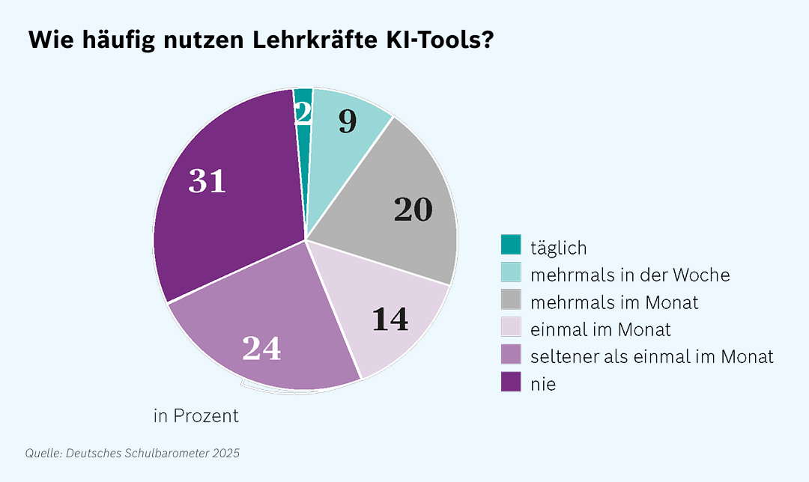

Bitkom kommt aus anderer Blickrichtung zu einem ähnlichen Bild: „bereits jede zweite Lehrkraft" habe KI schon einmal für die Schule genutzt.[^bitkom-lehrkraft] Die Zahlen widersprechen sich nicht – „schon einmal genutzt" ist etwas anderes als „nutzt regelmäßig".

Die Lücke ist messbar: **Schüler:innen nutzen KI breiter und selbstverständlicher als ihre Lehrkräfte – beide Seiten wachsen schnell.** Nur 23 % der weiterführenden Schulen haben überhaupt zentrale Regeln zum KI-Einsatz.[^bitkom-regeln] Hinzu kommt seit Februar 2025 eine **rechtliche** Erwartung (Art. 4 EU AI Act, siehe Abschnitt 4.2).

### 1.2 Als Schüler:in: Es geht um Ausbildung und Beruf

Für Schüler:innen ist das stärkste Argument nicht die Hausaufgabe, sondern die Zeit danach. Der **Anthropic Economic Index** misst anonymisiert, *wie* KI tatsächlich für berufliche Aufgaben genutzt wird. Stand November 2025:[^anthropic-index]

- Bei rund **49 %** der untersuchten Berufe wurde KI für **mindestens ein Viertel** der Aufgaben eingesetzt.
- Aber nur bei etwa **4 %** für **drei Viertel oder mehr** der Aufgaben.

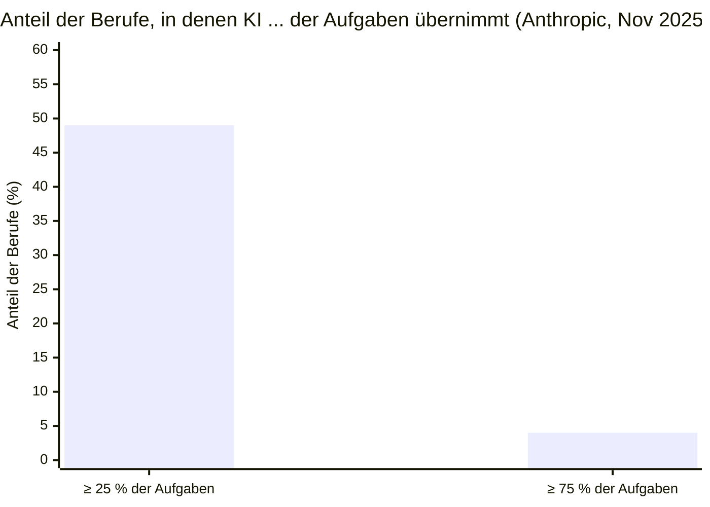

Daraus folgt die nüchterne Lesart: **KI berührt viele Berufe teilweise, aber nur sehr wenige vollständig.** Anthropic unterscheidet zwischen *Augmentation* (KI unterstützt den Menschen) und *Automation* (KI erledigt die Aufgabe weitgehend allein). Der automatisierende Anteil steigt – von rund 27 % auf 39 % innerhalb weniger Monate –, doch der größere Teil der Nutzung bleibt unterstützend.[^anthropic-index] Den größten Produktivitätsgewinn bringt KI bei komplexer Arbeit, gerade dort sinkt aber die Zuverlässigkeit – der **unersetzliche menschliche Wert liegt im Urteilen unter Unsicherheit und im Umgang mit den Fällen, in denen die KI versagt.**[^anthropic-labor]

#### Sauber eingeordnet: Was liegt an KI, was an der Wirtschaft?

Hier ist Vorsicht geboten – die Daten geben nicht alles her. Dass etwa Berufseinsteiger:innen (besonders in der Tech-Branche) es zuletzt schwerer hatten, **lässt sich nicht sauber allein der KI zuschreiben.** Mit hineinwirken:

- **konjunkturelle Faktoren** (Zinsniveau, Korrektur nach dem Einstellungsboom der Pandemiejahre),
- **branchenspezifische Zyklen**,
- und eben **KI** als ein Faktor unter mehreren.

Der Anthropic Economic Index misst, *wie KI genutzt wird* – nicht, *wie viele Stellen sie vernichtet hat*. Diese Kausalität sauber zu trennen, ist selbst für Ökonom:innen schwierig; seriöse Quellen mahnen zur Vorsicht. **Ehrlich ist daher: KI verändert Aufgaben nachweislich und spürbar; pauschale Aussagen über vernichtete Jobs sind nicht belegt.**

#### Wie man sich schützt: durch Bildung, nicht durch Vermeidung

Wenn der bleibende menschliche Vorteil im Urteilen, Prüfen und Steuern liegt, folgt daraus ein klares Bildungsziel. Wer im Arbeitsmarkt von morgen bestehen will, sollte:

- **KI bedienen können** – sie steuern, mit Kontext füttern, ihre Ergebnisse einordnen.
- **KI prüfen können** – erkennen, *wann* sie falsch liegt. Das setzt echtes Fachwissen voraus; man kann nur kontrollieren, was man selbst versteht.
- **das Menschliche stärken** – Urteilsvermögen, Kreativität, Zusammenarbeit, Anpassungsfähigkeit.

Die Schlussfolgerung ist also nicht „KI meiden", sondern „KI beherrschen **und** die eigenen, schwer ersetzbaren Fähigkeiten ausbauen". Genau das ist der Auftrag von Schule – und der Kern dieses Workshops.

### 1.3 Der globale Maßstab

Dass dies keine Modeerscheinung ist, zeigt die Adoptionskurve von ChatGPT. Nach dem Start im November 2022 war es die am schnellsten wachsende Verbraucher-Anwendung der Geschichte. Die von OpenAI genannten **wöchentlich aktiven Nutzer**:[^openai-wau]

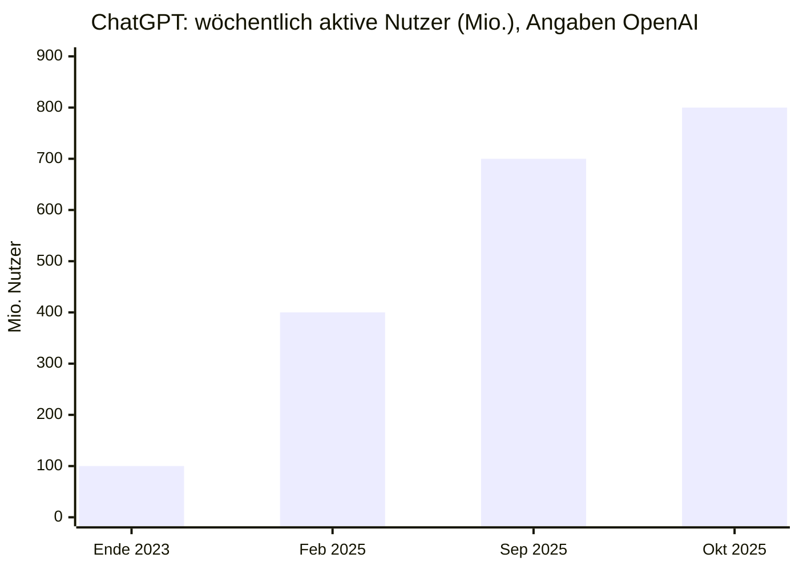

Im Oktober 2025 nannte OpenAI-Chef Sam Altman 800 Mio. wöchentlich aktive Nutzer.[^openai-wau] Für Anfang 2026 wurde darüber hinaus von rund 900 Mio. berichtet – diese jüngste Zahl ist nur über Sekundärquellen belegt und hier daher nur als Tendenz zu werten.[^openai-900] Entscheidend ist ohnehin nicht die exakte Zahl, sondern die **Steigung der Kurve**.

> **⚠️ Aktualitätsvorbehalt:** Nutzerzahlen und Marktanteile altern in diesem Feld in Monaten. Alle Werte sind mit Datum und Quelle versehen – prüfe vor einer Weiterverwendung die jeweils aktuelle Ausgabe.

---

## 2. Die fünf Rollen von KI im Schulalltag

KI begegnet dir nicht in *einer*, sondern in fünf Rollen. Sie auseinanderzuhalten lohnt sich, weil für jede andere Regeln und Risiken gelten:

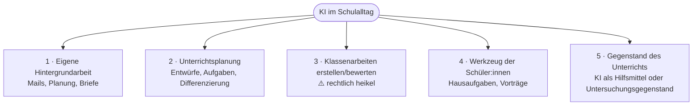

Die Rollen 1 und 2 sind weitgehend unbedenklich, Rolle 3 ist rechtlich sensibel (Abschnitt 4), die Rollen 4 und 5 betreffen den Umgang mit deinen Schüler:innen (Abschnitt 5).

---

## 3. Teil 1 – Wie funktioniert KI?

### 3.1 Das Experiment statt der Theorie

Öffne in vier Tabs dieselbe Art von KI-Oberfläche und stelle allen die *exakt gleiche* Frage:

- [ChatGPT](https://chatgpt.com) (OpenAI)
- [Gemini](https://gemini.google.com) (Google)
- [Claude](https://claude.ai) (Anthropic)
- [Grok](https://grok.com) (xAI)

Zwei Beobachtungen fallen sofort auf:

1. **Jede gibt eine andere Antwort.** Es gibt nicht *die eine* richtige Antwort „der KI".
2. **Stell dieselbe Frage zweimal** in je einem neuen Chat – auch dasselbe Modell antwortet beim zweiten Mal anders.

Probiere danach bewusst verschiedene **Modalitäten**: lass dir Bilder, Videos und Musik generieren, eine Präsentation entwerfen, ein Arbeitsblatt erstellen. Und zeig, was schon **agentisch** geht: Eine KI mit Dateizugriff kann einen unaufgeräumten Ordner sortieren, alle Dateien einheitlich umbenennen oder neue anlegen – sie *handelt*, statt nur zu antworten (zu Chancen **und** Risiken davon mehr in Abschnitt 6). Achte dabei kritisch darauf, *wo* die Qualität endet – fehlerhafte Hände in Bildern, erfundene Quellen im Arbeitsblatt, plausibel klingende, aber falsche Fakten in der Präsentation. Genau diese Bruchstellen sind der Lernstoff.

Das ist alles kein Fehler, sondern das Wesen der Technik – und der Schlüssel zu allem Weiteren.

> **💡 Tipp:** Stell die Antworten der Modelle nebeneinander und frag dieselbe Frage anschließend noch einmal – so wird sichtbar, wie stark schon ein einzelnes Modell von Antwort zu Antwort streut.

### 3.2 Was im Inneren passiert

Ein großes Sprachmodell (LLM) ist kein Lexikon und keine Suchmaschine. Es wurde mit riesigen Textmengen trainiert und sagt immer nur **das nächste wahrscheinliche Token** (eine Wort- oder Silbeneinheit) voraus – Stück für Stück, bis eine Antwort entsteht:

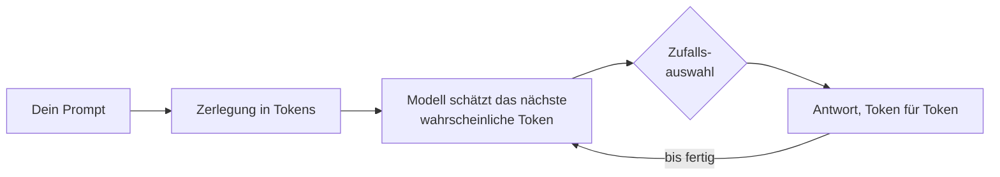

Daraus folgt zweierlei: Das Modell „weiß" nichts und schlägt nichts nach (außer du gibst ihm ausdrücklich ein Such- oder anderes Werkzeug). Und weil bei der Auswahl bewusst ein Zufallselement mitspielt, fällt jede Antwort etwas anders aus. Weil es auf *Plausibilität* statt auf *Wahrheit* optimiert ist, kann es sehr überzeugend Falsches behaupten.

### 3.3 Die wichtigsten Begriffe in je einem Satz

| Begriff | Bedeutung |
|---|---|
| **Prompt** | Deine Eingabe an die KI – die Frage oder Anweisung. |
| **Token** | Die kleinste Texteinheit, in der ein Modell rechnet (etwa eine Silbe oder ein kurzes Wort). |
| **Kontextfenster** | Wie viel Text (Prompt + bisheriger Chat) das Modell gleichzeitig „im Blick" hat. |
| **Halluzination** | Eine erfundene, aber überzeugend formulierte Aussage. |
| **System-Prompt** | Eine versteckte Grundanweisung, die das Verhalten des Modells festlegt. |
| **Training vs. Inferenz** | Training = das einmalige Lernen aus Daten; Inferenz = die Nutzung im Chat. |
| **Multimodal** | Ein Modell, das nicht nur Text, sondern auch Bild, Ton oder Video verarbeitet. |
| **Agent** | Eine KI, die nicht nur antwortet, sondern selbstständig Werkzeuge nutzt und Schritte ausführt. |
| **MCP** | Ein offener Standard, über den KI an externe Werkzeuge angedockt wird (siehe Abschnitt 6). |

### 3.4 Was KI gut kann – und was nicht

**Stärken** (sie arbeiten alle mit Material, das *du* lieferst):

- Umformulieren, kürzen, strukturieren.
- Ideen und Varianten liefern, wenn du feststeckst.
- Sprache: übersetzen, vereinfachen, Niveau anpassen („für Klasse 7 erklären").
- Routine: Listen, Tabellen, Standardformulierungen.

**Schwächen:**

- Fakten, Zahlen, Zitate, Quellen können erfunden sein.
- Klassisches Rechnen und Zählen (sie schätzt, statt zu rechnen – außer mit Werkzeug).
- Wissen über Ereignisse nach ihrem Trainingsstand (außer mit Internetzugriff).
- Die eigene Verlässlichkeit einschätzen (siehe 3.6).

Die Faustregel: **KI ist nur so gut wie ihr Kontext.**

### 3.5 Wie man KI gut nutzt: Kontext ist King

Die wichtigste Fähigkeit ist nicht „den perfekten Prompt kennen", sondern **genug Kontext mitgeben**:

- **Rolle und Ziel nennen:** „Du hilfst einer Deutschlehrerin, Klasse 9. Ziel: …"
- **Material mitliefern:** Füge deinen Text/deine Aufgabe ein, statt sie zu beschreiben.
- **Format vorgeben:** „Antworte als Tabelle mit drei Spalten."
- **Iterieren:** Die erste Antwort ist ein Entwurf – sag, was fehlt.
- **Gegenrechnen:** Bei allem, was stimmen *muss*, prüfst du selbst nach.

> **💡 Tipp:** Stell dieselbe Aufgabe einmal mit kargem und einmal mit reichem Kontext und vergleiche die Ergebnisse – der Qualitätssprung wird dann sofort sichtbar.

### 3.6 „Ist KI sicher?" – warum die Frage an die KI nicht weiterhilft

Eine naheliegende Idee: einfach die KI selbst fragen – „Bist du sicher?". **Das hilft nicht.** Das Modell erzeugt auch seine Selbsteinschätzung nur als wahrscheinliche Fortsetzung. Es kann eine falsche Antwort mit voller Überzeugung bestätigen oder eine richtige auf Nachfrage einknicken lassen. Sein „Selbstvertrauen" ist nicht kalibriert – **Sicherheit im Ton sagt nichts über Richtigkeit aus.**

Die einzige verlässliche Prüfung ist eine **externe**: eine zweite Quelle, dein Fachwissen, ein Taschenrechner, ein Blick ins Buch. Das ist zugleich die wichtigste Lektion für Schüler:innen.

---

## 4. Teil 2 – Was darf ich als Lehrer:in?

### 4.1 Der rechtliche Rahmen: EU AI Act

Seit dem 1. August 2024 gilt die KI-Verordnung der EU (VO (EU) 2024/1689, „EU AI Act"), die KI nach Risiko reguliert.[^aiact-reg] Die Bundesnetzagentur ist in Deutschland zentrale Stelle und stellt die Systematik so dar:[^bnetza]

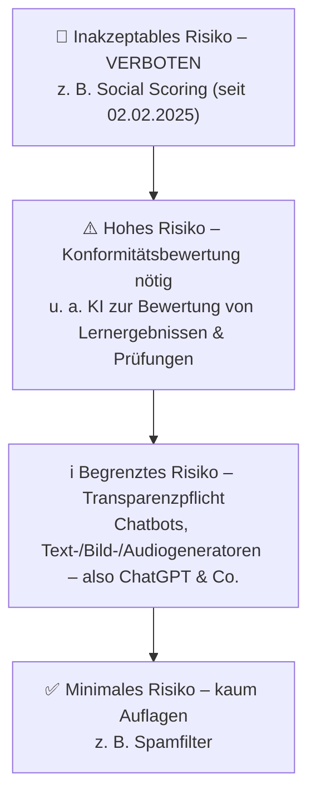

Zwei Punkte sind für Schule besonders wichtig:

**Erstens – die normale Chat-Nutzung ist „begrenztes Risiko".** Chatbots und Generatoren für Text, Bild oder Audio fallen laut Bundesnetzagentur unter die Transparenzpflicht: Nutzer müssen wissen, dass sie mit einer KI interagieren bzw. dass ein Inhalt KI-erzeugt ist.[^bnetza] Das normale Arbeiten mit ChatGPT ist also erlaubt – mit Kennzeichnungspflicht für KI-Inhalte.

**Zweitens – Bewerten ist „hohes Risiko".** Anhang III des EU AI Act stuft KI-Systeme im Bildungsbereich ausdrücklich als hochriskant ein, wenn sie **Lernergebnisse bewerten, über Zulassungen entscheiden oder das Verhalten bei Prüfungen überwachen**.[^aiact-annex3] Daher steht hinter „Klassenarbeiten von der KI bewerten lassen" ein großes Warnschild (Abschnitt 4.4). Der Großteil dieser Hochrisiko-Pflichten greift ab dem 2. August 2026.[^aiact-annex3]

### 4.2 KI-Kompetenz ist Pflicht (Art. 4)

Seit dem **2. Februar 2025** verpflichtet Artikel 4 des EU AI Act Anbieter *und Betreiber* von KI-Systemen, für ausreichende **KI-Kompetenz** ihres Personals zu sorgen.[^aiact-art4] Das gilt nicht nur für Hochrisiko-Systeme, sondern allgemein – und Schulen als Betreiber fallen darunter. Verlangt wird kein Zertifikat, sondern ein angemessenes, dokumentiertes Konzept; die nationale Durchsetzung läuft ab dem 2. August 2026 an.[^aiact-art4] Sich mit KI auszukennen ist also nicht mehr nur sinnvoll, sondern rechtlich erwartet.

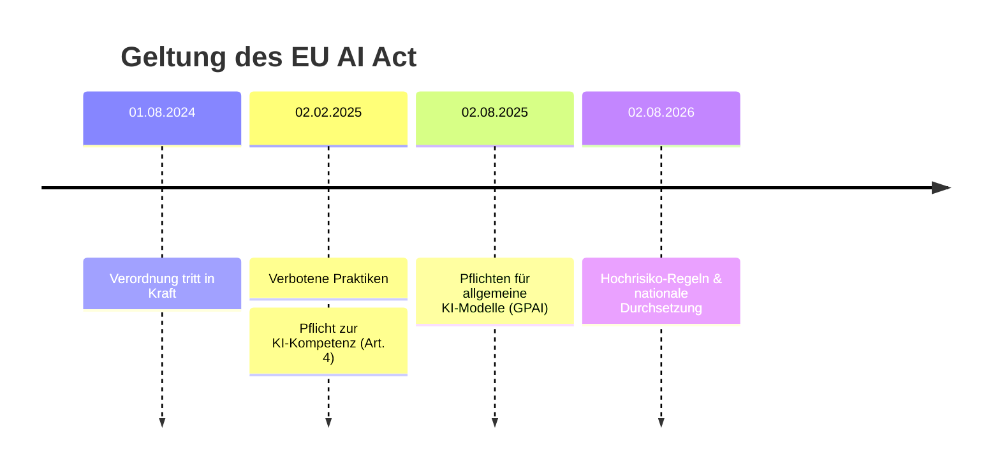

### 4.3 Datenschutz (DSGVO)

Unabhängig vom AI Act gilt die DSGVO. Praktische Regeln:

- **Keine personenbezogenen Daten** von Schüler:innen in öffentliche KI-Tools – keine Namen, Noten, Gutachten, Atteste, Fotos.
- Daten Minderjähriger sind besonders geschützt.
- **Anonymisiere**, wenn du Schülertexte verarbeitest (Namen entfernen).
- Prüfe, ob dein Bundesland/deine Schule eine geprüfte, datenschutzkonforme Lösung bereitstellt – diese ist der privaten Gratis-Variante vorzuziehen.

### 4.4 Klassenarbeiten erstellen und bewerten ⚠️

*Erstellen* von Aufgaben ist unproblematisch (immer gegenprüfen). *Bewerten* dagegen ist heikel:

1. **Rechtlich:** Die Maschinenbewertung von Lernergebnissen ist nach Anhang III potenziell ein **Hochrisiko-System** mit entsprechenden Pflichten.[^aiact-annex3]
2. **Praktisch:** Die Bewertung ist nicht reproduzierbar (gleiche Arbeit → andere Note) und nicht frei von Verzerrungen.

KI als *Zweitmeinung* oder zum Strukturieren von Feedback kann vertretbar sein – **die Note und die Verantwortung bleiben bei dir.** Genau dieses Muster zeigt das Schulbarometer in der Praxis: Lehrkräfte nutzen KI vor allem für Planung und Aufgabenerstellung, kaum für die Bewertung.[^schulbarometer]

### 4.5 Wann KI-Nutzung schlicht unnötig ist

Eine ehrliche Einschätzung, die in keinem Werbeprospekt steht: **Gute Lehrkräfte sind in ihrem eigenen Unterricht eingespielt.** Wenn du ein Thema seit Jahren souverän erklärst, brauchst du dir dafür nichts „geben zu lassen" – ein generischer KI-Stundenentwurf ist dann oft schlechter als das, was du ohnehin im Kopf hast. KI ist am wertvollsten bei dem, was dich Zeit kostet, ohne dein Können zu fordern: Routine, Formulierungen, erste Entwürfe. Setze sie dort ein – nicht aus Prinzip überall.

### 4.6 Welches Tool? Eine nüchterne Einordnung

Es gibt nicht *das eine beste* Tool. Einordnung nach Einsatzzweck:

| Tool | Anbieter (Sitz) | Stärke | Für Schule |
|---|---|---|---|
| **ChatGPT** | OpenAI (USA) | Allrounder, größte Verbreitung | Guter Einstieg |
| **Gemini** | Google (USA) | In Google-Welt integriert, lange Kontexte | Stark mit Workspace |
| **Claude** | Anthropic (USA) | Schreiben, Code, sorgfältige Antworten | Gut für Texte & Informatik |
| **NotebookLM** | Google (USA) | Arbeitet *nur* mit deinen Dokumenten | Ideal für eigene Materialien |
| **Kling AI** | Kuaishou (China) | Videoerzeugung | Nur Medienprojekte, Datenschutz beachten |

**NotebookLM** ist für Lehrkräfte oft unterschätzt: Du lädst eigene Materialien hoch, und es antwortet nur auf deren Basis – das senkt das Halluzinationsrisiko, weil der Kontext fest steht.

### 4.7 Tool richtig einrichten

Zwei Einstellungen, die kaum jemand vornimmt und die wirklich zählen:

1. **Training ausschließen.** In den Datenschutzeinstellungen lässt sich meist abschalten, dass Eingaben zum Training verwendet werden. ⚠️ Die genauen Schalter und Voreinstellungen ändern sich häufig und unterscheiden sich je Tarif – prüfe sie beim Einrichten konkret. Geschäfts-/Edu-Tarife trainieren in der Regel grundsätzlich nicht auf deinen Daten.
2. **Ausgabenlimit setzen.** Bei API- oder verbrauchsbasierten Tarifen ein **Spending Limit** hinterlegen, damit keine unangenehme Rechnung entsteht.

### 4.8 Wo sitzen die Anbieter – datenschutzfreundliche Alternativen

Die großen Anbieter (OpenAI, Google, Anthropic, xAI) sitzen in den **USA**, Kling in **China**. Wer mehr Datenkontrolle möchte:

- **Europäisch:** [Mistral / Le Chat](https://chat.mistral.ai) (Frankreich), Aleph Alpha (Deutschland, eher Behörden/Unternehmen).
- **Lokal auf dem eigenen Rechner:** Mit [Ollama](https://ollama.com) oder LM Studio laufen offene Modelle (Llama, Mistral, Gemma, Qwen) direkt auf einem leistungsfähigen Gerät – **kein Datenabfluss**, dafür schwächer und einrichtungsintensiver.

Faustregel: Für Sensibles lokal oder europäisch, für Anspruchsvolles ohne personenbezogene Daten die großen Modelle.

### 4.9 Besonderheit für Informatik-Lehrer:innen: Agentisches Coding

Werkzeuge wie Claude Code, Cursor oder GitHub Copilot schreiben nicht nur Code-Schnipsel, sondern arbeiten selbstständig über mehrere Dateien, führen Befehle aus und korrigieren sich. Das verändert, was „programmieren lernen" heißt – eine KI zu *steuern und ihren Output zu prüfen* wird zur Kernkompetenz. Lass Schüler:innen ein kleines Projekt einmal von Hand und einmal mit Assistenten bauen; der Vergleich, *wo* die KI hilft und *wo* sie still Fehler einbaut, ist die eigentliche Lektion.

### 4.10 Entscheidungshilfe: Darf ich KI dafür nutzen?

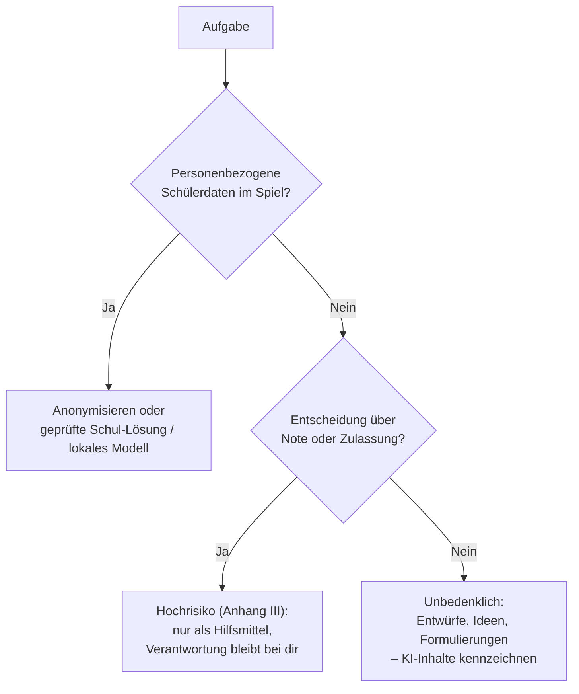

---

### 4.11  Peer Group Analyse

In den einführenden Statistiken wurde bereits gezeigt, dass die KI-Nutzung unter Lehrkräften noch nicht sehr weit fortgeschritten ist. Schaut man auf die Einsatzbereiche von KI in der Schule, geht es vor allem um Unterstützung.
Wenn du also das nächste Mal vor einer lästigen Aufgabe sitzt und keine Lust mehr darauf hast, frag dich, ob KI dir helfen kann. Deine Kolleg:innen nutzen KI zum Beispiel vermehrt für die folgenden Tätigkeiten.

Einfach anfangen ist am besten.

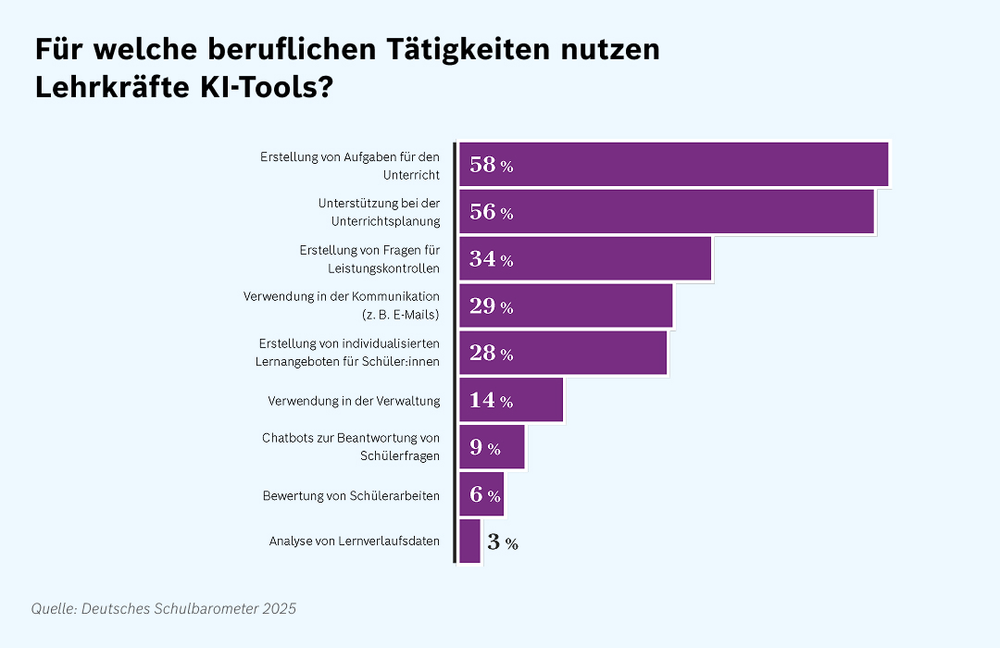

## 5. Teil 3 – Was dürfen meine Schüler:innen?

### 5.1 Hausaufgaben und Vorträge mit KI – wie bewerten?

Das Verbot funktioniert nicht – KI ist überall und kaum nachweisbar. **„KI-Detektoren" sind unzuverlässig** und schlagen besonders bei Nicht-Muttersprachler:innen fälschlich an; verlasse dich nicht darauf. Sinnvoller ist, die **Aufgabenstellung umzubauen**:

- **Prozess statt Produkt bewerten:** Zwischenstände, Quellen, Entwürfe, eine kurze Reflexion „Wo hat mir KI geholfen, wo nicht?".
- **Mündlich nachfragen:** Wer seinen Vortrag versteht, kann ihn erklären; wer ihn nur generiert hat, nicht.
- **Transparenz statt Verbot:** „KI erlaubt, aber kennzeichnen, wofür" ist ehrlicher und lehrreicher – und passt zur Transparenzlogik des AI Act.
- **Aufgaben, die KI schlecht kann:** Bezug zur konkreten Stunde, zur eigenen Erfahrung, zur Diskussion von gestern.

Dass dies dringend ist, zeigt die Zahl von oben: 23 % der Schüler:innen erledigen Hausaufgaben „meist" per KI.[^bitkom-hausaufgaben]

### 5.2 KI im Unterricht: Hilfsmittel oder Unterrichtsgegenstand?

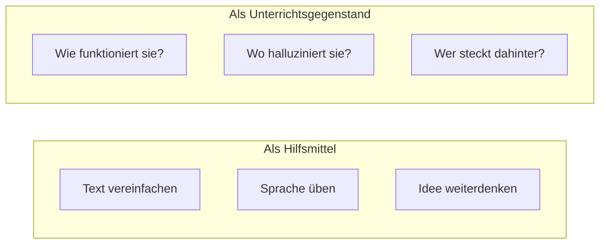

Beides ist wertvoll – aber gerade die zweite Sicht kommt zu kurz. Schüler:innen, die KI *als Gegenstand* verstanden haben, nutzen sie danach *als Hilfsmittel* deutlich souveräner.

> **Unterrichts Idee Halluzinations-Detektiv**  " Die KI erstellt am Ende der Unterrichtsstunde eine Zusammenfassung der wichtigsten Punkte des aktuellen Themas und die Schüler:innen reflektieren die KI Antwort im Plenum und markieren Fehler.

---

## 6. Next Steps für Fortgeschrittene

### 6.1 Was ist ein MCP-Server?

Das **Model Context Protocol (MCP)** ist ein offener Standard, mit dem eine KI an externe Werkzeuge und Datenquellen angedockt wird – etwa an einen Kalender, eine Datenbank oder ein Dateisystem. Ein **MCP-Server** ist die Brücke, die so ein Werkzeug für die KI bereitstellt. Vereinfacht: MCP macht aus einem reinen Chatbot eine KI, die *etwas tun* kann, weil sie standardisiert auf Werkzeuge zugreift.

### 6.2 Autonome Agenten – und das Beispiel OpenClaw

Ein **autonomer Agent** ist eine KI, die nicht auf jede einzelne Anweisung wartet, sondern ein Ziel über mehrere Schritte selbstständig verfolgt: planen, Werkzeuge nutzen, Ergebnisse prüfen, nachsteuern.

Ein viel diskutiertes Beispiel ist **OpenClaw** – ein quelloffener, selbst gehosteter Agent (ursprünglich „Warelay"), der über Messenger wie WhatsApp oder Telegram bedient wird und per MCP Dateien liest und schreibt, Terminalbefehle ausführt, den Kalender verwaltet und im Web recherchiert. Anfang 2026 wurde er zu einem der am schnellsten wachsenden Open-Source-KI-Projekte – und löste zugleich eine intensive Sicherheitsdebatte aus; China beschränkte seinen Einsatz in Behörden im März 2026 unter Verweis auf Sicherheitsrisiken wie unautorisiertes Löschen von Daten.[^openclaw]

Agentische Systeme bergen intrinsische Sicherheitsrisiken, die im folgenden angesprochen werden.

### 6.3 Die Gefahren agentischer Systeme

Sobald eine KI nicht mehr nur *redet*, sondern *handelt* (Dateien öffnet, Mails liest, Befehle ausführt, im Web surft), entstehen neue Risiken. Die wichtigsten:

**Die „Lethal Trifecta".** Der Sicherheitsforscher Simon Willison beschreibt, dass ein Agent besonders gefährlich wird, wenn **drei Eigenschaften zusammenkommen**:[^trifecta]

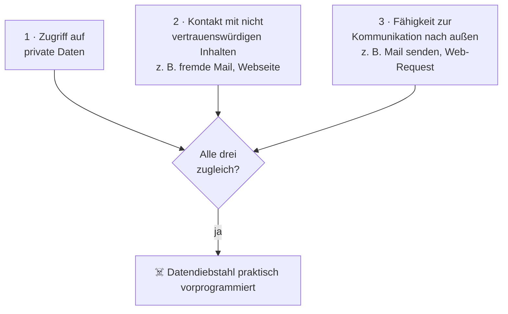

Hat ein Agent alle drei, kann ein Angreifer ihn austricksen: In einer scheinbar harmlosen Mail oder Webseite stehen versteckte Anweisungen (**Prompt Injection**), die der Agent als Befehl missversteht – und damit private Daten nach außen schickt.

**Daten-Exfiltration.** Genau das ist die Folge: vertrauliche Inhalte (Korrespondenz, Noten, Zugangsdaten) verlassen unbemerkt das System, weil der Agent „nur einen Link aufgerufen" oder „nur eine Mail beantwortet" hat.

**Schadsoftware und Befehle.** Ein Agent, der Terminalbefehle ausführen darf, kann durch eine manipulierte Eingabe dazu gebracht werden, Schadsoftware herunterzuladen, Dateien zu löschen oder das System zu verändern – ohne dass du es merkst.

**Verkettung von Fehlern.** Autonome Agenten handeln über viele Schritte. Ein früher Fehler oder eine falsche Annahme pflanzt sich fort und wird selten von allein bemerkt.

Die Schutzregel ist einfach formuliert: **Durchbrich die Trifecta.** Gib einem Agenten nie gleichzeitig Zugang zu sensiblen Daten, ungeprüften Inhalten *und* einem Kanal nach außen. Und führe ihn in einer Sandbox (siehe 6.4).

### 6.4 KI sicher auf dem eigenen Rechner aufsetzen

- **Lokale Modelle** über [Ollama](https://ollama.com) oder LM Studio – kein Datenabfluss, dafür schwächer und einrichtungsintensiver.
- **Sandboxing:** Werkzeuge, die Dateien lesen oder Befehle ausführen dürfen (agentische Coding-Tools, Agenten wie oben), in einer abgeschotteten Umgebung laufen lassen – einem Container oder einer virtuellen Maschine – damit ein Fehler oder eine manipulierte Eingabe nicht das ganze System trifft.
- **Rechte minimal halten:** Nur die Zugriffe geben, die wirklich nötig sind.

Das ist Nische und nichts für die breite Masse. Wenn du IT-affin bist, ist es ein lohnendes Projekt – halte das Setup einfach.

---

## 7. Warum ein Workshop besser ist als ein Vortrag

Über KI zu lesen formt Meinungen. KI unter Anleitung zu *nutzen* formt Urteilsvermögen. Am Ende erkennen Lehrkräfte und Schüler:innen den Unterschied zwischen einem Werkzeug, das ihnen beim Denken hilft, und einem, das *für* sie denkt – und genau darum geht es. Die Daten stützen den Ansatz: Die größte gemessene Hürde der Lehrkräfte ist nicht Ablehnung, sondern **Unsicherheit** (62 %).[^schulbarometer] Unsicherheit baut man nicht mit Folien ab, sondern mit eigener, angeleiteter Erfahrung.

> „Die Schüler waren nach dem Workshop kritischer gegenüber KI, nicht unkritischer." – Wenn das das Resultat ist, bin ich zufrieden.

## Einen Workshop buchen

Du möchtest mehr zu dem Thema erfahren? Ich biete Workshops für eine einzelne Klasse, einen ganzen Jahrgang oder das Kollegium an, auf Deutsch oder Englisch. Wenn du unterrichtest und das für deine Schüler:innen möchtest, [melde dich](/#kontakt) oder sieh dir das vollständige Programm auf [felix-paul.de/education](/education/) an.

---

## 8. Quellen

Jede Quelle ist mit ihrem **Veröffentlichungs- bzw. Erhebungsdatum** und dem **Abrufdatum (08.06.2026)** versehen. Statistiken in diesem Feld altern schnell – im Zweifel die jeweils aktuelle Ausgabe heranziehen.

[^bitkom-chatgpt]: Bitkom e. V., „Hälfte der Schülerinnen und Schüler hat schon mal ChatGPT genutzt" (repräsentative Befragung, 504 Schüler:innen, 14–19 J.). *Veröffentlicht 23.05.2023; abgerufen 08.06.2026.* — Hinweis: ältere Erhebung, hier nur als historischer Vergleichswert genutzt. <https://www.bitkom.org/Presse/Presseinformation/ChatGPT-in-Schule-nutzen>

[^bitkom-hausaufgaben]: Bitkom e. V., „Knapp ein Viertel der Schüler macht Hausaufgaben meist mit KI" (Studie *Digitale Schule 2025*, 502 Schüler:innen 14–19 J., Erhebung KW 9–15/2025). *Veröffentlicht 26.05.2025; abgerufen 08.06.2026.* <https://www.bitkom.org/Presse/Presseinformation/Knappes-Viertel-Schueler-macht-Hausaufgaben-mit-KI>

[^bitkom-lehrkraft]: Bitkom e. V., „Bereits jede zweite Lehrkraft hat KI für die Schule genutzt". *Veröffentlicht 09.10.2024; abgerufen 08.06.2026.* <https://www.bitkom.org/Presse/Presseinformation/jede-zweite-Lehrkraft-KI-Schule-genutzt>

[^bitkom-regeln]: Bitkom e. V., „Viele Schulen regeln den KI-Einsatz nicht" (Studie *Digitale Schule 2025*, Erhebung KW 9–15/2025). *Veröffentlicht 30.06.2025; abgerufen 08.06.2026.* <https://www.bitkom.org/Presse/Presseinformation/Viele-Schulen-regeln-KI-Einsatz-nicht>

[^schulbarometer]: Robert Bosch Stiftung, *Deutsches Schulbarometer 2025 – Befragung Lehrkräfte* (repräsentativ). *Veröffentlicht Juni 2025; abgerufen 08.06.2026.* <https://www.bosch-stiftung.de/sites/default/files/documents/2025-06/Deutsches%20Schulbarometer_Lehrkr%C3%A4fte_2025.pdf> · Zusammenfassung: <https://deutsches-schulportal.de/bildungswesen/deutsches-schulbarometer-lehrkraefte-2025-die-wichtigsten-ergebnisse/>

[^anthropic-index]: Anthropic, *Anthropic Economic Index*: Nutzung von KI über Berufe und Aufgaben, Augmentation vs. Automation. *Berichte veröffentlicht September 2025 bzw. Januar 2026; abgerufen 08.06.2026.* <https://www.anthropic.com/research/anthropic-economic-index-september-2025-report> · <https://www.anthropic.com/research/anthropic-economic-index-january-2026-report>

[^anthropic-labor]: Anthropic, „Labor market impacts of AI: A new measure and early evidence". *Veröffentlicht 05.03.2026; abgerufen 08.06.2026.* <https://www.anthropic.com/research/labor-market-impacts>

[^openai-wau]: Sam Altman / OpenAI auf dem DevDay: 800 Mio. wöchentlich aktive Nutzer (Verlauf: ~100 Mio. Ende 2023, 400 Mio. Feb 2025, 700 Mio. Sep 2025). *Bericht (TechCrunch) vom 06.10.2025; abgerufen 08.06.2026.* <https://techcrunch.com/2025/10/06/sam-altman-says-chatgpt-has-hit-800m-weekly-active-users/>

[^openai-900]: Für Anfang 2026 von rund 900 Mio. wöchentlich aktiven Nutzern berichtet (Sekundärquelle, laufend aktualisierte Statistikseite, hier nur als Tendenz geführt). *Abgerufen 08.06.2026.* <https://www.demandsage.com/chatgpt-statistics/>

[^aiact-reg]: Verordnung (EU) 2024/1689 („EU AI Act"). *Im Amtsblatt veröffentlicht 12.07.2024, in Kraft seit 01.08.2024; abgerufen 08.06.2026.* Konsolidierter Text & Artikelübersicht: <https://artificialintelligenceact.eu/>

[^aiact-art4]: EU AI Act, Artikel 4 – KI-Kompetenz (allgemeine Pflicht für Anbieter und Betreiber). *Gilt seit 02.02.2025; abgerufen 08.06.2026.* <https://artificialintelligenceact.eu/article/4/>

[^aiact-annex3]: EU AI Act, Anhang III Nr. 3 – Bildung und berufliche Bildung als Hochrisiko-Bereich (u. a. Bewertung von Lernergebnissen, Zulassungsentscheidungen, Prüfungsüberwachung). *Geltung des Großteils ab 02.08.2026; abgerufen 08.06.2026.* <https://ai-act-law.eu/de/anhang/3/>

[^bnetza]: Bundesnetzagentur, „Risikoklassifizierung von KI-Systemen" (vier Risikostufen nach dem EU AI Act). *Webseite ohne ausgewiesenes Datum; abgerufen 08.06.2026.* <https://www.bundesnetzagentur.de/DE/Fachthemen/Digitales/KI/2_Risiko/start_risiko.html>

[^openclaw]: OpenClaw (autonomer Open-Source-KI-Agent, Peter Steinberger, erstveröffentlicht Nov 2025; viral Anfang 2026; Einschränkung durch China im März 2026). *Wikipedia-Artikel, laufend bearbeitet; abgerufen 08.06.2026.* <https://en.wikipedia.org/wiki/OpenClaw>

[^trifecta]: Simon Willison, „The lethal trifecta for AI agents: private data, untrusted content, and external communication". *Veröffentlicht 16.06.2025; abgerufen 08.06.2026.* <https://simonwillison.net/2025/Jun/16/the-lethal-trifecta/>
