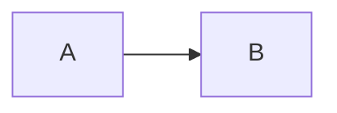

Intro, siehe , ,  und .

## 1. Erster Abschnitt

:::figure{#abb-eins short="Ein Testbild"}
Lange Beschreibung des Bildes, **mit Markdown**, vor dem Bild.

:::

:::figure{#abb-zwei short="Ein Diagramm"}
Diagramm als Mermaid.

:::

Ein Satz mit :anchor[markierter Stelle]{#punkt-x} im Text.

:::table{#tab-eins short="Eine Testtabelle"}
| Format | Honorar |
|---|---|
| Vortrag | 500 € |

Lange Beschreibung der Tabelle, nach der Tabelle.
:::

Quelle[^q].

## Quellen

[^q]: Eine Quelle.
